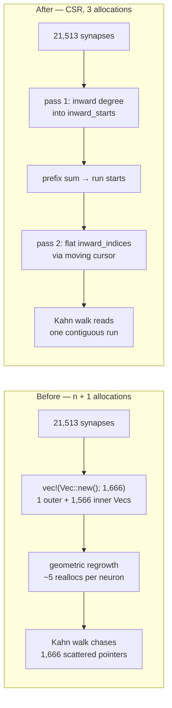

# [perf] `compute_reverse_topological_order` — CSR inward adjacency

## Summary

`compute_reverse_topological_order` (`neat-core/src/topology_ops.rs`) built its
inward adjacency as `Vec<Vec<u32>>` — **one heap allocation per neuron**, plus
the geometric regrowth of every inner `Vec` as the synapse list was pushed into
it. Kahn's walk then chased a separate pointer per neuron, scattering the
traversal across n unrelated allocations. `queue` and `result` were `Vec::new()`
with no capacity hint, so each grew by realloc-and-copy. This runs once per
creature to set up backprop ordering, so it is on the per-generation path.

The adjacency is now **CSR (compressed sparse row)**, built in two passes over
the synapse list:

1. **Pass 1** — inward degree per neuron, accumulated one slot to the right in
   `inward_starts` so the prefix sum turns it straight into run starts.
2. **Prefix sum** over `inward_starts` (n + 1 entries).
3. **Pass 2** — fill one flat `inward_indices` (one entry per surviving
   synapse) through a moving per-neuron cursor, accumulating `out_degree` on
   the same surviving synapses.

That is **3 allocations for the adjacency instead of n + 1**, and the walk
reads one contiguous run per neuron. It is the layout `PropagateInput` already
uses for its inward lists (`inward_starts` / `inward_counts` /
`inward_indices`), so this is the established shape in the crate. `queue` and
`result` are additionally `with_capacity`'d from `n - input_count`; `visited`
stays `n` wide because it is indexed by absolute neuron index.

**Behaviour is unchanged.** Both passes apply the *identical* filter (not a
self-loop, both endpoints inside `n`), which is what keeps the emitted order
element-identical. The defensive skip-don't-panic contract on malformed input
is preserved exactly — this function is reached from WASM, where a trap aborts
the whole run. The now-dead `from == idx` check inside the walk was dropped
because self-loops are filtered when the adjacency is built.

Closes #388.

## Evidence

Backend library change with no web interface, so there is no screenshot.
Evidence is allocation counts, wall-clock A/B, and Criterion.

### Allocation + wall-clock A/B at the production anchor

`cargo run --release --example reverse_topo_order_alloc_ab` — new committed
harness (`neat-core/examples/reverse_topo_order_alloc_ab.rs`) that runs the
shipped function and the pre-#388 `Vec<Vec<u32>>` reference side by side under
a counting global allocator, at **n = 1,666 with 21,513 synapses** (the anchor
named in the issue). It asserts the two orders are element-identical before
reporting, so the numbers can never come from a diverged implementation.

| Metric (per call) | Before (`Vec<Vec<u32>>`) | After (CSR) | Delta |
| --- | --- | --- | --- |
| Allocations | 4,721 | **7** | **−99.9%** |
| Peak live bytes | 177,210 | 139,846 | **−21%** |
| Wall clock (best of 12 rounds × 100) | 128.5 µs | 90.3 µs | **−30%** |
| Returned order | 1,566 entries | 1,566 entries | element-identical |

4,721 = 1 outer `vec![Vec::new(); n]` + 1,566 inner `Vec`s + their regrowth
reallocs + the ungrown `queue`/`result` chains. The 7 remaining are
`out_degree`, `inward_starts`, `cursor`, `inward_indices`, `queue`, `result`
and `visited`.

Wall clock is reported as the **fastest** of 12 alternating rounds. This
machine is shared, so per-round means swung ±50%; interference only ever *adds*
time, so min-of-rounds is the honest estimate and both sides see the same
conditions. Sanity check: before the change both columns ran the same
algorithm and agreed within 3%, confirming the harness has no side bias.

### Criterion — `topology_ops` group in `hot_paths`

`compute_reverse_topological_order` is added to the existing `topology_ops`
group, sharing #387's two topologies and reporting throughput per graph element
(`neurons + synapses`). Baseline and comparison were taken **back to back on
the same machine state**, with the old function body temporarily restored for
the baseline run, so the two are properly paired.

| Case | Before (median) | After (median) | Change (Criterion) |
| --- | --- | --- | --- |
| `n1666_21513` | 559.21 µs | 172.14 µs | **−67.4%** (p = 0.00) |
| `n4127_21513` | 586.23 µs | 115.11 µs | **−79.9%** (p = 0.00) |

The baseline was itself re-measured against an earlier baseline of the same
unchanged code and came back p = 0.72 (no change), which is what makes the
above deltas trustworthy rather than machine drift.

### Where the allocations went

### Mutation testing — the differential test genuinely catches errors

The guard was verified by injecting faults into the CSR build and confirming
the suite fails:

| Injected fault | Result |
| --- | --- |
| `inward_starts[to + 1] += 1` → `inward_starts[to] += 1` (prefix-sum off-by-one) | **7 tests fail** |
| Cursor fill writes `to` instead of `from` | **1 test fails** |
| Pass 1 keeps self-loops that pass 2 drops (filter mismatch) | **2 tests fail** |

The third fault initially escaped a clean-DAG-only generator — it leaves an
unwritten slot that reads as a phantom inward edge from neuron 0 and releases
that neuron into the queue one step early. The randomised generator now mixes
self-loops and out-of-range endpoints into every case, and a hand-built
minimal reproducer (`(&[1, 0, 0, 5], &[1, 2, 3, 2], 6, 0)`) was added to the
malformed-input table, so the mismatch is now caught.

## Test Plan

Added to the `#[cfg(test)]` module of `neat-core/src/topology_ops.rs`, all
differential against `reference_reverse_topological_order` — the pre-#388
`Vec<Vec<u32>>` implementation kept verbatim as the behavioural oracle:

- `reverse_topological_order_matches_reference_on_random_dags` — 200 randomised
  forward-only DAGs (n up to 61, randomised input counts, self-loops and
  out-of-range endpoints mixed in), asserting the returned order is
  **element-identical** to the reference.
- `reverse_topological_order_matches_reference_on_malformed_inputs` — 11
  hand-built pathological cases: out-of-range `from`, out-of-range `to`,
  mismatched lengths, `input_count > n`, self-loops, duplicate edges, back
  edges (cycles), empty edge lists, `n = 0`, and the phantom-edge reproducer.
- `reverse_topological_order_appends_cycle_members_in_ascending_order` —
  pins the documented contract that neurons left in a cycle are appended at the
  end in ascending index order.

Existing tests pass **unchanged** — in particular the #2659 malformed-buffer
guards named in the issue: `reverse_topological_order_oob_from_does_not_panic`,
`reverse_topological_order_oob_to_does_not_panic`,
`reverse_topological_order_mismatched_lengths_returns_empty`,
`reverse_topological_order_input_count_exceeds_neurons`.

### Gate status

- `cargo test --workspace` — green (192 lib tests + all integration suites).
- `cargo fmt --all --check`, `cargo clippy --workspace --all-targets -D warnings` — clean.
- `cargo check -p neat-core --target wasm32-unknown-unknown` — clean (this
  function is `wasm_bindgen`-exported).
- `./quality.sh` — two BATS assertions fail:
  `perf sources name none of the private trainer's internal scripts` (#138) and
  `perf acceptance models reference no private internal script paths` (#151).
  Both were verified **pre-existing on the milestone branch** by stashing this
  change and re-running the two suites on the clean tree; they concern prose in
  `tests/perf/*.ts` and are unrelated to this change, so they are left alone
  per the change-scope rule.
