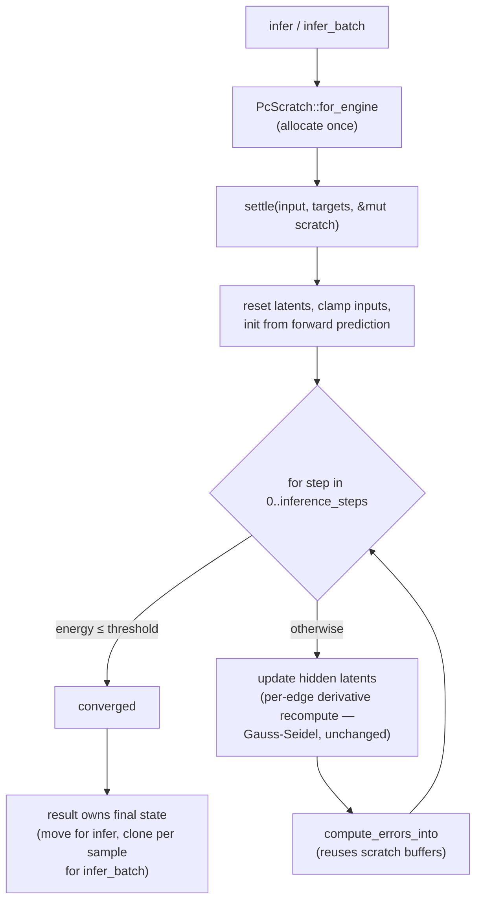

# [perf] PC settling loop — hoist per-step buffers, keep numerics bit-identical

## Summary

The predictive-coding settling loop (`PredictiveCodingEngine::infer`,
`neat-core/src/pc_inference.rs`) allocated two `Vec`s on every settling step and
recomputed each target neuron's pre-activation once per inbound edge. This PR
removes the per-step allocations — **104 → 4 allocations per `infer`, a 96%
reduction** — without changing a single result bit, and documents why the
per-edge derivative recompute is **left intact**. Closes #389.

Wall clock is unchanged (see [Evidence](#evidence)): the settling loop is
dominated by work that cannot be removed while preserving the numerics, so this
lands as a **memory-efficiency** win on the #383 milestone, not a speed one.
Two speed optimisations were tried and rejected on measurement; both are
recorded below so they are not re-attempted.

> **Landed in two parts.** The buffer hoist itself merged as PR #401. That PR
> cited a ~16% / ~8% speed-up measured against a benchmark that converged on
> iteration 1 and never ran the settling loop at all. This PR fixes the
> benchmark, adds the in-process A/B harness, and replaces those figures with
> the measured result. The numbers below supersede PR #401's.

### What changed

1. **`compute_errors_into(latents, predictions, errors)`** — writes prediction
   errors into caller-owned buffers. `compute_errors` is retained as a thin
   allocating wrapper (test-only, exercised by a wrapper-equivalence unit test).
2. **Hoisted working buffers** — a private `PcScratch { latents, predictions,
   errors }` is allocated once per `infer` call and reused across every settling
   step via `compute_errors_into`. The settling loop is now O(1) allocations in
   `inference_steps` instead of `2 × (steps + 1)`.
3. **`infer_batch` reuses one `PcScratch` across all samples** — the per-step
   working `Vec`s are allocated once for the whole batch rather than once per
   sample. Each sample's result owns its own copy of the final settled state.
4. **Criterion `pc_inference` group + `pc_infer_ab` example** — the benchmark
   the issue asked for, plus an in-process A/B against a standalone pre-#389
   reference implementation.

### Semantics: why the per-edge derivative recompute stays

The issue asked to precompute the squash derivative once per non-input neuron
per step. **This is not value-preserving here**, so it was not done.

The loop updates `latents[hidden_idx]` *inside* the step and reads those updates
back via `compute_pre_activation` when processing later hidden neurons in the
same step (Gauss-Seidel ordering). Whenever a target neuron's inbound sum reads
a latent already updated this step — which happens for any target with ≥2 hidden
inbound sources (common in multi-layer topologies) — a step-start derivative
cache would return a different value and silently change the results.

The aliasing is in fact **total**, not occasional: every hidden neuron that
reads target `T`'s pre-activation is by definition an inbound source of `T`, and
it updates its own latent immediately after that read. So the next reader of `T`
always sees a changed inbound sum, and a dirty-flag cache would never get a
hit. Per the acceptance criteria, only the provably-non-aliasing work (the
allocation optimisations) was hoisted; the derivative recompute is preserved and
annotated in the code. A byte-exact incremental pre-activation cache was also
rejected: f32 addition is non-associative, so incremental accumulation would not
be bit-identical to the full per-edge recompute.

## Evidence

Backend/CLI change — no UI, so no screenshot. Verified by tests plus an A/B on a
production-shaped PC topology (32 inputs → 96 → 96 → 48 hidden → 8 outputs,
fan-in 16, 3,968 synapses, 50 steps, `energy_threshold = 0`).

### Allocations — the measured win

`cargo run --release --example pc_infer_ab`, one supervised 50-step `infer`
under a counting global allocator:

| | Allocations | Peak live bytes |
| --- | --- | --- |
| pre-#389 | 104 | 5,292 |
| this PR | **4** | **3,308** |
| delta | **−100 (−96.2%)** | −1,984 (−37.5%) |

Four is the floor: they are exactly the four `Vec`s `PcInferenceResult` owns and
returns (`latents`, `predictions`, `errors`, `energy_history`). The count is now
independent of `inference_steps`; before, it was `4 + 2 × (steps + 1)`.

### Wall clock — no change

Same example, tight A/B alternation in one process, minimum of 400 rounds
(minimum, not mean: the host is shared, so every sample is the true cost plus
interference):

| Case | pre-#389 | this PR | Change |
| --- | --- | --- | --- |
| `infer` | 1.929–1.970 ms | 1.917–1.935 ms | −0.2% … −2.4% |
| `infer_batch/8` | 15.46–15.82 ms | 15.40–15.55 ms | ~0% |

**Honest reading: no wall-clock improvement.** The measured deltas sit inside
run-to-run noise on this host (load average ~16 on 12 cores). The loop's cost is
`O(edges × fan-in)` dependent-f32-add chains plus one transcendental derivative
per edge, and neither can be reduced without changing the numerics — so removing
100 allocations out of a 1.9 ms call is not visible. The change is neutral on
speed and large on allocation pressure; it does not regress either.

### Rejected optimisations (negative results — do not re-attempt)

- **Per-step derivative cache** — not value-preserving; see above. Rejected on
  correctness, before measurement.
- **Structure-of-arrays inward connections + CSR outward adjacency.** Replacing
  the 16-byte `PcConnection` walk with parallel `Vec<u32>`/`Vec<f32>` arrays,
  and the `Vec<Vec<PcOutwardConnection>>` outward map with a CSR triple carrying
  the target's relative index and squash type inline. Implemented, verified
  bit-identical, and measured **1.1–1.8% slower** on `infer` across repeated
  runs. The topology's hot arrays (≈63 KB) already sit in cache, so the layout
  change bought nothing while the extra parallel-array bounds checks cost a
  little. Reverted — the simpler array-of-structs walk stays.

### Benchmark correctness fix

The `pc_inference` Criterion case originally ran **unsupervised** (`targets =
None`). That is not a settling benchmark: `infer` initialises every non-input
latent from its own forward prediction, so the first error vector is exactly
zero, energy is `0.0`, and the loop converges and exits on iteration 1. It was
timing initialisation — 12 µs instead of the 5.9 ms a real 50-step settle costs,
a 450× understatement. Both cases are now supervised and the bench asserts
`steps_used == 50`, so a fixture that starts converging early fails loud.

### Base-branch repair (unrelated to #389, required to get here)

The milestone branch's own `Merge branch 'Develop'` (9befd1d) auto-resolved two
files without conflict markers and produced code that **does not compile**,
blocking every PR that targets it. Repaired on the milestone branch directly
as commit `7492a4b`, which is now part of the base, so it is not in this PR's
diff:

- `topology_ops.rs` — PRs #399 (Develop) and #400 (milestone) both rewrote
  `compute_reverse_topological_order` for Issue #388; the hunks did not overlap
  textually, so both CSR builds were concatenated (two prefix-sum passes, a
  `u32`/`usize` type error, a duplicated `tests` module). Resolved to the
  milestone side's file, with Develop's three extra differential tests
  re-appended so trunk keeps that coverage.
- `hot_paths.rs` — the merge took Develop's import line verbatim, dropping
  `scan_available_connections` and `TrainingDataConfig` while keeping the bench
  bodies that use them.

## Test Plan

New tests (all `cargo test` green; existing `tests/pc_inference.rs` and
`tests/pc_learning.rs` unchanged and green):

- `tests/pc_inference.rs::infer_scratch_buffers_match_baseline` — differential
  equivalence: asserts `infer` is **bit-identical** (`latents`, `predictions`,
  `errors`, `final_energy`, `energy_history`, `steps_used`, `converged`) to a
  standalone reproduction of the pre-change algorithm, over 40 randomised
  multi-fan-in topologies × {supervised, unsupervised} × {converged-early,
  steps-exhausted}.
- `tests/pc_inference.rs::infer_batch_matches_per_sample_bit_identical` —
  `infer_batch` with a reused scratch is byte-identical to independent `infer`
  calls, including a sample shorter than `num_inputs` to exercise the
  latent-reset (no stale-buffer leak).
- `tests/pc_inference_allocations.rs` — O(1)-allocation regression for the
  settling loop (`infer` and `infer_batch`): the allocation count barely moves
  between a 10-step and a 500-step run (delta < 20). Before the fix a 500-step
  run allocated ~980 more times.
- `src/pc_inference.rs::tests::compute_errors_wrapper_matches_into` — the
  `compute_errors` wrapper matches `compute_errors_into`.
- `examples/pc_infer_ab.rs` — asserts bit-identity against the pre-#389
  reference on both the supervised and unsupervised paths before it reports any
  numbers, so the A/B cannot quote a figure for a changed answer.
- Repaired base: the three `reverse_topological_order_matches_reference_*`
  differential tests carried over from Develop.

## Quality gate

`./quality.sh` — fmt, clippy `-D warnings`, `cargo deny`, the full workspace
test suite, `cargo doc -D warnings` and the release build.

## Security self-check

Backend numeric change only. No new external input, no injection surface, no
secrets or `.config*.json` staged, no new dependencies. The only new `unsafe`
code is the counting `GlobalAlloc` in `examples/pc_infer_ab.rs`, which forwards
an unchanged `Layout` to `System` — the same delegation pattern as the existing
`examples/reverse_topo_order_alloc_ab.rs` — and it ships in an example, not in
the library.
