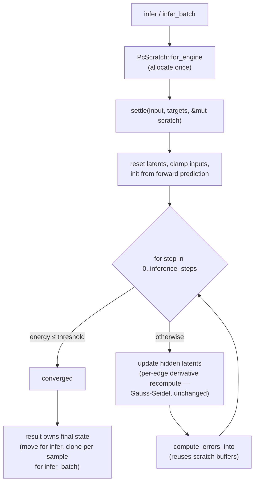

# [perf] PC settling loop — hoist per-step buffers, keep numerics bit-identical

## Summary

The predictive-coding settling loop (`PredictiveCodingEngine::infer`,
`neat-core/src/pc_inference.rs`) allocated two `Vec`s on every settling step and
recomputed each target neuron's pre-activation once per inbound edge. This PR
removes the per-step allocations without changing the numerics, and documents
why the per-edge derivative recompute is **left intact**. Closes #389.

### What changed

1. **`compute_errors_into(latents, predictions, errors)`** — writes prediction
   errors into caller-owned buffers. `compute_errors` is retained as a thin
   allocating wrapper (test-only, exercised by a wrapper-equivalence unit test).
2. **Hoisted working buffers** — a private `PcScratch { latents, predictions,
   errors }` is allocated once per `infer` call and reused across every settling
   step via `compute_errors_into`. The settling loop is now O(1) allocations in
   `inference_steps` instead of `2 × (steps + 1)`.
3. **`infer_batch` reuses one `PcScratch` across all samples** — the per-step
   working `Vec`s are allocated once for the whole batch rather than once per
   sample. Each sample's result owns its own copy of the final settled state.

### Semantics: why the per-edge derivative recompute stays

The issue asked to precompute the squash derivative once per non-input neuron
per step. **This is not value-preserving here**, so it was not done.

The loop updates `latents[hidden_idx]` *inside* the step and reads those updates
back via `compute_pre_activation` when processing later hidden neurons in the
same step (Gauss-Seidel ordering). Whenever a target neuron's inbound sum reads
a latent already updated this step — which happens for any target with ≥2 hidden
inbound sources (common in multi-layer topologies) — a step-start derivative
cache would return a different value and silently change the results. Per the
acceptance criteria, only the provably-non-aliasing work (the two allocation
optimisations) was hoisted; the derivative recompute is preserved and annotated
in the code. A byte-exact incremental pre-activation cache was also rejected:
f32 addition is non-associative, so incremental accumulation would not be
bit-identical to the full per-edge recompute.

## Evidence

Backend/CLI change — no UI. Verified by tests plus a Criterion A/B on a
production-shaped PC topology (32 inputs → 96 → 96 → 48 hidden → 8 outputs,
fan-in 16, 50 steps, `energy_threshold = 0` so the loop runs to exhaustion).

Benchmark: `neat-core/benches/hot_paths.rs::bench_pc_inference`
(`cargo bench -p neat-core --bench hot_paths -- pc_inference`), same machine,
`--warm-up-time 1 --measurement-time 3`:

| Case                      | Before (baseline) | After     | Change   |
|---------------------------|-------------------|-----------|----------|
| `pc_inference/single_settle` | 16.41 µs       | 13.76 µs  | ~16% faster |
| `pc_inference/batch_32`   | 532.99 µs         | 491.48 µs | ~8% faster  |

Allocation evidence: `tests/pc_inference_allocations.rs` uses a counting global
allocator to assert the allocation count barely moves between a 10-step and a
500-step run (delta < 20) for both `infer` and `infer_batch` — before the fix a
500-step run allocated ~980 more times.

## Test Plan

New tests (all `cargo test` green; existing `tests/pc_inference.rs` and
`tests/pc_learning.rs` unchanged and green):

- `tests/pc_inference.rs::infer_scratch_buffers_match_baseline` — differential
  equivalence: asserts `infer` is **bit-identical** (`latents`, `predictions`,
  `errors`, `final_energy`, `energy_history`, `steps_used`, `converged`) to a
  standalone reproduction of the pre-change algorithm, over 40 randomised
  multi-fan-in topologies × {supervised, unsupervised} × {converged-early,
  steps-exhausted}.
- `tests/pc_inference.rs::infer_batch_matches_per_sample_bit_identical` —
  `infer_batch` with a reused scratch is byte-identical to independent `infer`
  calls, including a sample shorter than `num_inputs` to exercise the
  latent-reset (no stale-buffer leak).
- `tests/pc_inference_allocations.rs` — O(1)-allocation regression for the
  settling loop (`infer` and `infer_batch`).
- `src/pc_inference.rs::tests::compute_errors_wrapper_matches_into` — the
  `compute_errors` wrapper matches `compute_errors_into`.

## Quality gate

`clippy --all-targets --all-features -D warnings`, `cargo fmt --check`,
`cargo test --workspace --all-features`, and `cargo doc -D warnings` all pass.
`./quality.sh` reports two failures in pre-existing `tests/perf` doc-content
checks (`perf_private_repo_reference.bats` / `private_repo_reference.bats`) that
also fail on the untouched base branch and are unrelated to this change — no
files under `tests/perf` or `docs/` prose were touched here.

## Security self-check

Backend numeric change only. No new external input, no injection surface, no
secrets, no new dependencies.
