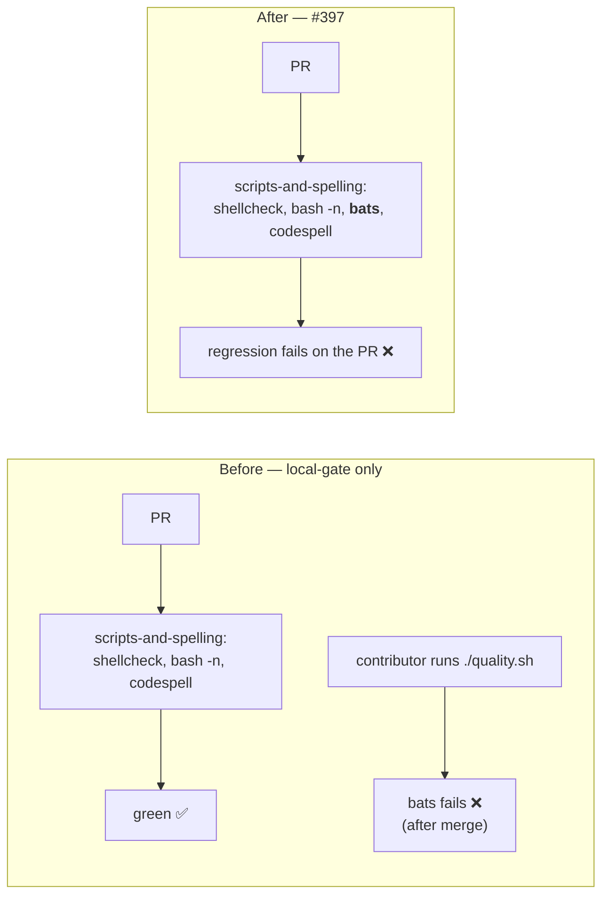

## Summary

`./quality.sh` was red at the bats stage on a clean tree: two assertions from the
Issue #375 public-safety gate fired on `tests/perf/learn_flags_wiring.ts`, whose
comments still named the private trainer's internal scripts. Reworded those four
comments to concept level in the style #382 used elsewhere in the same file, and
closed the CI gap that let the regression land green. Closes #397.

Two changes:

1. **`tests/perf/learn_flags_wiring.ts`** — four comments reworded to concept
   level ("the shared memory-budget helper", "the learn launcher script"), so no
   private internal script path is published. The tests themselves are unchanged;
   only prose moved.
2. **`.github/workflows/ci.yml`** — the `scripts-and-spelling` job now installs
   bats and runs `bats tests/scripts`. It previously ran shellcheck, `bash -n`
   and codespell only, so the whole bats suite — including the #375 guard — was
   enforced by the local `quality.sh` gate alone. That is why the regression
   survived #382 and only surfaced on a contributor's machine. The job's
   `timeout-minutes: 15` comment already claimed "shellcheck + bats + codespell";
   the step is now really there. No bats test compiles Rust, so the job stays
   fast.



## Evidence

Backend/CLI and CI-config change — no web interface to screenshot. Evidence is
the gate output before and after.

**Before** (clean tree, `bats tests/scripts/perf_private_repo_reference.bats
tests/scripts/private_repo_reference.bats`):

```
not ok 4 perf sources name none of the private trainer's internal scripts
not ok 14 perf acceptance models reference no private internal script paths
```

Four lines in `tests/perf/learn_flags_wiring.ts` tripped the gate — the
FFI/OS-headroom constant doc comment (`:31`), the two `Mirror of …` doc comments
on `heapFloorMb` (`:57`) and `selectMaxOldSpaceSizeMb` (`:80`), and the
`learnV8HeapFlag` doc comment (`:95`). Each named a private internal script by
path; they are not reproduced here, since this summary is published from the same
public repository the gate protects.

**After** — all 15 assertions in both gate files pass:

```
1..15
ok 1 all four perf acceptance-model files exist
...
ok 4 perf sources name none of the private trainer's internal scripts
...
ok 14 perf acceptance models reference no private internal script paths
ok 15 perf acceptance models link the renamed lane (d) doc, not the old name
```

The new CI-gate tests failed first (TDD) against the unmodified workflow, then
passed once the bats step landed:

```
not ok 2 scripts-and-spelling job installs bats
not ok 3 scripts-and-spelling job runs the bats suite over tests/scripts
not ok 4 the bats step is named so a failure is attributable
not ok 5 the bats step does not swallow a failing suite
```

`actionlint` passes against the modified workflow
(`tests/scripts/actionlint_workflow.bats::actionlint passes against the current
workflows on disk`), and `deno test tests/perf/learn_flags_wiring_test.ts`
reports `13 passed | 0 failed` — the reworded comments changed no behaviour.

## Test Plan

- **New** `tests/scripts/ci_bats_gate.bats` (5 assertions) — parses the committed
  `ci.yml` and asserts the observable job contract: `scripts-and-spelling`
  installs bats, runs `bats tests/scripts`, names that step so a failure is
  attributable, and does not swallow a failing suite via `|| true` or
  `continue-on-error`. All four substantive assertions fail against the
  pre-change workflow.
- **Existing, now green** `tests/scripts/perf_private_repo_reference.bats::perf
  sources name none of the private trainer's internal scripts` and
  `tests/scripts/private_repo_reference.bats::perf acceptance models reference no
  private internal script paths` — the two regression assertions named in the
  issue. No existing test was modified or removed.
- Full `bats tests/scripts` suite green; `./quality.sh` green.
