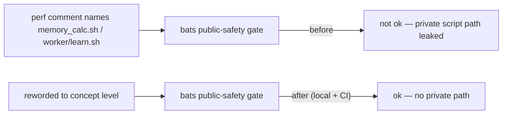

# PR Summary — Issue #397

## Summary

`./quality.sh` failed at the bats stage because `tests/perf/learn_flags_wiring.ts`
still named the private trainer's internal scripts (`memory_calc.sh`,
`worker/learn.sh`) in four comments — the four the Issue #375 reword (#382)
missed. Two public-safety gate assertions were red:

- `perf sources name none of the private trainer's internal scripts`
- `perf acceptance models reference no private internal script paths`

Reworded the four comments to concept level in the same style #382 used
elsewhere in the file ("the memory-sizing helper", "the learn launcher script"),
so no private internal script path is named. The tests themselves are
unchanged — only prose moves to concept level.

Also added a bats step to the `scripts-and-spelling` CI job so this class of
public-safety regression fails on the PR rather than only on a contributor's
local gate (the job's own timeout comment already anticipated
"shellcheck + bats + codespell").

Closes #397.

## Evidence

Backend/CLI change — no web interface to screenshot. Verified via the existing
bats public-safety gates.

Before (gates red):

```
not ok 4 perf sources name none of the private trainer's internal scripts
not ok 14 perf acceptance models reference no private internal script paths
```

After (gates green), and `./quality.sh` passes cleanly end-to-end:

```
✅ All quality checks passed!
```



## Test Plan

- `bats tests/scripts/perf_private_repo_reference.bats` — assertion "perf
  sources name none of the private trainer's internal scripts" now passes.
- `bats tests/scripts/private_repo_reference.bats` — assertion "perf acceptance
  models reference no private internal script paths" now passes.
- `bats tests/scripts` — full suite green (no `not ok`).
- `./quality.sh < /dev/null` — passes cleanly.
- `actionlint .github/workflows/ci.yml` — no findings for the added bats step.
