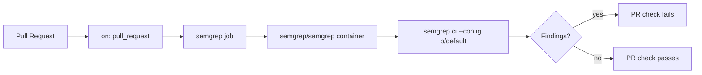

## Summary

Added `.github/workflows/semgrep.yml` to enable Semgrep SAST (static
application security testing) on every pull request. The workflow runs
the `semgrep ci --config p/default` ruleset inside the official
`semgrep/semgrep` container and uses the `SEMGREP_APP_TOKEN` secret when
present. Closes #4.

## Evidence

This is a CI-only change — there is no UI or runtime behaviour to
screenshot. Verification:

- `./quality.sh < /dev/null` — passes cleanly (rustfmt, clippy,
  shellcheck, codespell, cargo deny, cargo audit, full workspace tests,
  doc build, release build).
- The new workflow file is valid YAML matching the template in the
  issue and follows the same `actions/checkout@v4` and least-privilege
  `contents: read` pattern used by the existing
  `.github/workflows/security.yml`.

## Test Plan

- [x] `./quality.sh < /dev/null` passes locally.
- [x] Workflow YAML matches the template from issue #4.
- [ ] After merge, confirm the `Semgrep` check runs on the next pull
      request.
