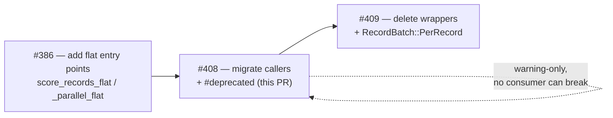
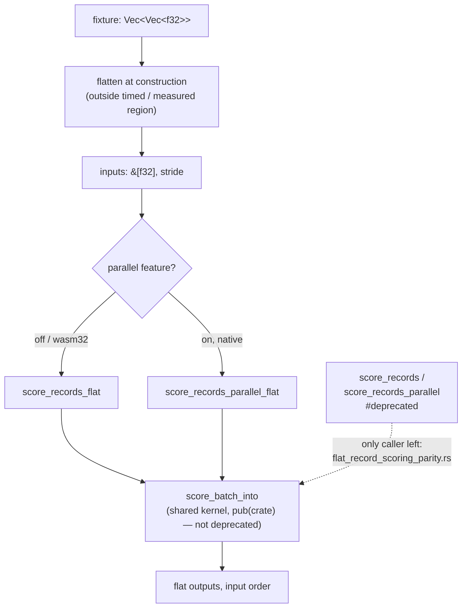

# Migrate remaining callers to the flat scoring entry points, deprecate the per-record ones

## Summary

Phase 2 of the flat-slice migration started by #386: every remaining in-repo
caller of the per-record `&[Vec<f32>]` scoring API now uses the flat entry
points, and the old wrappers are marked `#[deprecated]`. Warning-only by design
— nothing is deleted, so no consumer can break. Removal is tracked separately by
Issue #409 and deliberately does **not** land here. Closes #408.

What changed:

1. **Deprecation** — `CompiledNetwork::score_records` and **both** `cfg` arms of
   `CompiledNetwork::score_records_parallel` carry
   `#[deprecated(since = "0.2.28", note = "use score_records_flat / score_records_parallel_flat (Issue #386)")]`.
   The sequential fallback arm now drives the shared `score_batch_alloc` helper
   directly instead of calling `score_records`, so it needs no
   `allow(deprecated)` of its own.
2. **Callers migrated** to `score_records_flat` / `score_records_parallel_flat`,
   with each fixture flattened into the contiguous `record * stride` layout at
   construction time (outside any measured or timed region):

   | File | Sites |
   |---|---|
   | `neat-core/benches/hot_paths.rs` | `scoring` group |
   | `neat-core/benches/parallel_scoring.rs` | `score_in_pool` (missed by the issue's ground-truth table) |
   | `neat-core/tests/parallel_scoring.rs` | 11 sites (missed by the issue's ground-truth table) |
   | `neat-core/tests/bench_fixtures.rs` | production-batch smoke test |
   | `neat-core/tests/score_squash_simd_parity.rs` | `assert_parity` |
   | `neat-core/tests/interleaved_scoring_parity.rs` | 3 sites |
   | `neat-core/tests/scoring_allocations.rs` | 2 sites |

3. **Parity test kept on both APIs** — `flat_record_scoring_parity.rs` exists
   precisely to compare the two layouts, so its three oracle call sites carry
   `#[allow(deprecated)]` with a comment naming the deletion issue (#409). These
   are the only `allow(deprecated)` sites in the tree.
4. **Version + docs** — workspace version `0.2.27 → 0.2.28` (patch: deprecation
   is non-breaking under `RELEASING.md`), and the deprecation is noted in the
   `parallel_scoring` module docs and `README.md`. There is no `CHANGELOG.md` in
   this repo — the `v<version>` GitHub release cut by `release.yml` is the
   release note, so the version bump plus the README/module-doc note is how the
   project normally records this.

### Bench-group note

`hot_paths` carried two groups measuring the same shard: `scoring` (per-record
input) and `scoring_flat` (flat input), added by #386 as a deliberate A/B of the
two input layouts. With the per-record entry point deprecated there is no second
layout left to compare against, so migrating `scoring` would have made the two
groups byte-for-byte identical. The long-running `scoring/production/*` baseline
series in `benches/BASELINE.md` is kept and now drives `score_records_flat`; the
redundant `scoring_flat` group is retired. `benches/README.md` and the group's
doc comment both say so.

## Evidence

Backend/library change with no web interface, so no screenshot applies. The
evidence is the compiler: CI builds with `RUSTFLAGS="-D warnings"`, which turns
`deprecated` into a hard error, so a missed caller fails the build rather than
sliding through. `./quality.sh` is green, including
`cargo clippy --workspace --all-targets --all-features -- -D warnings` and the
same lint run under the **default** feature set (which is what compiles the
`cfg(not(parallel))` fallback arm).

```
🔧 Running linter...
    Finished `dev` profile
✅ Running type checks...
🧪 Running tests...
📖 Building documentation...
🏗️ Building release...
✅ All quality checks passed!
```

Migrated suites, all green and with unchanged expected values:

```
test result: ok. 15 passed  (bench_fixtures)
test result: ok.  8 passed  (flat_record_scoring_parity)
test result: ok.  3 passed  (interleaved_scoring_parity)
test result: ok.  9 passed  (parallel_scoring)
test result: ok.  3 passed  (score_squash_simd_parity)
test result: ok.  1 passed  (scoring_allocations)
```

Sequential phasing agreed by the parent issue, and where this PR sits:



Call-site shape after the migration:



## Test Plan

No new behaviour is introduced, so no new tests: this is a call-site change and
the existing parity/allocation suites are the regression guard. Every expected
value and tolerance in the migrated files is unchanged — only the entry point
and the input layout differ.

Modified tests (all still asserting on observable outcomes, "what" not "how"):

- `neat-core/tests/parallel_scoring.rs` — all 9 tests now score through
  `score_records_flat` / `score_records_parallel_flat`; the independent
  per-record `activate` reference is untouched, as are `TOL`, the tail-boundary
  counts `[0,1,2,3,4,5,7,8,9,12,15,16,17,24,31,33]`, and the bit-identity
  assertion between the sequential and parallel paths. `score_records_matches_reference`
  is renamed `sequential_scoring_matches_reference` — it no longer names a
  deprecated function, and the assertion is unchanged.
- `neat-core/tests/interleaved_scoring_parity.rs` — both dispatch arms
  (interleaved fast path, aggregate per-lane fallback) and the exact
  single-record bit-identity case, across counts `[1,7,8,9,16,17]`, `TOL` 2e-3.
- `neat-core/tests/score_squash_simd_parity.rs` — `assert_parity` scores the
  flattened batch; the scalar `activate` reference and `TOL` 1e-3 are unchanged.
- `neat-core/tests/scoring_allocations.rs` — the counting-allocator regression
  now measures `score_records_flat`. Records are flattened in
  `build_flat_records` *before* the measured window, so the flattening cost is
  not counted; the `delta < 50` assertion is unchanged and still fails loudly if
  per-record output allocation returns.
- `neat-core/tests/bench_fixtures.rs` —
  `score_records_on_production_batch_yields_finite_ordered_outputs` scores the
  flat buffer; the flat-length and finiteness assertions are unchanged.
- `neat-core/tests/flat_record_scoring_parity.rs` — **unchanged assertions**;
  only `#[allow(deprecated)]` plus comments naming #409 were added. This suite
  is what proves the deprecated and flat paths remain bit-identical, so it is
  also the regression guard for the migration itself.
