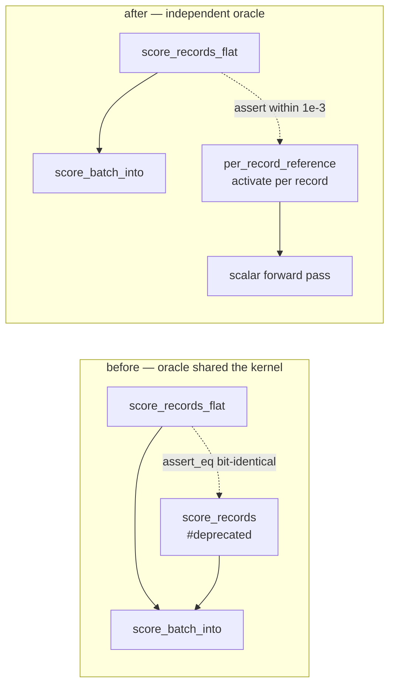

# Delete the deprecated per-record scoring wrappers (Issue #409)

## Summary

Phase 3 of the flat-slice migration (#386 → #408 → #409): deletes the deprecated
per-record scoring wrappers and the batch variant only they used, and re-points
the parity test onto an independent oracle. **Closes #409.**

- **Removed** `CompiledNetwork::score_records` and
  `CompiledNetwork::score_records_parallel` — **both** `cfg` arms of the parallel
  wrapper (the `parallel`-on native arm and the off/`wasm32` sequential
  fallback), so nothing survives on either target.
- **Removed** `RecordBatch::PerRecord`. With only the flat layout left, the enum
  collapses to a `pub(crate) struct RecordBatch { inputs, stride }`; `len()` and
  `record()` lose their one-arm matches. The `flat()` fail-loud constructor
  (Issue #3234) is unchanged.
- **Kept** `pub(crate) score_batch_into` — the shared implementation the flat
  paths drive — and the `_flat` public API.
- **Version** bumped `0.2.28 → 0.3.0` (breaking removal of public items, per
  `RELEASING.md`), with the conventional-commit `!` marker so the CI
  `version-gate` sees the breaking signal. README and the `parallel_scoring`
  module docs now record the removal and the migration (flatten once, call the
  `_flat` entry points).

### Precondition check (task 1)

| Check | Result |
|---|---|
| Wrappers carried `#[deprecated]` (from #408) | yes, both arms |
| In-repo callers outside `flat_record_scoring_parity.rs` | **0** |
| `gh search code` hits in NEAT-AI-scorer, NEAT-AI, NEAT-AI-Discovery, NEAT-AI-Examples, NEAT-AI-Explore | **0** source hits (only two historical doc mentions in NEAT-AI-scorer) |
| `#[allow(deprecated)]` left in the tree for these functions | **0** |

### Parity-test oracle

Deleting the per-record path deleted the parity test's oracle, so the test is
re-pointed rather than dropped: it now builds its own per-record reference from
the scalar forward pass (`CompiledNetwork::activate`), in the style of the
independent reference in `score_squash_simd_parity.rs`. Each record is scored on
its own — padded with zeros for a stride narrower than the network's input arity
— and the flat batch output is compared element-wise.

The comparison is now within `TOL = 1e-3` rather than bit-for-bit: the old
assertion compared two entry points that shared one kernel, whereas the scalar
reference re-associates nothing and does not use the vectorised squash, so the
documented SIMD tolerance applies (same constant and rationale as
`score_squash_simd_parity.rs`). Records are deliberately distinct, so a lane or
stride slip is an O(1) error and still trips the assertion.



## Evidence

Backend/library change with no web interface, so no screenshot applies. Verified
by the local quality gate and by building both feature arms and the `wasm32`
target.

```text
$ ./quality.sh < /dev/null
…
🧪 Running tests...
test result: ok. 196 passed; 0 failed   (lib)
… all integration suites ok, 0 failed
📖 Building documentation...  Finished
🏗️ Building release...        Finished
✅ All quality checks passed!
```

Acceptance checks run explicitly:

| Command | Result |
|---|---|
| `cargo clippy --workspace --all-targets --all-features -- -D warnings` | clean |
| `cargo clippy --workspace --all-targets -- -D warnings` (parallel off) | clean |
| `cargo test --workspace --lib --tests --all-features` | all suites pass |
| `cargo test --workspace --lib --tests` (parallel off) | all suites pass |
| `cargo check --lib --target wasm32-unknown-unknown` | clean |
| `cargo check --lib --target wasm32-unknown-unknown --features parallel` | clean (both removed `cfg` arms gone) |
| `RUSTDOCFLAGS="-D warnings" cargo doc` | clean — no dangling intra-doc links to the removed API |

`neat-core/benches/BASELINE.md`'s wasm32 reproduction recipe (Issue #288) called
`score_records`; its snippet now flattens the fixture records once and calls
`score_records_flat`, so the documented recipe still compiles. The Criterion
group name `score_records/<label>` in `benches/parallel_scoring.rs` is unchanged
so the committed baselines stay comparable.

## Test Plan

Modified — `neat-core/tests/flat_record_scoring_parity.rs` (8 tests, all
passing):

- `per_record_reference` (new helper) — independent scalar oracle, shares no code
  with the batched scoring path.
- `flat_input_matches_per_record_on_the_interleaved_arm` and
  `…_on_the_aggregate_squash_arm` — both dispatch arms, record counts 0/1/7/8/9/12
  across the 8-record SIMD group boundary, now asserted against the reference.
- `flat_input_matches_per_record_at_production_shard_width` — 259 production-width
  records, re-pointed onto the reference.
- `flat_input_zero_fills_a_stride_narrower_than_the_network` — **coverage kept**:
  9 records of width 5 through a 12-input network, compared against the reference
  scoring each short record on its own.
- `flat_input_into_writes_the_same_buffer_as_the_allocating_entry_point` —
  **coverage kept**, unchanged.
- `parallel_flat_input_matches_the_sequential_flat_path`,
  `flat_input_rejects_a_zero_stride`, `flat_input_rejects_a_ragged_buffer` —
  unchanged.

No tests were removed or commented out. No test references the deleted API.
