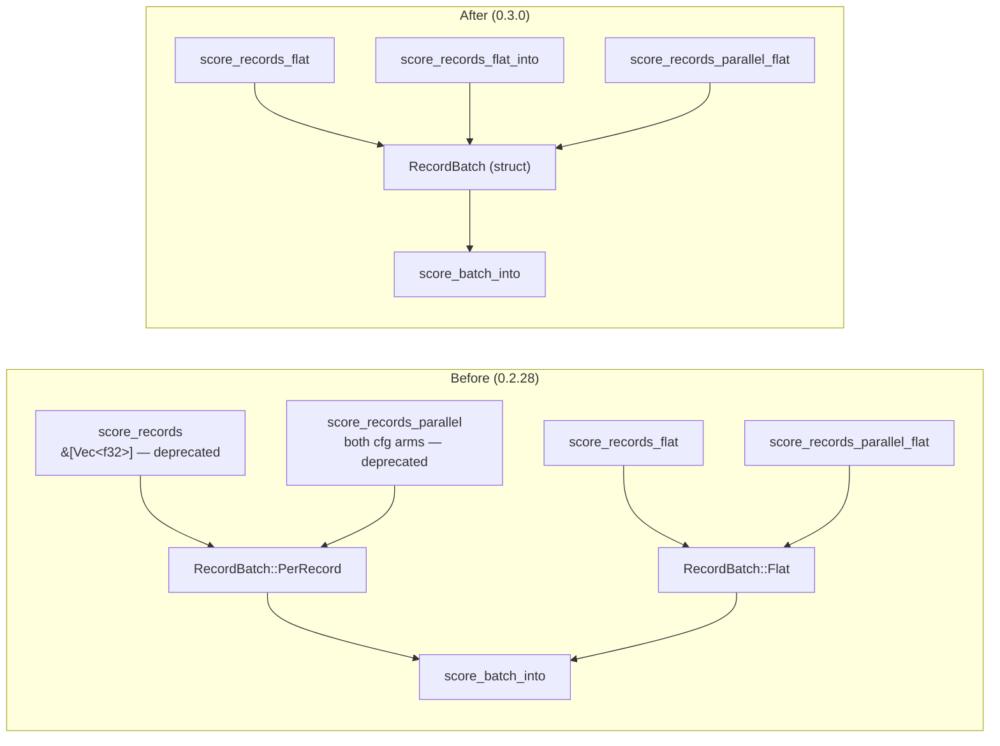

# Delete the deprecated per-record scoring wrappers and `RecordBatch::PerRecord`

## Summary

Phase 3 of the flat-slice migration started by #386 and prepared by #408.
`CompiledNetwork::score_records` and **both** `cfg` arms of
`CompiledNetwork::score_records_parallel` are removed, along with the
`RecordBatch::PerRecord` variant that only they constructed. The flat entry
points (`score_records_flat`, `score_records_flat_into`,
`score_records_parallel_flat`) are now the whole scoring API. Closes #409.

This is a **breaking change**: the workspace version moves `0.2.28 → 0.3.0`
(major-equivalent pre-1.0, per `RELEASING.md`), the commit carries a
`refactor(scoring)!:` marker plus a `BREAKING CHANGE:` footer, and the removal is
recorded in `README.md` and the `parallel_scoring` module docs.

### What changed

1. **Wrappers deleted** — `score_records` (`parallel_scoring.rs`), the rayon
   `score_records_parallel`, and its sequential/`wasm32` fallback arm. Both
   `cfg` arms are gone, so the `wasm32` and feature-off builds lose the API too.
2. **`RecordBatch` collapsed** — with `PerRecord` gone, `Flat` was the only
   variant left, so the `pub(crate)` enum becomes a plain struct and its two
   `match`es become direct field reads. `RecordBatch::flat` keeps its fail-loud
   stride/length assertions unchanged.
3. **`score_batch_into` untouched** — it stays `pub(crate)` and remains the
   shared implementation the flat paths (and the fused MSE loss lane) drive.
4. **Parity test re-pointed** — see below.
5. **Docs** — `README.md`, the `parallel_scoring` module header, and the
   `BASELINE.md` wasm32 anchor recipe (a copy-pasteable scratch crate that would
   no longer compile) now use the flat API. Historical benchmark prose in
   `BASELINE.md` is left as the record of what was measured at the time.

## Evidence

Backend/library change — no web interface to screenshot. Verified by the test
suite and the acceptance matrix below.

### Precondition (task 1)

Confirmed before deleting anything:

| Check                                                          | Result |
|----------------------------------------------------------------|--------|
| Wrappers carried `#[deprecated(since = "0.2.28")]` (from #408)  | yes    |
| In-repo callers outside `flat_record_scoring_parity.rs`         | **0**  |
| Code hits across NEAT-AI-scorer, NEAT-AI, NEAT-AI-Discovery, NEAT-AI-Examples, NEAT-AI-Explore (`gh search code`) | **0** — only two prose mentions in NEAT-AI-scorer's `CHANGELOG.md` / an archived PR summary, both recording the migration |

### Acceptance matrix

Every arm run locally with `RUSTFLAGS="-D warnings"`:

| Command                                                                   | Result |
|---------------------------------------------------------------------------|--------|
| `./quality.sh` (all features)                                             | ✅ `All quality checks passed!` |
| `cargo test --workspace --lib --tests --features parallel`                | ✅ exit 0, 35 suites ok |
| `cargo test --workspace --lib --tests --no-default-features`              | ✅ exit 0, 35 suites ok |
| `cargo check -p neat-core --target wasm32-unknown-unknown`                | ✅ |
| `cargo check -p neat-core --target wasm32-unknown-unknown --features parallel` | ✅ |
| `grep -rn "allow(deprecated)"` over the tree                              | ✅ no hits |

The two `wasm32` checks are what prove **both** `cfg` arms of the parallel
wrapper are gone: the feature-off/`wasm32` fallback arm compiles only on that
target, so a leftover would have failed there even with the native build green.

## Test Plan

`neat-core/tests/flat_record_scoring_parity.rs` was the only file calling the
deleted API — it compared `score_records_flat` against `score_records` as its
oracle. Deleting the per-record path deletes that oracle, so the file is
**re-pointed rather than dropped**: a new `reference()` helper scores each
record on its own through the scalar single-record forward pass
(`CompiledNetwork::activate`), in the style of the existing independent
reference in `score_squash_simd_parity.rs`, and pads each record out to the
network's input arity so the zero-fill contract is checked against an explicit
oracle rather than buffer residue.

Because the reference is now independent of the scoring path, parity is asserted
within `TOL = 2e-3` instead of bit-for-bit — the batched kernel re-associates its
weighted sums and squashes whole lanes at once (#230 / #243), which the scalar
path does not. That is the same bound `interleaved_scoring_parity.rs` uses for
the identical scalar-vs-batched comparison; a real stride or lane bug is an O(1)
error and still trips it.

Coverage is unchanged — all eight tests kept, none commented out or removed:

| Test | Coverage retained |
|------|-------------------|
| `flat_input_matches_per_record_on_the_interleaved_arm` | counts 0/1/7/8/9/12 vs per-record reference, all-standard-squash dispatch |
| `flat_input_matches_per_record_on_the_aggregate_squash_arm` | same counts, aggregate per-lane dispatch |
| `flat_input_matches_per_record_at_production_shard_width` | 259-record production-width shard |
| `flat_input_zero_fills_a_stride_narrower_than_the_network` | short-record zero-fill (issue's `:182` case) |
| `flat_input_into_writes_the_same_buffer_as_the_allocating_entry_point` | `_into` case (issue's `:193` case) |
| `parallel_flat_input_matches_the_sequential_flat_path` | parallel/sequential determinism |
| `flat_input_rejects_a_zero_stride` / `flat_input_rejects_a_ragged_buffer` | fail-loud malformed-batch panics (#3234) |

The re-pointed test was run green **against the un-deleted code first**, so the
new oracle is verified to agree with the old one before the wrappers were
removed — the reference is a real check, not one tuned to whatever the code now
produces.

## Security self-check

- No new external input, dependency, endpoint, or serialisation surface — this
  is a deletion plus a `pub(crate)` enum→struct collapse.
- `RecordBatch::flat`'s validation (non-zero stride, whole number of records)
  is preserved verbatim, so a malformed batch still fails loud rather than
  mis-slicing.
- No hidden files staged; no secrets touched.
