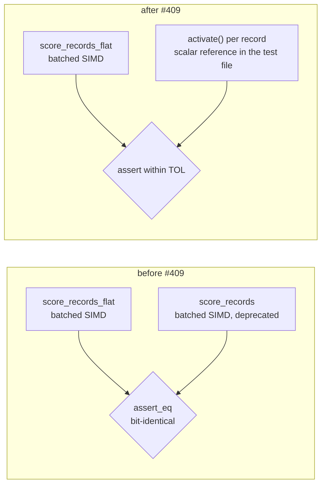

# Delete the deprecated per-record scoring wrappers and `RecordBatch::PerRecord`

## Summary

Phase 3 of the flat-slice scoring migration (#386 → #408 → #409). The
per-record `&[Vec<f32>]` scoring entry points, deprecated in `0.2.28` by #408,
are now **deleted**, along with the batch variant only they constructed.
Closes #409.

Removed:

- `CompiledNetwork::score_records`
- `CompiledNetwork::score_records_parallel` — **both** `cfg` arms (the
  `parallel`-on native arm and the `parallel`-off / `wasm32` sequential
  fallback), so no arm survives on any target.
- `RecordBatch::PerRecord`, its doc bullet and its two match arms.

Kept, as the issue requires: `score_batch_into` (`pub(crate)`) — the shared
implementation the flat paths drive — and the `_flat` public surface
(`score_records_flat`, `score_records_flat_into`,
`score_records_parallel_flat`).

`RecordBatch` had one variant left, so its `match`es in `len()` / `record()`
were dead weight; it collapses to a plain struct with the same `flat()`
constructor, so every call site is unchanged. The doc comments that described
"either layout" — the module header, `score_batch_into`, `score_records_flat`
and `score_records_parallel_flat` — were re-pointed at the single remaining
layout, and `score_records_flat` absorbed the batched-SIMD description that
used to live on `score_records`.

**Breaking change**: workspace version `0.2.28 → 0.3.0` (pre-1.0, a breaking
change is the major-equivalent minor bump — see `RELEASING.md`). The commit
carries a `refactor!:` subject marker and a `BREAKING CHANGE:` footer so
`scripts/detect-breaking.sh` signals the `version-gate` job. The repo keeps no
`CHANGELOG.md`; the removal is recorded in `README.md`, in the module docs, in
the `Cargo.toml` version comment, and in this archived summary.

### Precondition check (task 1)

- No in-repo caller outside `flat_record_scoring_parity.rs` — confirmed by
  `grep` over `neat-core/src`, `neat-core/tests` and `neat-core/benches`.
- Zero code hits across the consuming repos (GitHub code search): NEAT-AI,
  NEAT-AI-Discovery, NEAT-AI-Examples, NEAT-AI-Explore all `total_count=0`.
  NEAT-AI-scorer returns 2 hits, both **documentation only**
  (`CHANGELOG.md`, `docs/archive/pr-summaries/pr-summary-470.md`) — no Rust
  source.

## Evidence

Backend/library change with no web interface, so there is no screenshot;
verification is the compiler and the test suite.

### The parity oracle moved, it did not disappear

`flat_record_scoring_parity.rs` used to compare `score_records_flat` against
`score_records` — deleting the per-record path would have deleted its oracle.
It is now re-pointed at an **independent** per-record reference written in the
test file, in the style of `score_squash_simd_parity.rs`: each record is scored
on its own through the scalar `CompiledNetwork::activate` forward pass and the
results flattened to the `[record * num_outputs]` layout.



Because the reference is now genuinely independent — scalar `activate` rather
than the same batched kernel — the comparison is a tolerance check
(`TOL = 1e-3`) rather than bit-equality, matching the documented SIMD numerics
in `crate::batch_scoring` (re-associated weighted sums plus the vectorised
squash approximations). `1e-3` sits far below any scoring-decision threshold
while a genuine lane or stride bug — an O(1) error — still trips it. This is
the same tolerance and rationale `score_squash_simd_parity.rs` already uses.

Coverage is preserved: the boundary record counts (0, 1, 7, 8, 9, 12), both
dispatch arms (interleaved fast path and aggregate-squash per-lane fallback),
the production-width shard, the short-record zero-fill case and the `_into`
case all still assert. No `#[allow(deprecated)]` remains anywhere in the tree.

### Acceptance criteria

| Criterion | Result |
| --- | --- |
| `./quality.sh` green | ✅ `All quality checks passed!` (fmt, clippy `-D warnings`, `cargo check`, full test suite `--all-features`, `cargo doc -D warnings`, release build, cargo-deny, bats, markdownlint, Mermaid) |
| `parallel` feature **off** | ✅ `cargo clippy --workspace --all-targets -- -D warnings` |
| `parallel` feature **on** | ✅ `cargo clippy --workspace --all-targets --features parallel -- -D warnings` |
| `wasm32` target, both arms | ✅ `cargo clippy -p neat-core --target wasm32-unknown-unknown --lib` with and without `--features parallel` |
| Parity test has no reference to the deleted API | ✅ `grep` for `score_records(` and `allow(deprecated)` in the test file returns nothing |

The `wasm32` runs matter specifically because `score_records_parallel` had a
`#[cfg(not(all(feature = "parallel", not(target_arch = "wasm32"))))]` fallback
arm that a native-only build would never compile — both arms are gone, and both
targets confirm it.

`cargo doc` with `RUSTDOCFLAGS="-D warnings"` is the extra guard that no
intra-doc link still points at a deleted method.

Also updated: the wasm32 scoring-anchor reproduction recipe in
`neat-core/benches/BASELINE.md`, which embedded a `score_records` call and
would no longer have compiled. It now packs the fixture records into one flat
buffer and calls `score_records_flat`. The historical benchmark narrative in
that file (and the `score_records/<label>` Criterion group name in
`benches/parallel_scoring.rs`) is left alone — those are records of past runs
and a bench label, not API references.

## Test Plan

No new test file; the existing parity guard was re-pointed rather than dropped,
which is the substance of the change.

Modified — `neat-core/tests/flat_record_scoring_parity.rs`:

- `reference()` (new) — independent per-record scalar oracle via
  `CompiledNetwork::activate`, replacing the deleted `score_records` oracle.
- `assert_close()` (new) — per-element tolerance assertion with the failing
  index, actual and expected values in the message.
- `flat_input_matches_per_record_on_the_interleaved_arm` — now vs the scalar
  reference; still covers counts 0/1/7/8/9/12 on the all-Tanh (no aggregate)
  interleaved dispatch arm.
- `flat_input_matches_per_record_on_the_aggregate_squash_arm` — same, on the
  Maximum network that forces the per-lane fallback arm.
- `flat_input_matches_per_record_at_production_shard_width` — 259 records at
  production input width, vs the scalar reference; `#[allow(deprecated)]`
  dropped.
- `flat_input_zero_fills_a_stride_narrower_than_the_network` — a stride of 5
  against a 12-input network still asserts the uncovered inputs are zero-filled,
  now against the scalar reference; `#[allow(deprecated)]` dropped.

Unchanged and still passing: `flat_input_into_writes_the_same_buffer_as_the_allocating_entry_point`,
`parallel_flat_input_matches_the_sequential_flat_path`,
`flat_input_rejects_a_zero_stride`, `flat_input_rejects_a_ragged_buffer`.

```text
running 8 tests
test flat_input_into_writes_the_same_buffer_as_the_allocating_entry_point ... ok
test flat_input_matches_per_record_on_the_aggregate_squash_arm ... ok
test flat_input_matches_per_record_on_the_interleaved_arm ... ok
test flat_input_rejects_a_zero_stride - should panic ... ok
test flat_input_rejects_a_ragged_buffer - should panic ... ok
test flat_input_zero_fills_a_stride_narrower_than_the_network ... ok
test parallel_flat_input_matches_the_sequential_flat_path ... ok
test flat_input_matches_per_record_at_production_shard_width ... ok

test result: ok. 8 passed; 0 failed; 0 ignored; 0 measured; 0 filtered out
```

The rest of the suite is unmodified and green under `--all-features`; the
deletion is verified by the compiler (nothing else referenced the removed
symbols) plus the full `./quality.sh` run above.

## Security self-check

- No new external input surface, no new dependency, no new SQL/shell/HTTP call
  — this PR only removes public API and narrows an internal type.
- The `RecordBatch::flat` fail-loud guards (zero stride, ragged buffer) are
  unchanged and still asserted by two `#[should_panic]` tests, so a malformed
  batch still fails loudly rather than mis-slicing records (Issue #3234).
- No secrets or hidden files staged.
