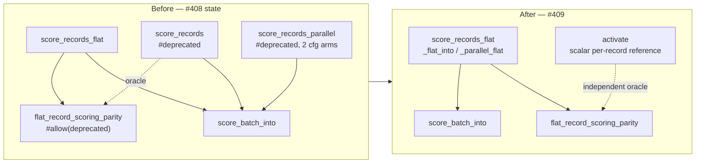

# Delete the deprecated per-record scoring wrappers and `RecordBatch::PerRecord`

## Summary

Phase 3 of the flat-slice migration (#386 → #408 → #409). Deletes the
per-record `&[Vec<f32>]` scoring wrappers deprecated by #408 and the batch
variant only they constructed, leaving the flat entry points as the single
scoring surface. Closes #409.

Removed:

- `CompiledNetwork::score_records` (`neat-core/src/parallel_scoring.rs`)
- `CompiledNetwork::score_records_parallel` — **both** `cfg` arms (the rayon
  path and the `parallel`-off / `wasm32` sequential fallback)
- `RecordBatch::PerRecord`, its doc bullet, and its two match arms

`RecordBatch` keeps its name and `flat` constructor but collapses from a
two-variant enum to a struct, so `len()` / `record()` lose their now-single-arm
matches. `score_batch_into` is untouched — it remains the `pub(crate)` shared
implementation the flat paths drive.

The workspace version is bumped **0.2.28 → 0.3.0**: removing public items is
breaking, which pre-1.0 is a minor bump per
[`RELEASING.md`](../../../RELEASING.md). The commit carries a
`refactor(scoring)!:` Conventional Commit marker and a `BREAKING CHANGE:`
footer, so `scripts/detect-breaking.sh` reports `true` and the `version-gate`
job sees the break shipping on a minor bump.

### Precondition check (task 1)

| Check | Result |
| --- | --- |
| Wrappers deprecated by #408 (`baf9023`) | yes |
| In-repo callers outside `flat_record_scoring_parity.rs` | **0** |
| `score_records` / `score_records_parallel` in NEAT-AI-scorer, NEAT-AI, NEAT-AI-Discovery, NEAT-AI-Examples, NEAT-AI-Explore code | **0** (only CHANGELOG / archived PR-summary prose in the scorer) |
| `#[allow(deprecated)]` left in the tree | **0** |

### The parity-test re-point

Deleting the per-record path deletes the oracle
`flat_record_scoring_parity.rs` compared against, so the test is re-pointed
rather than dropped — the flat path is the one that ships and still needs an
independent check. The new oracle follows the existing independent reference in
`score_squash_simd_parity.rs`: score each record on its own through the scalar
single-record forward pass (`activate`), with the activation buffer zeroed per
record so nothing carries over and a short record's uncovered inputs read as
`0.0`.

Because a scalar reference is genuinely independent of the batched SIMD path
under test, it cannot be bit-identical — the batched path re-associates the
weighted sums and uses the vectorised squash approximations. The comparison
therefore uses the same `TOL = 1e-3` tolerance and rationale as
`score_squash_simd_parity.rs`: far below any scoring-decision threshold, while
a real lane or stride bug (an O(1) error) still trips it.



## Evidence

Backend-only change — no web interface to screenshot. Verified by test runs and
the quality gate.

**Oracle bites (mutation check).** To confirm the new reference is a real
guard and not a tautology, `RecordBatch::record` was temporarily mutated to
return record `(index + 1) % len`. Five of the eight tests failed, including
the shard-scale case:

```text
production-width shard: element 0 is 0.34136853 but the per-record reference
is -0.37548274 (diff 0.71685123 exceeds 0.001)

failures:
    flat_input_matches_per_record_at_production_shard_width
    flat_input_matches_per_record_on_the_aggregate_squash_arm
    flat_input_matches_per_record_on_the_interleaved_arm
    flat_input_zero_fills_a_stride_narrower_than_the_network
    parallel_flat_input_matches_the_sequential_flat_path
```

The mutation was reverted; on the shipped tree all eight pass:

```text
running 8 tests
test flat_input_zero_fills_a_stride_narrower_than_the_network ... ok
test flat_input_into_writes_the_same_buffer_as_the_allocating_entry_point ... ok
test flat_input_matches_per_record_on_the_aggregate_squash_arm ... ok
test flat_input_matches_per_record_on_the_interleaved_arm ... ok
test flat_input_rejects_a_zero_stride - should panic ... ok
test flat_input_rejects_a_ragged_buffer - should panic ... ok
test parallel_flat_input_matches_the_sequential_flat_path ... ok
test flat_input_matches_per_record_at_production_shard_width ... ok

test result: ok. 8 passed; 0 failed
```

**All three required configurations green** (both `cfg` arms of the removed
parallel wrapper are gone, not just the native one):

| Configuration | Command | Result |
| --- | --- | --- |
| `parallel` on (all features) | `./quality.sh` | ✅ All quality checks passed |
| `parallel` off | `cargo clippy --workspace --all-targets -- -D warnings` + `cargo test --workspace --lib --tests` | ✅ |
| `wasm32`, `parallel` requested | `cargo clippy -p neat-core --target wasm32-unknown-unknown --lib --all-features -- -D warnings` | ✅ |
| `wasm32`, default features | `cargo check -p neat-core --target wasm32-unknown-unknown --lib` | ✅ |

## Test Plan

Modified `neat-core/tests/flat_record_scoring_parity.rs`. No test was removed
or commented out; the three call sites that used the deleted API now compare
against the independent reference instead, and the other five tests are
unchanged.

- `reference()` — new independent scalar per-record oracle (zeroed activation
  buffer per record).
- `assert_matches_reference()` — new tolerance comparison (`TOL = 1e-3`).
- `flat_input_matches_per_record_on_the_interleaved_arm` — re-pointed;
  all-Tanh network, record-interleaved fast path, counts 0/1/7/8/9/12.
- `flat_input_matches_per_record_on_the_aggregate_squash_arm` — re-pointed;
  Maximum network, per-lane fallback dispatch, same counts.
- `flat_input_matches_per_record_at_production_shard_width` — re-pointed;
  259 records at production input width.
- `flat_input_zero_fills_a_stride_narrower_than_the_network` — re-pointed;
  keeps its short-record (stride 5 into a 12-input network) coverage.
- `flat_input_into_writes_the_same_buffer_as_the_allocating_entry_point`,
  `parallel_flat_input_matches_the_sequential_flat_path`,
  `flat_input_rejects_a_zero_stride`, `flat_input_rejects_a_ragged_buffer` —
  unchanged (never referenced the deleted API; the first two remain exact
  equality assertions).

Documentation updated where it named the deleted API: `README.md`, the
`parallel_scoring` module docs, and the `benches/BASELINE.md` wasm32 harness
recipe (its `score_once()` snippet now uses `score_records_flat`, since the
recipe must still compile). Historical narrative in `BASELINE.md` describing
past benchmark runs is left as-is.

## Security self-check

- **Input validation** — unchanged; `RecordBatch::flat` keeps its fail-loud
  `stride > 0` and whole-number-of-records assertions (Issue #3234), still
  covered by `flat_input_rejects_a_zero_stride` /
  `flat_input_rejects_a_ragged_buffer`.
- **Secrets / injection / output encoding / auth** — not applicable; this is a
  pure API deletion in a numeric library with no new I/O.
- **Dependencies** — no dependency added; `bump-deps.sh` ran via `quality.sh`.
