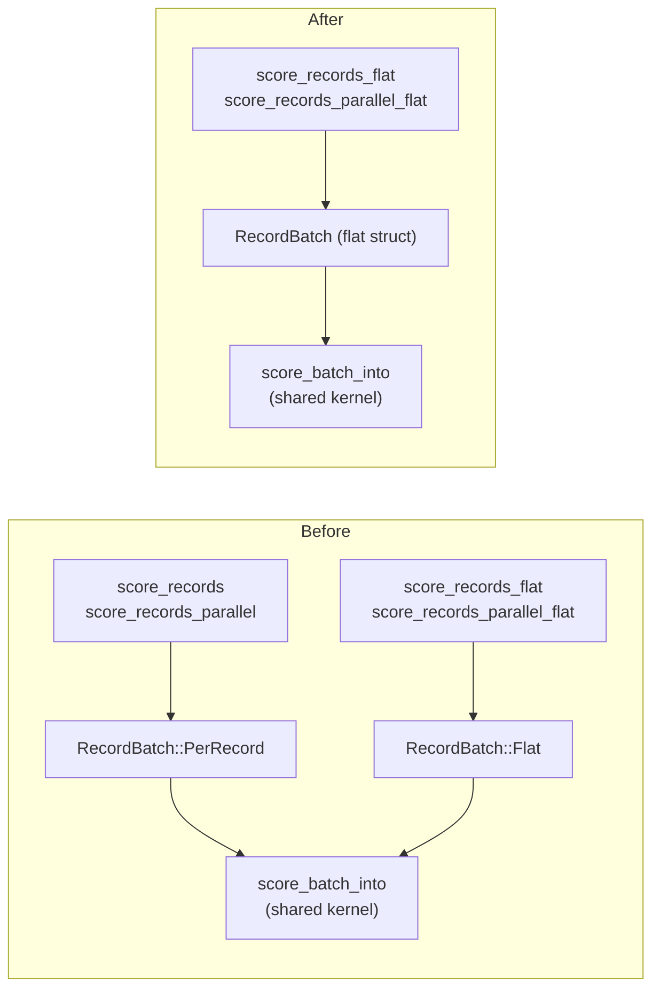

# PR Summary — Issue #409

## Summary

Phase 3 of the flat-slice record-scoring migration (#386, deprecated in #408):
delete the deprecated per-record scoring wrappers and the batch variant that
only they used. Every in-repo caller — and every sibling repo (NEAT-AI-scorer,
NEAT-AI, NEAT-AI-Discovery, NEAT-AI-Examples, NEAT-AI-Explore) — already scores
through the `_flat` entry points, so the per-record layer carries no callers
beyond the parity test.

Removed:

- `CompiledNetwork::score_records` (`neat-core/src/parallel_scoring.rs`).
- Both `cfg` arms of `CompiledNetwork::score_records_parallel` — the
  `parallel`-on native path **and** the sequential wasm/feature-off fallback, so
  neither arm survives on any target.
- `RecordBatch::PerRecord` (`neat-core/src/batch_scoring.rs`). It was the only
  variant those wrappers constructed; with it gone `RecordBatch` collapses from a
  two-variant enum to a plain struct and its per-record `match` arms in `len()`
  and `record()` become direct field access.

Kept deliberately: `score_batch_into` (`pub(crate)`) — the shared batched kernel
the flat paths drive — is untouched.

The parity test `flat_record_scoring_parity.rs` previously used the now-deleted
`score_records` as its oracle. It is re-pointed onto an **independent** scalar
per-record reference (each record scored through `CompiledNetwork::activate`,
flattened to the `[record * num_outputs]` layout), matched within the SIMD
tolerance the batched kernel introduces — the same technique as the existing
reference in `score_squash_simd_parity.rs`. The short-record zero-fill case and
the `_into` case keep their coverage, and the last `#[allow(deprecated)]` in the
tree is removed.

This is a **breaking change** (public API removal): signalled by the
`feat(scoring)!:` / `BREAKING CHANGE:` conventional-commit marker so the CI
`version-increment` job bumps the minor per `RELEASING.md`. Only the latest
neat-ai\* versions are supported; no back-compat retention is required.

Closes #409.

## Evidence

Backend/library change — no web interface to screenshot. Verified by the test
suite and by compiling every acceptance arm.

Acceptance checks run locally (all green):

- `./quality.sh` — full gate (`--all-features`, i.e. `parallel` on).
- `cargo check -p neat-core --tests` — default build, `parallel` **off**.
- `cargo check -p neat-core --features parallel --tests` — `parallel` **on**.
- `cargo build -p neat-core --target wasm32-unknown-unknown` and
  `... --features parallel` — the `wasm32` target, both cfg arms of the removed
  parallel wrapper confirmed gone.
- `grep` confirms no `#[allow(deprecated)]` and no live caller of the removed
  API remains in the tree.

## Test Plan

`neat-core/tests/flat_record_scoring_parity.rs` — re-pointed onto the
independent per-record reference; all 8 tests pass:

- `flat_input_matches_reference_on_the_interleaved_arm` — all-standard-squash
  network, record-interleaved fast path, across counts `{0,1,7,8,9,12}`.
- `flat_input_matches_reference_on_the_aggregate_squash_arm` — Maximum network,
  per-lane fallback dispatch, same counts.
- `flat_input_matches_reference_at_production_shard_width` — 259-record
  production-width shard.
- `flat_input_zero_fills_a_stride_narrower_than_the_network` — short-record
  zero-fill coverage retained.
- `flat_input_into_writes_the_same_buffer_as_the_allocating_entry_point` —
  `_into` coverage retained.
- `parallel_flat_input_matches_the_sequential_flat_path` — parallel determinism.
- `flat_input_rejects_a_zero_stride`, `flat_input_rejects_a_ragged_buffer` —
  fail-loud malformed-batch guards.
