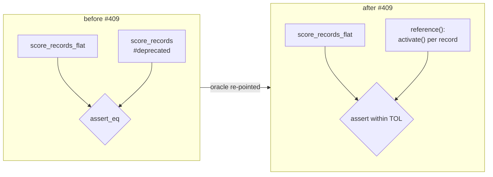

# Delete the deprecated per-record scoring wrappers (Issue #409)

## Summary

Phase 3 of the flat-slice migration (#386 → #408 → #409): the deprecated
per-record scoring entry points are gone, and the only batch layout left is the
flat one. Closes #409.

1. **Deleted** `CompiledNetwork::score_records` and **both** `cfg` arms of
   `CompiledNetwork::score_records_parallel` (the `parallel`-on native arm and
   the sequential/`wasm32` fallback) from `neat-core/src/parallel_scoring.rs`.
2. **Collapsed `RecordBatch`** (`neat-core/src/batch_scoring.rs`) from a
   two-variant enum to a plain struct holding `inputs` + `stride`. Every
   construction already went through `RecordBatch::flat`, so `len()` and
   `record()` lose their match entirely. The type is kept — the flat path still
   needs it. `score_batch_into` is untouched.
3. **Re-pointed the parity test** onto an independent per-record reference and
   dropped all three `#[allow(deprecated)]` attributes.
4. **Version + docs** — workspace version `0.2.28 → 0.3.0` (breaking: a public
   item was removed), the removal recorded in a new "Breaking changes by version"
   table in `RELEASING.md` (there is no `CHANGELOG.md` in this repo), plus
   `README.md`, the `parallel_scoring` module docs, and the reproducible wasm32
   anchor recipe in `benches/BASELINE.md` — which called `score_records` and
   would no longer compile.

### Precondition (task 1) confirmed before deleting

| Check | Result |
|-------|--------|
| Wrappers carried `#[deprecated(since = "0.2.28")]` (#408 merged as `baf9023`) | yes |
| In-repo callers outside `flat_record_scoring_parity.rs` | **0** |
| Code hits across NEAT-AI-scorer, NEAT-AI, NEAT-AI-Discovery, NEAT-AI-Examples, NEAT-AI-Explore | **0** (the two scorer hits are `CHANGELOG.md` / an archived PR summary — prose, not code) |

## Evidence

Backend/library change — no web interface to screenshot. Verified by the test
suite and by building both `cfg` arms of the removed parallel wrapper:

```
$ cargo test -p neat-core                                     # parallel off
$ cargo test -p neat-core --features parallel                 # parallel on
$ cargo check -p neat-core --target wasm32-unknown-unknown                 # wasm32, feature off
$ cargo check -p neat-core --target wasm32-unknown-unknown --all-features  # wasm32, feature on
$ ./quality.sh < /dev/null
…
✅ All quality checks passed!
```

`./quality.sh` runs `clippy --workspace --all-targets --all-features -D warnings`,
`cargo test --workspace --lib --tests --all-features`, and
`RUSTDOCFLAGS="-D warnings" cargo doc` — so a stale intra-doc link to a deleted
method would have failed the run.

The parity oracle before and after — the flat path never loses its check:



Why a tolerance rather than `assert_eq`: the batched path sums *across records*
and squashes eight lanes at a time, so it matches the scalar `activate`
reference within `f32` noise rather than bit-for-bit (Issues #230, #243) — the
same reason `score_squash_simd_parity.rs` uses `TOL = 1e-3`. Measured headroom on
the production-shard case: worst observed deviation **1.2e-7** against a
tolerance of **1e-3**, while emulating a one-record stride slip moves the worst
deviation to **1.39** — comfortably caught.

## Test Plan

`neat-core/tests/flat_record_scoring_parity.rs` (8 tests, all still asserting
flat-batch output against a per-record reference, none referencing the deleted
API):

- `flat_input_matches_per_record_on_the_interleaved_arm` — all-Tanh network
  (record-interleaved fast path), record counts `0, 1, 7, 8, 9, 12`.
- `flat_input_matches_per_record_on_the_aggregate_squash_arm` — Maximum network
  (per-lane fallback dispatch), same counts.
- `flat_input_matches_per_record_at_production_shard_width` — 259 records at
  production input width.
- `flat_input_zero_fills_a_stride_narrower_than_the_network` — **short-record
  coverage kept**: stride 5 into a 12-input network, compared against the
  reference, which zero-fills the uncovered inputs the same way.
- `flat_input_into_writes_the_same_buffer_as_the_allocating_entry_point` — the
  `_into` case, **unchanged**.
- `parallel_flat_input_matches_the_sequential_flat_path`,
  `flat_input_rejects_a_zero_stride`, `flat_input_rejects_a_ragged_buffer` —
  unchanged.

No existing test was removed or commented out; the three per-record oracle call
sites were re-pointed, which is precisely what Issue #409 asks for. The rest of
the suite (`parallel_scoring.rs`, `interleaved_scoring_parity.rs`,
`score_squash_simd_parity.rs`, `scoring_allocations.rs`, `bench_fixtures.rs`)
already drove the flat entry points after #408 and passes unchanged.

## Security self-check

- No new external input, dependency, endpoint, or secret. The removal is
  API-surface reduction only; the `RecordBatch::flat` fail-loud asserts on a zero
  or ragged stride (Issue #3234) are retained and still covered by tests.
