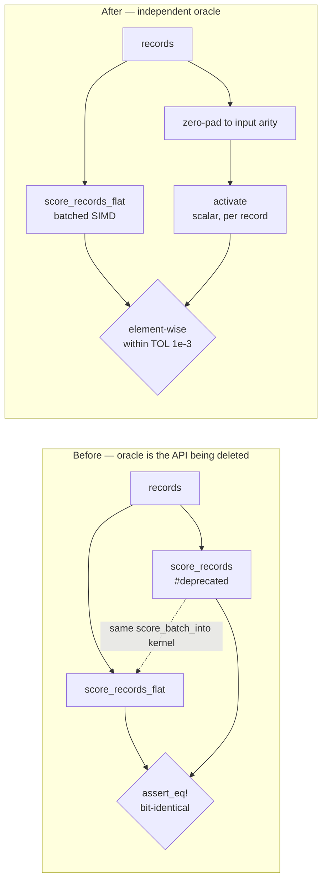

# Delete the deprecated per-record scoring wrappers and `RecordBatch::PerRecord`

## Summary

Phase 3 of the flat-slice migration (#386 → #408 → #409). The per-record
`&[Vec<f32>]` scoring wrappers, deprecated since `0.2.28`, are deleted along with
the batch variant only they constructed. Closes #409.

Removed:

- `CompiledNetwork::score_records` (`neat-core/src/parallel_scoring.rs`).
- `CompiledNetwork::score_records_parallel` — **both** `cfg` arms, the rayon one
  and the sequential/`wasm32` fallback.
- `RecordBatch::PerRecord`, its doc bullet and its two match arms.

Simplified as a consequence:

- `RecordBatch` is now a plain `struct { inputs, stride }`. With `PerRecord`
  gone it was a one-variant enum whose `len()` / `record()` matched on a single
  arm; the flat layout still needs the type, just not the enum.
- `score_batch_alloc` is inlined into `score_records_flat`, its sole remaining
  caller — it existed to be "shared by the per-record and flat-slice entry
  points" and there is now only one.

Deliberately **not** touched: `score_batch_into` (`pub(crate)`), the shared
implementation the flat paths drive.

Breaking change: the workspace version is bumped `0.2.28 → 0.3.0` (public-item
removal, major-equivalent pre-1.0 per `RELEASING.md`) and the commit carries a
Conventional Commit `!` marker plus a `BREAKING CHANGE:` footer. The removal is
recorded in a new **Breaking-change log** table in `RELEASING.md` — the table the
`v<version>` GitHub release notes point at — and in the README scoring section.

### Precondition check (task 1)

Confirmed before deleting: both wrappers carried `#[deprecated]` (landed by
#408), `flat_record_scoring_parity.rs` was the only in-repo caller, and a code
search across **NEAT-AI-scorer**, **NEAT-AI**, **NEAT-AI-Discovery**,
**NEAT-AI-Examples** and **NEAT-AI-Explore** returned **zero** Rust-source hits
for `score_records` (the two NEAT-AI-scorer hits are historical `CHANGELOG.md` /
archived-PR-summary prose, not code).

## Evidence

Backend/library change with no web interface, so there is no screenshot to
capture. Evidence is the test suite plus the three-configuration build.

### Migrating the parity oracle

`flat_record_scoring_parity.rs` compared `score_records_flat` against
`score_records`, so deleting the per-record path deletes its oracle. It is
re-pointed — not dropped — onto an independent per-record reference built in the
test file, in the style of `score_squash_simd_parity.rs`.

The reference shares no code with the batched scoring path, so a lane, stride or
offset slip in that path can no longer hide in the oracle. Two details matter:

- **Zero-padding.** `activate` copies only `min(input.len(), num_inputs)` values
  into its *reused* activation buffer, so a short record would inherit the
  previous call's values in the uncovered slots. The reference pads each record
  to the input arity first, which is exactly the flat path's documented
  zero-fill contract — this is what keeps the short-record case (`stride` 5 on a
  12-input network) a real test rather than a tautology.
- **Tolerance.** The comparison moves from `assert_eq!` to element-wise within
  `TOL = 1e-3`. The old assertion could be exact because both sides drove the
  same kernel; against a scalar reference the batched path re-associates each
  standard-squash weighted sum across records and evaluates the squash through
  `squash_x8` / `squash_x4`, so it matches scalar within a small `f32` margin
  (Issue #230). `1e-3` is the same budget `score_squash_simd_parity.rs` uses —
  far below any scoring-decision threshold, while a real lane/stride bug (an
  O(1) error) still trips it.

All `#[allow(deprecated)]` attributes and their comments are gone; `grep` for
`allow(deprecated)` across the tree returns nothing.

### Acceptance: green in all three configurations

Both `cfg` arms of the removed parallel wrapper are gone, not just the native
one — verified by building for `wasm32`, where the deleted fallback arm was the
one that compiled:

| Configuration | Command | Result |
|---|---|---|
| `parallel` **on** (all features) | `./quality.sh` | ✅ all checks passed |
| `parallel` **off** (default) | `RUSTFLAGS="-D warnings" cargo test -p neat-core --lib --tests` | ✅ 25 suites, 0 failed |
| `wasm32` | `RUSTFLAGS="-D warnings" cargo check -p neat-core --target wasm32-unknown-unknown --features parallel` | ✅ clean |

`./quality.sh` covers fmt, clippy `-D warnings` on `--all-targets --all-features`,
`cargo deny`, the full test run, `RUSTDOCFLAGS="-D warnings" cargo doc` (which is
what catches a doc link to a deleted item) and the release build.

### Documentation kept honest

`benches/BASELINE.md`'s wasm32 scoring anchor (Issue #288) is a
copy-paste-to-reproduce harness that called `score_records`; it is updated to
hold one flat buffer and call `score_records_flat`, so the recipe still compiles.
The historical baseline prose and the `score_records/{label}` Criterion group
name are left alone — renaming the group would orphan every committed baseline.

## Test Plan

`neat-core/tests/flat_record_scoring_parity.rs` — re-pointed, not reduced. All 8
tests pass:

- `flat_input_matches_per_record_on_the_interleaved_arm` — all-Tanh network
  (record-interleaved fast path), counts `0, 1, 7, 8, 9, 12` straddling the
  8-record SIMD group boundary, now vs the independent reference.
- `flat_input_matches_per_record_on_the_aggregate_squash_arm` — same counts on a
  `Maximum` network (per-lane fallback dispatch).
- `flat_input_matches_per_record_at_production_shard_width` — 259 records at
  production width (2,461 inputs), spanning many full groups plus a scalar tail.
- `flat_input_zero_fills_a_stride_narrower_than_the_network` — **coverage
  retained**: `stride` 5 on a 12-input network, against the explicitly
  zero-padded reference.
- `flat_input_into_writes_the_same_buffer_as_the_allocating_entry_point` —
  **coverage retained and strengthened**: still asserts `_into` equals the
  allocating entry point, and now also checks both against the reference.
- `parallel_flat_input_matches_the_sequential_flat_path`,
  `flat_input_rejects_a_zero_stride`, `flat_input_rejects_a_ragged_buffer` —
  unchanged.

No test was commented out, weakened or removed. The oracle change is the
documented business-logic change: `assert_eq!` against a same-kernel path becomes
an element-wise `1e-3` comparison against an independent scalar path — a
genuinely stronger check, since the previous assertion could not have failed on a
bug common to both sides.

Regression linkage: the new reference was run against the **unmodified** tree
first (all 8 tests green) before the wrappers were deleted, so the oracle swap is
proven not to have moved the goalposts.

The rest of the suite is unchanged and green, including
`scoring_allocations.rs`, `evaluate_mse_allocations.rs` and
`wasm_dataset_offload.rs`, which exercise `score_batch_into` through the flat
paths.

### Security self-check

Backend refactor that deletes public API and adds no new input surface. No new
dependency, no new I/O, no secrets or hidden files staged. The `RecordBatch::flat`
constructor keeps its fail-loud asserts on a zero or non-dividing `stride`
(Issue #3234), covered by the two `should_panic` tests, so a malformed batch
still panics rather than mis-slicing every record.
