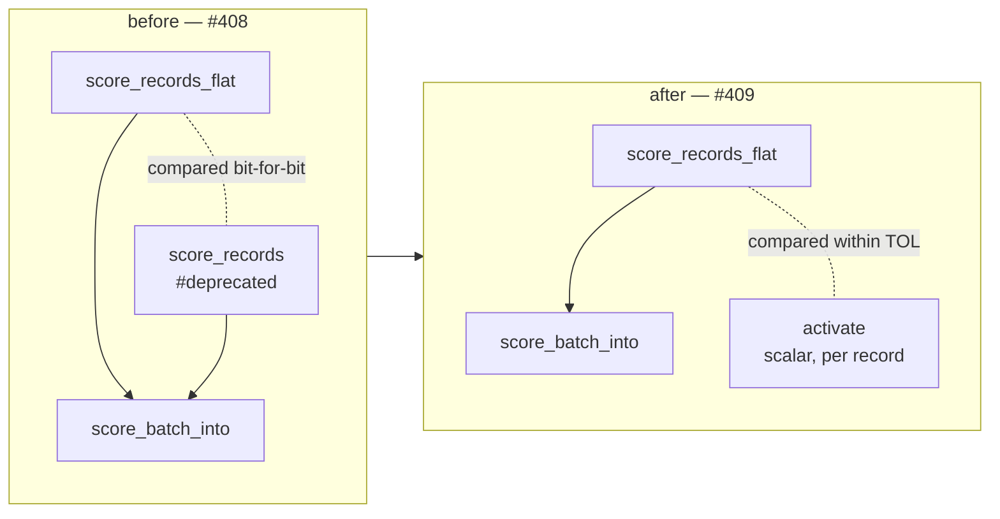

# Delete the deprecated per-record scoring wrappers and `RecordBatch::PerRecord`

## Summary

Phase 3 of the flat-slice migration started by #386. Deletes the per-record
scoring entry points deprecated by #408, the batch variant only they
constructed, and the deprecation scaffolding around them. Closes #409.

**Removed (breaking):**

- `CompiledNetwork::score_records`
- `CompiledNetwork::score_records_parallel` — **both** `cfg` arms: the rayon
  path and the sequential/`wasm32` fallback
- `RecordBatch::PerRecord` (`pub(crate)`), its doc bullet and its two match arms

`score_batch_into` is untouched — it is `pub(crate)` and remains the shared
implementation the flat paths drive.

**Simplifications the removal made trivial:**

- `RecordBatch` had one variant left, so it collapses from an enum to a
  `pub(crate) struct { inputs, stride }`. The `RecordBatch::flat(inputs, stride)`
  constructor keeps its name, so every call site is unchanged, and `len()` /
  `record()` lose their one-arm matches.
- `score_batch_alloc` had one caller left (`score_records_flat`) once
  `score_records` went, so it is inlined there.

**Version:** `0.2.28` → `0.3.0`. Pre-1.0, removing a public item is a
major-equivalent (minor) bump per `RELEASING.md`. The commit carries a
`feat(scoring)!:` Conventional Commit marker and a `BREAKING CHANGE:` footer, so
the `version-increment` job sees the breaking signal and `version-gate` passes.
A new **Breaking-change log** section in `RELEASING.md` records the removal with
a before/after migration snippet.

## Precondition (task 1)

Verified before deleting anything:

- Both wrappers carried `#[deprecated(since = "0.2.28", …)]` from #408.
- The only in-repo caller was `neat-core/tests/flat_record_scoring_parity.rs`,
  and the only `RecordBatch::PerRecord` constructors were inside the wrappers
  themselves.
- Zero hits across the consumers. GitHub code search for `score_records` in
  `stSoftwareAU/{NEAT-AI, NEAT-AI-Discovery, NEAT-AI-Examples, NEAT-AI-Explore}`
  returns **0**; `NEAT-AI-scorer` returns **2**, both Markdown
  (`CHANGELOG.md`, `docs/archive/pr-summaries/pr-summary-470.md`) recording its
  own #470 audit that found 0 source hits. No `.rs` file downstream calls either
  wrapper, so nothing breaks on the path dependency at head.

## The parity test, re-pointed (task 2)

`flat_record_scoring_parity.rs` used `score_records` as its oracle. Deleting the
per-record path deletes that oracle, so the test is re-pointed rather than
dropped — the flat path is the one that ships and it needs an independent check.

The new `per_record_reference` scores each record **on its own** through the
scalar single-record forward pass (`activate`) and flattens the results to the
`[record * num_outputs]` layout, mirroring the independent reference at
`score_squash_simd_parity.rs:103`. It shares no code with the batched scoring
path, so it is a stronger oracle than the old one (which drove the same kernel
through a different input layout).

The assertion moves from exact equality to `assert_close` within `TOL = 1e-3`:
batched standard-squash neurons accumulate **across records** rather than across
synapses, so they match the scalar reference within SIMD re-association noise
(~1e-6) plus `SQUASH_SIMD_MAX_ABS_ERR` (5e-6), not bit-for-bit. This is the same
tolerance and rationale `parallel_scoring.rs` and `score_squash_simd_parity.rs`
already use. Coverage is unchanged: the same `COUNTS` boundary sweep
(0, 1, 7, 8, 9, 12), the production-width 259-record shard, both dispatch arms,
the short-record zero-fill case, and the `_into` case. No `#[allow(deprecated)]`
remains anywhere in the tree.



## Evidence

Backend/library change — no web interface to screenshot. Verified by tests and
by compiling every `cfg` arm the removal touches.

### The re-pointed oracle has teeth

A mutation test confirms the independent reference still catches the class of
bug the old exact comparison caught. Dropping one input value per record in
`RecordBatch::record` (reverted immediately afterwards) fails the suite:

```text
test flat_input_zero_fills_a_stride_narrower_than_the_network ... FAILED
test flat_input_matches_per_record_on_the_interleaved_arm ... FAILED

a narrow stride must zero-fill the uncovered inputs: max abs diff 0.03883232
  at index 8 exceeds tol 0.001 (actual=0.0072785076, expected=-0.031553816)
count 1: flat-slice input vs per-record reference: max abs diff 0.012175173
  at index 0 exceeds tol 0.001 (actual=-0.16482854, expected=-0.17700371)

test result: FAILED. 6 passed; 2 failed
```

A one-element stride slip is an O(1) error, ~12–39× above `TOL`.

### Acceptance — both feature modes and `wasm32`

Both `cfg` arms of the removed parallel wrapper are gone, not just the native
one, so all four build configurations were checked:

| Configuration | Command | Result |
|---|---|---|
| `parallel` on (native) | `./quality.sh` (`--all-features`) | ✅ All quality checks passed |
| `parallel` off (native) | `cargo clippy --workspace --all-targets -- -D warnings` + `cargo test --workspace --lib --tests` | ✅ clean, 0 failures |
| `wasm32`, feature off | `cargo clippy -p neat-core --target wasm32-unknown-unknown -- -D warnings` | ✅ clean |
| `wasm32`, feature on | `cargo clippy -p neat-core --target wasm32-unknown-unknown --features parallel -- -D warnings` | ✅ clean |

```text
✅ All quality checks passed!
```

Full suite with `--all-features`: 196 + 8 + 15 + 8 + 24 + 27 + 15 + 14 + 1 + 8 +
5 + 14 + 3 + 1 + 4 + 8 + 2 + 9 + 16 + 2 passed, **0 failed**, plus 2 doc-tests.

### Documentation

- `README.md` — the deprecation note becomes a removal note with the migration.
- `neat-core/benches/BASELINE.md` — the #288 wasm32 harness recipe is live code
  a reader compiles, so it is updated to `score_records_flat` with the records
  flattened once at setup. The #288 measurement narrative is preserved as
  measured, with a short naming note pointing at the surviving entry point.
- `RELEASING.md` — new **Breaking-change log** section.

## Test Plan

No tests were removed or commented out. Modified:

- `neat-core/tests/flat_record_scoring_parity.rs`
  - `flat_input_matches_per_record_on_the_interleaved_arm` — now compares
    against `per_record_reference` (all-Tanh → record-interleaved fast path)
  - `flat_input_matches_per_record_on_the_aggregate_squash_arm` — same, Maximum
    network → per-lane fallback dispatch
  - `flat_input_matches_per_record_at_production_shard_width` — 259-record
    production shard vs the reference; `#[allow(deprecated)]` dropped
  - `flat_input_zero_fills_a_stride_narrower_than_the_network` — stride 5 into a
    12-input network vs the zero-padded reference; `#[allow(deprecated)]` dropped
  - `flat_input_into_writes_the_same_buffer_as_the_allocating_entry_point`,
    `parallel_flat_input_matches_the_sequential_flat_path`,
    `flat_input_rejects_a_zero_stride`, `flat_input_rejects_a_ragged_buffer` —
    unchanged, still exact

Unchanged suites that exercise the surviving paths and would have caught a
regression in the `RecordBatch` collapse: `parallel_scoring.rs`,
`interleaved_scoring_parity.rs`, `score_squash_simd_parity.rs`,
`scoring_allocations.rs`, `bench_fixtures.rs`, `wasm_dataset_offload.rs`.

## Security self-check

- **Input validation** — unchanged. `RecordBatch::flat` still asserts a non-zero
  stride and a whole number of records, failing loud (Issue #3234) rather than
  mis-slicing; `score_records_flat_into` still validates the output buffer
  length. `flat_input_rejects_a_zero_stride` / `flat_input_rejects_a_ragged_buffer`
  still cover both.
- **Memory safety** — no `unsafe` added or altered. The load-time
  `from_index < num_neurons` check that makes the SIMD `get_unchecked` sound is
  untouched. `RecordBatch::record` is a checked slice index, as before.
- **Secrets / dependencies / injection / output encoding / auth** — not
  applicable; this PR only deletes public API and rewires one test. No new
  dependency, no I/O, no external input.
