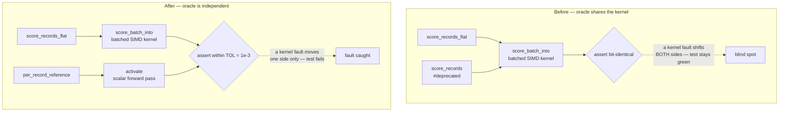

# Delete the deprecated per-record scoring wrappers and `RecordBatch::PerRecord`

## Summary

Phase 3 (final) of the flat-slice scoring migration started by #386 and staged
by #408. Deletes the deprecated per-record scoring wrappers and the batch
variant that only they constructed, and re-points the parity test onto an
oracle that is genuinely independent of the code under test. **Closes #409.**

What went:

- `CompiledNetwork::score_records` — the sequential `&[Vec<f32>]` wrapper.
- `CompiledNetwork::score_records_parallel` — **both** `cfg` arms: the rayon
  arm and the sequential/`wasm32` fallback arm. Neither survives, so the
  `wasm32` build sheds the symbol too.
- `RecordBatch::PerRecord`, its doc bullet, and its two match arms — its only
  constructors were the two wrappers above.

What stayed: `score_batch_into` is untouched. It is `pub(crate)` and remains the
shared implementation every flat entry point drives.

**Simplification.** With `PerRecord` gone, `RecordBatch` had a single variant
and two one-arm matches. It collapses to a plain struct holding `inputs` +
`stride`; `flat()`, `len()` and `record()` keep their exact signatures, so no
call site changed. This is the "simplify anything the removal makes trivial"
task from the issue.

**Breaking change.** Version bumped `0.2.28 → 0.3.0` (pre-1.0, so minor is the
major-equivalent slot per `RELEASING.md`). The commit carries a
`refactor(scoring)!:` subject and a `BREAKING CHANGE:` footer, so
`scripts/detect-breaking.sh` returns `true` and the `version-gate` job sees a
minor bump. A new **Breaking-change log** table in `RELEASING.md` records the
removal and the migration path.

Migration for a caller still holding one `Vec<f32>` per record — flatten once,
then use the flat entry point:

```rust
let flat: Vec<f32> = recs.iter().flat_map(|r| r.iter().copied()).collect();
let outputs = net.score_records_flat(&flat, stride, num_outputs);
```

## Evidence

Backend/library change — no web interface to screenshot. Evidence is the test
suite plus a mutation check on the new oracle.

### The parity-test problem, and why the new oracle is stronger

`flat_record_scoring_parity.rs` compared `score_records_flat` against
`score_records`. Both wrappers fed the *same* `score_batch_into` kernel, so the
test could only ever have caught a marshalling difference between the two public
signatures — never a fault in the kernel itself. Deleting the wrapper removed a
weak oracle, and the replacement is deliberately independent: each record is
scored on its own through the scalar `activate` forward pass (the style of the
existing reference at `score_squash_simd_parity.rs:103`).



Because the reference no longer shares the kernel, the assertion moves from
bit-for-bit to a `1e-3` per-element tolerance — the batched path re-associates
its weighted sums across records and uses the vectorised squash approximations
(#230/#243). `1e-3` matches `score_squash_simd_parity.rs` and sits far below any
scoring-decision threshold, while a real lane or stride slip is an O(1) error.

**Mutation check (the oracle is not vacuous).** Perturbing
`RecordBatch::record()` to return record `index + 1` — a fault entirely inside
the kernel's record slicing — fails 5 of the 8 tests, including both dispatch
arms, the production shard and the zero-fill case:

```
test flat_input_matches_per_record_on_the_interleaved_arm ... FAILED
test flat_input_matches_per_record_on_the_aggregate_squash_arm ... FAILED
test flat_input_matches_per_record_at_production_shard_width ... FAILED
test flat_input_zero_fills_a_stride_narrower_than_the_network ... FAILED
test parallel_flat_input_matches_the_sequential_flat_path ... FAILED
test result: FAILED. 3 passed; 5 failed
```

The mutation was reverted; the committed tree is green. The pre-change oracle
would have passed this mutation, because both compared paths slice records
through the same `RecordBatch::record()`.

### Acceptance criteria

| Criterion | Result |
|---|---|
| `./quality.sh` green (uses `--all-features`, i.e. `parallel` **on**) | ✅ `All quality checks passed!` |
| `parallel` feature **off** | ✅ `cargo clippy -p neat-core --all-targets --no-default-features -- -D warnings` clean; full test run green |
| `wasm32` target — both removed `cfg` arms gone | ✅ `cargo clippy -p neat-core --target wasm32-unknown-unknown --all-features -- -D warnings` clean, with and without `parallel` |
| Parity test asserts flat output against a per-record reference | ✅ `per_record_reference()` built from `activate` |
| No reference to the deleted API in the parity test | ✅ |
| No `#[allow(deprecated)]` left in the tree for these functions | ✅ zero `allow(deprecated)` sites remain outside archived PR summaries |

### Precondition (issue task 1)

Verified before deleting: the wrappers carried `#[deprecated]` (landed by #408),
`flat_record_scoring_parity.rs` was the only in-repo caller, and a `gh` code
search across the five consumer repos found **no code callers** —
`NEAT-AI`, `NEAT-AI-Discovery`, `NEAT-AI-Examples` and `NEAT-AI-Explore` return
zero hits, and the two `NEAT-AI-scorer` hits are both markdown
(`CHANGELOG.md`, an archived PR summary), not source.

### Documentation

- `README.md` — the deprecation note becomes a removal note with the flatten
  migration snippet, and now describes the independent reference the parity test
  uses.
- `RELEASING.md` — new **Breaking-change log** table recording `0.3.0` / #409
  alongside the existing `0.2.0` / #177 entry.
- `neat-core/benches/BASELINE.md` — the reproducible `wasm-pack` scratch-harness
  recipe for the #288 wasm32 anchor called `score_records`; re-pointed at
  `score_records_flat` (records flattened once at setup, outside the timed loop)
  so the recipe still compiles. Historical measurement narrative naming the old
  entry point is left as the record of what was measured at the time.
- Archived PR summaries under `docs/archive/pr-summaries/` are historical records
  and are deliberately untouched.

## Test Plan

No tests were removed or commented out. `flat_record_scoring_parity.rs` keeps
all 8 tests and all of its current coverage — the issue's two named must-keep
cases included.

Modified (`neat-core/tests/flat_record_scoring_parity.rs`):

- `per_record_reference()` — **new** independent oracle: scores each record on
  its own via `activate` and flattens to the `[record * num_outputs]` layout.
- `assert_within_tolerance()` — **new** elementwise comparison against `TOL`,
  reporting the worst deviation and its index on failure.
- `flat_input_matches_per_record_on_the_interleaved_arm` — re-pointed; still
  covers counts `0, 1, 7, 8, 9, 12` on the all-Tanh (record-interleaved) arm.
- `flat_input_matches_per_record_on_the_aggregate_squash_arm` — re-pointed;
  still covers the same counts on the Maximum (per-lane fallback) arm.
- `flat_input_matches_per_record_at_production_shard_width` — re-pointed;
  259 records at production input width.
- `flat_input_zero_fills_a_stride_narrower_than_the_network` — re-pointed;
  **the short-record zero-fill case the issue called out** keeps its coverage.
  `activate` leaves inputs past the supplied slice at zero, matching the batched
  path's zero-fill, so the reference is valid for this case.
- `#[allow(deprecated)]` dropped from all three call sites plus the module doc.

Unchanged and still passing (**the `_into` case the issue called out** among
them):

- `flat_input_into_writes_the_same_buffer_as_the_allocating_entry_point`
- `parallel_flat_input_matches_the_sequential_flat_path`
- `flat_input_rejects_a_zero_stride` / `flat_input_rejects_a_ragged_buffer` —
  the fail-loud guards (#3234) survive the enum → struct change.

Suite results:

- `./quality.sh` — fmt, clippy `-D warnings`, `cargo-deny`, full workspace test
  run, doc build, release build: all green.
- `cargo test -p neat-core --lib --tests --no-default-features` — green with the
  `parallel` feature off.
- `cargo test -p neat-core --test flat_record_scoring_parity --features parallel`
  — 8 passed, 0 failed.
