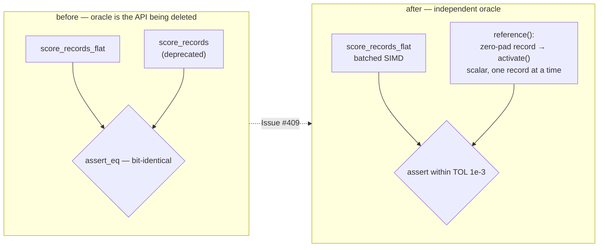

# Delete the deprecated per-record scoring wrappers and `RecordBatch::PerRecord`

## Summary

Phase 3 of the flat-slice migration started by #386 and staged by #408: the
deprecated per-record scoring API is gone. **Closes #409.**

Removed:

- `CompiledNetwork::score_records`
- `CompiledNetwork::score_records_parallel` — **both** `cfg` arms (the rayon
  arm and the sequential / `wasm32` fallback), so nothing survives on either
  feature setting or target
- `RecordBatch::PerRecord`, whose only constructors were inside those wrappers

Kept, as the issue requires: `score_batch_into` stays `pub(crate)` and remains
the shared implementation every flat path drives.

Simplifications the removal made trivial:

- `RecordBatch` had one variant left, so it collapses from an enum to a plain
  struct — `len()` and `record()` lose their `match` and just slice.
- `score_batch_alloc` had one caller left, so it folds into
  `score_records_flat`.

This is a **breaking** change: the workspace version goes `0.2.28 → 0.3.0`
(pre-1.0, so minor is the major-equivalent slot per `RELEASING.md`), the commit
carries a Conventional Commit `!` marker plus a `BREAKING CHANGE:` footer, and
`RELEASING.md` gains a **Breaking changes by version** table recording the
removal and the migration for the `v0.3.0` release notes. `README.md` now
documents the flat entry points as the only record-scoring API and shows the
one-line flatten.

### Migration

```rust
// before
let outputs = net.score_records(&recs, num_outputs);
let outputs = net.score_records_parallel(&recs, num_outputs);

// after — one contiguous buffer plus the record stride
let flat: Vec<f32> = recs.iter().flat_map(|r| r.iter().copied()).collect();
let outputs = net.score_records_flat(&flat, stride, num_outputs);
let outputs = net.score_records_parallel_flat(&flat, stride, num_outputs);
```

## Evidence

Backend-only change — no web interface to screenshot. Verified by the test
suite and by building every configuration named in the acceptance criteria.

### The parity-test oracle move

`flat_record_scoring_parity.rs` compared `score_records_flat` against
`score_records`; deleting the per-record path deletes that oracle. Rather than
dropping the test, it is re-pointed onto a hand-written per-record reference in
the test file, in the style of the existing independent reference in
`score_squash_simd_parity.rs`.



The reference scores each record on its own through the scalar
`CompiledNetwork::activate` forward pass and flattens the results into the
`[record * num_outputs]` layout. Each record is **zero-padded to the network's
input arity first**, so the short-record case asserts the documented zero-fill
contract independently instead of inheriting it from the path under test.

Because the reference is scalar and the path under test re-associates its sums
across SIMD lanes, agreement is within `TOL = 1e-3` rather than bit-for-bit —
the same bound `parallel_scoring.rs` and `score_squash_simd_parity.rs` already
use for this comparison. A real lane or stride bug is an O(1) error and still
trips it.

### Acceptance criteria

| Criterion | Result |
|-----------|--------|
| `./quality.sh` green | ✅ `All quality checks passed!` |
| `parallel` feature **on** | ✅ `cargo clippy -p neat-core --all-targets --features parallel` clean under `-D warnings` |
| `parallel` feature **off** | ✅ `cargo clippy -p neat-core --all-targets` clean under `-D warnings` |
| `wasm32` target, both feature settings | ✅ `cargo check -p neat-core --target wasm32-unknown-unknown` with and without `--features parallel`, clean — the removed wrapper's `cfg(not(...))` arm is gone too, not just the native one |
| Parity test asserts against a per-record reference, no reference to the deleted API | ✅ see above |
| No `#[allow(deprecated)]` left for these functions | ✅ zero hits in the tree |

```text
running 8 tests
test flat_input_into_writes_the_same_buffer_as_the_allocating_entry_point ... ok
test flat_input_rejects_a_ragged_buffer - should panic ... ok
test flat_input_matches_per_record_on_the_aggregate_squash_arm ... ok
test flat_input_zero_fills_a_stride_narrower_than_the_network ... ok
test flat_input_rejects_a_zero_stride - should panic ... ok
test flat_input_matches_per_record_on_the_interleaved_arm ... ok
test parallel_flat_input_matches_the_sequential_flat_path ... ok
test flat_input_matches_per_record_at_production_shard_width ... ok

test result: ok. 8 passed; 0 failed; 0 ignored; 0 measured; 0 filtered out
```

### Downstream precondition

Re-confirmed zero **code** callers before deleting. GitHub code search across
`NEAT-AI-scorer`, `NEAT-AI`, `NEAT-AI-Discovery`, `NEAT-AI-Examples` and
`NEAT-AI-Explore` returns hits only in `NEAT-AI-scorer`'s `CHANGELOG.md` and an
archived PR summary — prose, not source. In-repo, the sole remaining mentions
are doc prose and the unchanged `score_records/<label>` criterion benchmark
group name.

## Test Plan

Modified `neat-core/tests/flat_record_scoring_parity.rs`. No test was removed or
commented out; every case keeps its coverage, with the oracle swapped:

- `flat_input_matches_per_record_on_the_interleaved_arm` — all-Tanh network
  (record-interleaved fast path), record counts `0, 1, 7, 8, 9, 12` straddling
  the 8-record SIMD group boundary, now vs the independent reference.
- `flat_input_matches_per_record_on_the_aggregate_squash_arm` — Maximum network
  (per-lane fallback dispatch), same counts.
- `flat_input_matches_per_record_at_production_shard_width` — 259 records at
  production input width.
- `flat_input_zero_fills_a_stride_narrower_than_the_network` — **coverage kept**
  and strengthened: stride 5 against a 12-input network, compared with an
  explicitly zero-padded reference.
- `flat_input_into_writes_the_same_buffer_as_the_allocating_entry_point` —
  **coverage kept**, unchanged (it never touched the deleted API).
- `parallel_flat_input_matches_the_sequential_flat_path`,
  `flat_input_rejects_a_zero_stride`, `flat_input_rejects_a_ragged_buffer` —
  unchanged.

New helpers in that file: `reference()` (the independent per-record oracle) and
`assert_matches_reference()` (tolerance comparison reporting the worst element
and its index, so a lane mix-up is diagnosable).

Full workspace suite (`cargo test --workspace --lib --tests --all-features`) is
green via `./quality.sh`, including `parallel_scoring.rs`,
`bench_fixtures.rs`, `scoring_allocations.rs` and `wasm_dataset_offload.rs`,
which exercise the flat paths and the shared `score_batch_into` the deleted
wrappers used to reach.
