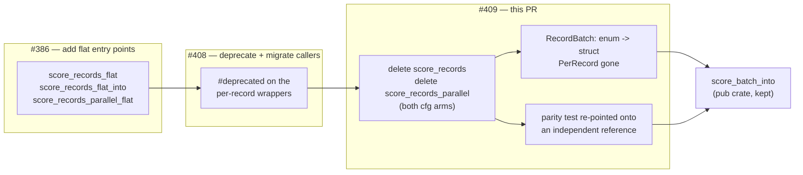
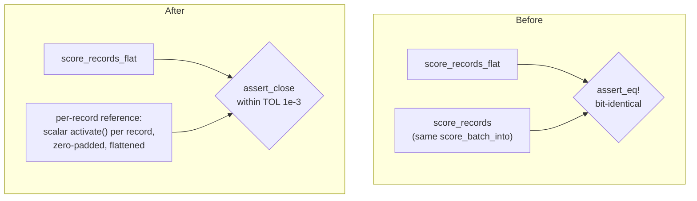

# Delete the deprecated per-record scoring wrappers and `RecordBatch::PerRecord`

## Summary

Phase 3 (and last) of the flat-slice record-input migration started by #386 and
prepared by #408. The deprecated per-record scoring entry points and the batch
variant only they constructed are deleted, and the parity test that used them as
its oracle is re-pointed onto an independent per-record reference.
**Closes #409.**

Removed:

- `CompiledNetwork::score_records` (`neat-core/src/parallel_scoring.rs`)
- `CompiledNetwork::score_records_parallel` — **both** `cfg` arms, the rayon
  path and the sequential/`wasm32` fallback
- `RecordBatch::PerRecord` (`neat-core/src/batch_scoring.rs`), its doc bullet
  and both match arms

`score_batch_into` is untouched: it stays `pub(crate)` and remains the shared
implementation the flat paths drive.

### Simplification the removal unlocked

With `PerRecord` gone, `RecordBatch` had a single variant, so it collapses from
an enum to a plain struct. `RecordBatch::len` and `RecordBatch::record` lose
their `match` and become one-line field expressions; `RecordBatch::flat` keeps
its fail-loud stride/length assertions (Issue #3234) unchanged.

### Breaking change and version bump

Removing a public item is breaking under
[`RELEASING.md`](../../../RELEASING.md), so the workspace version is bumped
`0.2.28 → 0.3.0` (pre-1.0: minor is the major-equivalent slot). The commit
subject carries a Conventional Commit `!` marker plus a `BREAKING CHANGE:`
footer, so `scripts/detect-breaking.sh` reports `true` and the `version-gate`
job sees a minor bump. The removal is recorded in `README.md` and the
`parallel_scoring` module docs; the `v0.3.0` GitHub release cut by
`release.yml` on merge is the release note.

## Evidence

Backend/library change — no web interface to screenshot. Evidence is the test
suite plus the compiler, which is the real proof that nothing constructs
`PerRecord` any more.

### Precondition check (task 1 of the issue)

| Check | Result |
| --- | --- |
| Wrappers carried `#[deprecated]` before this PR | yes (#408, `0.2.28`) |
| In-repo callers outside `flat_record_scoring_parity.rs` | **0** |
| Code hits across NEAT-AI-scorer / NEAT-AI / NEAT-AI-Discovery / NEAT-AI-Examples / NEAT-AI-Explore | **0** |

The two `score_records` hits GitHub code search reports in NEAT-AI-scorer are
`CHANGELOG.md` and `docs/archive/pr-summaries/pr-summary-470.md` — prose
recording the migration, not callers.

### Acceptance: `./quality.sh` across every configuration

`quality.sh` runs `--all-features` (parallel **on**). The `parallel` **off** and
`wasm32` arms were checked explicitly, since both `cfg` arms of the removed
parallel wrapper had to go, not just the native one:

| Configuration | Command | Result |
| --- | --- | --- |
| parallel **on** | `./quality.sh` (clippy/check/test `--all-features`) | ✅ `All quality checks passed!` |
| parallel **off** | `cargo clippy --workspace --all-targets -- -D warnings`, `cargo test --workspace --lib --tests` | ✅ clean, all suites pass |
| `wasm32`, parallel on | `cargo clippy -p neat-core --target wasm32-unknown-unknown --all-features --lib -- -D warnings` | ✅ clean |
| `wasm32`, parallel off | `cargo clippy -p neat-core --target wasm32-unknown-unknown --lib -- -D warnings` | ✅ clean |

(`--all-targets` on `wasm32` fails in `criterion` itself — `Rayon cannot be used
when targeting wasi32` — which is pre-existing and unrelated to this change, so
the `wasm32` rows are `--lib`.)

`flat_record_scoring_parity.rs`: 8 passed, 0 failed.

### Migration shape

### Parity oracle before and after

The deleted wrappers *were* the parity test's oracle, so the test had to be
re-pointed rather than dropped — the flat path is the one that ships and it
needs an independent check.

Before, both sides funnelled into the same `score_batch_into`, so a bug in the
shared kernel would have satisfied the assertion. After, the reference is the
scalar single-record `activate` forward pass — genuinely independent of the
batch scoring path, matching the existing reference in
`score_squash_simd_parity.rs`. Because full 8-record groups re-associate the
weighted sums and use the vectorised squash approximations (#230 / #243), the
comparison is `TOL = 1e-3` rather than bit-for-bit — the same tolerance
`tests/parallel_scoring.rs` already uses against this reference. A real
lane/stride/order bug is an O(1) error and still trips it.

## Test Plan

`neat-core/tests/flat_record_scoring_parity.rs` — re-pointed, not dropped. Its
three `#[allow(deprecated)]` sites are removed; **no `#[allow(deprecated)]`
remains anywhere in the tree**.

Modified to score against the new independent reference (coverage preserved):

- `flat_input_matches_per_record_on_the_interleaved_arm` — all-Tanh network
  (record-interleaved fast path), record counts `0, 1, 7, 8, 9, 12` across the
  8-record SIMD group boundary.
- `flat_input_matches_per_record_on_the_aggregate_squash_arm` — Maximum network
  (per-lane fallback dispatch), same counts.
- `flat_input_matches_per_record_at_production_shard_width` — 259 records at
  production input width, spanning many full groups plus a non-empty tail.
- `flat_input_zero_fills_a_stride_narrower_than_the_network` — stride 5 into a
  12-input network; the reference zero-pads each record explicitly, so the
  zero-fill contract is asserted rather than inherited from the buffer's initial
  state.

Added helpers: `reference` (scalar per-record oracle), `assert_close` (reports
the worst element and its index on failure), `TOL`.

Unchanged and still passing:

- `flat_input_into_writes_the_same_buffer_as_the_allocating_entry_point` — the
  `_into` case keeps its current coverage.
- `parallel_flat_input_matches_the_sequential_flat_path`
- `flat_input_rejects_a_zero_stride`, `flat_input_rejects_a_ragged_buffer` —
  fail-loud assertions on a malformed batch (#3234).

No test was commented out, weakened, or deleted.

## Documentation

- `README.md` — the deprecation note becomes a removal note naming `0.3.0`, and
  points readers at the flat entry points.
- `neat-core/src/parallel_scoring.rs` / `batch_scoring.rs` — module and item
  docs no longer reference the removed API; the `score_records` doc text
  describing the batched SIMD path is folded into `score_records_flat`, which
  now owns that contract.
- `neat-core/benches/BASELINE.md` — the #288 `wasm32` reproduction recipe was a
  runnable harness calling `score_records`; it is updated to
  `score_records_flat` (flattening the fixtures once, outside the timed loop) so
  the recipe still compiles. Historical measurement narrative elsewhere in the
  file is left as the record of what was measured at the time.
- `neat-core/benches/hot_paths.rs`, `neat-core/tests/evaluate_mse_allocations.rs`
  — comments that described the API as "deprecated" updated to "deleted".

## Security self-check

- No new external input, dependency, endpoint, or `unsafe` block. The change is
  a public-API deletion plus a test-oracle swap.
- `RecordBatch::flat`'s fail-loud stride and length assertions are preserved
  verbatim, so a malformed batch still panics rather than mis-slicing records.
- No secrets or hidden files staged.
