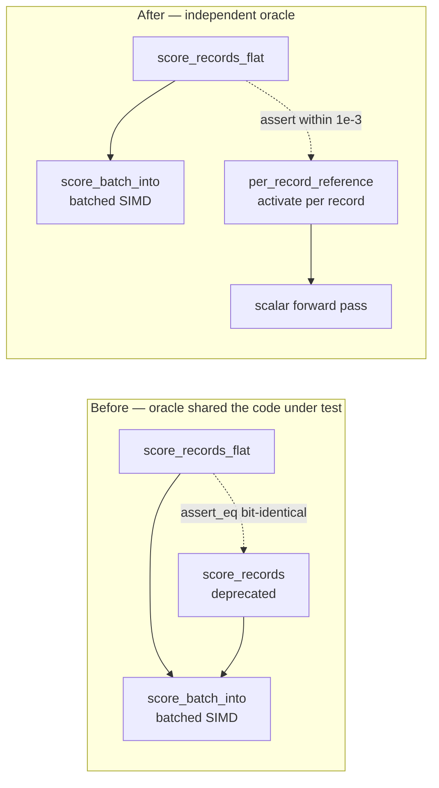

# Delete the deprecated per-record scoring wrappers (Issue #409)

## Summary

Phase 3 — and the last phase — of the flat-slice scoring migration started by
#386. Deletes `CompiledNetwork::score_records` and both `cfg` arms of
`CompiledNetwork::score_records_parallel`, deprecated in `0.2.28` by #408 once
every in-repo caller had moved to the `_flat` entry points. **Closes #409.**

Removing the wrappers left `RecordBatch::PerRecord` with no constructors, so the
two-variant enum collapses to the flat struct and its single-arm `match`es go
with it. `score_batch_alloc` had one caller left and is inlined into
`score_records_flat`. `score_batch_into` is untouched — it remains the
`pub(crate)` implementation the flat paths drive.

This is a **breaking change**: the workspace version is bumped `0.2.28 → 0.3.0`
(pre-1.0, so minor is the major-equivalent slot per `RELEASING.md`), the commit
carries a Conventional Commit `!` marker plus a `BREAKING CHANGE:` footer, and
`RELEASING.md` gains a breaking-change log recording the removal and its
migration.

### Precondition (task 1) confirmed before deleting

- Wrappers carried `#[deprecated(since = "0.2.28")]` on `Develop` @ `baf9023`.
- `flat_record_scoring_parity.rs` was the only in-repo caller.
- Zero hits across NEAT-AI-scorer, NEAT-AI, NEAT-AI-Discovery, NEAT-AI-Examples
  and NEAT-AI-Explore (the only greps that matched were unrelated
  `valuesPerRecord` / `bytesPerRecord` identifiers).

## Evidence

No web interface to screenshot — this is a library API removal. Evidence is the
compiler, the re-pointed parity test, and a mutation check that the new oracle
is not vacuous.

### The parity oracle, before and after



The old assertion compared two entry points into the *same* kernel, so it could
only catch a marshalling slip. The replacement scores each record on its own
through the scalar `activate` path — no shared machinery — in the style of the
existing reference in `score_squash_simd_parity.rs:103`. Because the batched
path re-associates weighted sums across records and squashes through the
vectorised approximations, the comparison moves from bit-identical to the same
`1e-3` per-element tolerance `score_squash_simd_parity.rs` documents.

### Mutation check — the new oracle bites

Injecting an off-by-one lane bug into `RecordBatch::record` (returning record
`index - 1` for `index > 0`) and running the re-pointed suite:

```text
test flat_input_matches_per_record_on_the_interleaved_arm ... FAILED
test flat_input_matches_per_record_on_the_aggregate_squash_arm ... FAILED
test flat_input_matches_per_record_at_production_shard_width ... FAILED
test flat_input_zero_fills_a_stride_narrower_than_the_network ... FAILED
test result: FAILED. 4 passed; 4 failed
```

All four oracle-backed tests trip; the mutation was reverted before committing.

### Acceptance criteria

| Criterion | Result |
|-----------|--------|
| `./quality.sh` green | `exit=0`, `✅ All quality checks passed!` |
| `parallel` feature **on** | `cargo clippy --workspace --all-targets --features parallel -- -D warnings` clean; `cargo test --workspace --features parallel` all green |
| `parallel` feature **off** | `cargo clippy --workspace --all-targets --no-default-features -- -D warnings` clean |
| `wasm32` target | `cargo clippy --workspace --lib --target wasm32-unknown-unknown --all-features -- -D warnings` clean — both `cfg` arms of the removed wrapper are gone, not just the native one |
| Parity test still asserts against a per-record reference | Yes, via `per_record_reference` |
| No reference to the deleted API in the parity test | Yes — only a historical note in the module doc |
| No `#[allow(deprecated)]` left for these functions | Yes — all three sites removed; none remain in the tree |

## Test Plan

`neat-core/tests/flat_record_scoring_parity.rs` — re-pointed, no tests removed
or commented out; all eight still run and pass:

- `flat_input_matches_per_record_on_the_interleaved_arm` — all-Tanh network (no
  aggregate neurons → record-interleaved fast path), counts `[0, 1, 7, 8, 9, 12]`
  straddling the 8-record SIMD group boundary, now compared against the
  independent oracle.
- `flat_input_matches_per_record_on_the_aggregate_squash_arm` — Maximum network
  → per-lane fallback dispatch, same counts, same oracle.
- `flat_input_matches_per_record_at_production_shard_width` — 259 records at
  production input width, spanning many full 8-record groups plus a non-empty
  scalar tail.
- `flat_input_zero_fills_a_stride_narrower_than_the_network` — **coverage kept**:
  a 5-wide record against a 12-input network must zero-fill the uncovered
  inputs, now checked against scoring the same short record on its own.
- `flat_input_into_writes_the_same_buffer_as_the_allocating_entry_point` —
  **coverage kept**, unchanged.
- `parallel_flat_input_matches_the_sequential_flat_path` — unchanged.
- `flat_input_rejects_a_zero_stride` / `flat_input_rejects_a_ragged_buffer` —
  unchanged fail-loud guards (Issue #3234).

New helpers in that file: `per_record_reference` (the independent oracle) and
`assert_matches_reference` (per-element tolerance check reporting the first
offending index).

The rest of the workspace suite is unchanged and green — the removal is
compiler-verified: nothing else constructed `RecordBatch::PerRecord` or called
the wrappers.

### Documentation

- `README.md` — the deprecation paragraph becomes a removal note with the
  migration, and points at the new independent oracle.
- `RELEASING.md` — new **Breaking change log** section recording `0.3.0`
  (this removal) and `0.2.0` (the #177 `u16` narrowing).
- `neat-core/benches/BASELINE.md` — the reproducible wasm32 scoring-anchor
  recipe called `score_records`, so it would no longer compile; switched to
  `score_records_flat` with the records flattened once at setup, outside the
  timed call. Historical narrative elsewhere in that file is left as-is.
- Module docs in `parallel_scoring.rs` / `batch_scoring.rs` updated; the
  intra-doc link to the deleted `score_records` is replaced so `cargo doc`
  stays clean.

### Security self-check

Backend library change, no new external input surface. No new dependencies, no
secrets or hidden files staged (`git diff --cached --name-only` verified), no
new SQL/shell/filesystem/HTTP calls. The fail-loud `stride` validation on
`RecordBatch::flat` is preserved verbatim.
