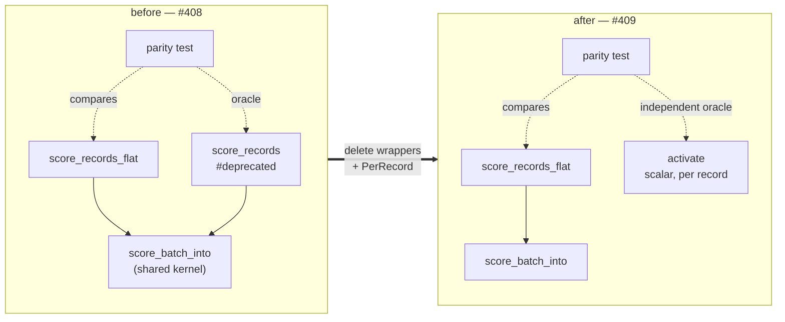

# Delete the deprecated per-record scoring wrappers and `RecordBatch::PerRecord`

## Summary

Phase 3 of the flat-slice migration started by #386 and prepared by #408.
Deletes the deprecated per-record scoring entry points and the batch variant
only they constructed, so the flat-slice layout is the single scoring contract.
Closes #409.

Removed:

- `CompiledNetwork::score_records`
- `CompiledNetwork::score_records_parallel` — **both** `cfg` arms (the rayon
  arm and the sequential / `wasm32` fallback)
- `RecordBatch::PerRecord`, its doc bullet and its two match arms

Kept: `score_batch_into` (`pub(crate)`) is untouched — it is the shared
implementation the flat paths drive.

Because `PerRecord` was the only other variant, `RecordBatch` collapses from a
two-variant enum to a plain flat-layout struct (`inputs`, `stride`); `len()` and
`record()` lose their matches. Every construction already went through
`RecordBatch::flat`, so no call site changed.

This is a **breaking change**: the workspace version is bumped `0.2.28 → 0.3.0`
(pre-1.0 major-equivalent, per `RELEASING.md`), the commit carries a
Conventional Commit `!` marker plus a `BREAKING CHANGE:` footer, and
`RELEASING.md` gains a breaking-change log recording the removal and the
migration path.

### Precondition check (task 1)

| Check | Result |
|-------|--------|
| Wrappers carried `#[deprecated]` after #408 | ✅ yes |
| In-repo callers outside `flat_record_scoring_parity.rs` | **0** |
| `gh search code` hits in NEAT-AI-scorer, NEAT-AI, NEAT-AI-Discovery, NEAT-AI-Examples, NEAT-AI-Explore | **0 code hits** (two prose mentions in the scorer's own changelog / PR summary) |

### Re-pointing the parity test (task 2)

Deleting the per-record path deletes the oracle
`flat_record_scoring_parity.rs` compared against, so the test is re-pointed
rather than dropped — the flat path is the one that ships and it needs an
independent check.

The new `per_record_reference` scores each record on its own through the scalar
`CompiledNetwork::activate` forward pass and flattens to the
`[record * num_outputs]` layout, in the style of the existing independent
reference in `score_squash_simd_parity.rs`. It shares no code with the batched
path under test. Records shorter than the network's input arity are explicitly
zero-padded, which is precisely the contract a narrow `stride` must honour.

The comparison moves from bit-identical to a `1e-3` per-element tolerance —
matching `score_squash_simd_parity.rs` — because the oracle is no longer the
same kernel: the batched path re-associates its weighted sums across records
(~1e-6) and evaluates the squash through approximations within
`SQUASH_SIMD_MAX_ABS_ERR` (5e-6). `1e-3` sits far below any scoring-decision
threshold while a real lane/stride/offset bug (an O(1) error) still trips it —
verified by mutation, below.



## Evidence

Backend-only change — no web interface to screenshot.

### Mutation check: the new oracle is not vacuous

`RecordBatch::record` was temporarily shifted by one record and the suite
re-run; the oracle caught it in every parity case:

```
thread 'flat_input_matches_per_record_at_production_shard_width' panicked at
neat-core/tests/flat_record_scoring_parity.rs:182:9:
production shard: element 0 is 0.34136853, per-record reference is -0.37548274 (tolerance 0.001)

failures:
    flat_input_matches_per_record_at_production_shard_width
    flat_input_matches_per_record_on_the_aggregate_squash_arm
    flat_input_matches_per_record_on_the_interleaved_arm
    flat_input_zero_fills_a_stride_narrower_than_the_network
    parallel_flat_input_matches_the_sequential_flat_path

test result: FAILED. 3 passed; 5 failed
```

The mutation was reverted before commit.

### Acceptance criteria

| Criterion | Result |
|-----------|--------|
| `./quality.sh` green | ✅ `All quality checks passed!` |
| `parallel` feature **on** | ✅ `cargo check --workspace --all-targets --all-features` clean |
| `parallel` feature **off** | ✅ `cargo check --workspace --all-targets` and `--no-default-features` clean |
| `wasm32` target — both `cfg` arms gone | ✅ `cargo check -p neat-core --target wasm32-unknown-unknown --all-features` clean |
| Parity test asserts flat batch vs a per-record reference | ✅ 8/8 pass, no reference to the deleted API |
| No `#[allow(deprecated)]` left for these functions | ✅ zero `allow(deprecated)` in the tree |
| Version gate | ✅ `check-version-bump.sh 0.2.28 0.3.0 true` → OK; `detect-breaking.sh` → `true` |

## Test Plan

`neat-core/tests/flat_record_scoring_parity.rs` — re-pointed, all 8 tests pass:

- `flat_input_matches_per_record_on_the_interleaved_arm` — all-Tanh network
  (record-interleaved fast path) vs the scalar reference across record counts
  0, 1, 7, 8, 9, 12.
- `flat_input_matches_per_record_on_the_aggregate_squash_arm` — Maximum network
  (aggregate per-lane fallback), same counts.
- `flat_input_matches_per_record_at_production_shard_width` — 259 records at
  production input width.
- `flat_input_zero_fills_a_stride_narrower_than_the_network` — **coverage kept**:
  stride 5 into a 12-input network now compared against explicitly zero-padded
  records, a stronger statement of the documented contract than the old
  wrapper-vs-wrapper comparison.
- `flat_input_into_writes_the_same_buffer_as_the_allocating_entry_point` —
  **coverage kept**, unchanged (both sides were already flat).
- `parallel_flat_input_matches_the_sequential_flat_path`,
  `flat_input_rejects_a_zero_stride`, `flat_input_rejects_a_ragged_buffer` —
  unchanged.

No existing test was removed or commented out. The one behavioural change to a
test is the bit-identical → `1e-3` tolerance, documented above and forced by
swapping a same-kernel oracle for an independent one.

Docs touched by the removal: `README.md`, `RELEASING.md` (breaking-change log),
the `parallel_scoring.rs` / `batch_scoring.rs` module docs, the wasm32 scoring
anchor recipe in `benches/BASELINE.md` (its snippet called the deleted method),
and a stale prose reference in `tests/evaluate_mse_allocations.rs`.

## Pre-PR Security Self-Check

- **Input validation**: unchanged — `RecordBatch::flat` still asserts
  `stride > 0` and a whole number of records, failing loud on a malformed batch.
- **Secrets**: none staged; no hidden files touched.
- **Injection surface / output encoding / auth**: not applicable — pure
  in-process numeric code, no new SQL, shell, filesystem or HTTP calls.
- **Error handling**: no errors swallowed; the panics remain the documented
  fail-loud path.
- **Dependencies**: no dependency added or changed (`Cargo.lock` moves only the
  `neat-core` version string).
