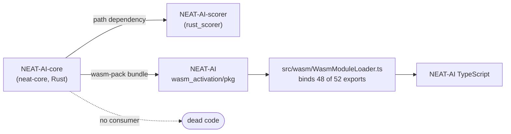

## Summary

Ran the dead-code audit across NEAT-AI, NEAT-AI-scorer and NEAT-AI-core
requested by #413 and filed one issue per confirmed finding in the repository
that owns the code. This PR adds the audit record only —
`docs/research/dead-code-audit-2026-07-29.md` — with no code removed, exactly as
the issue specifies ("file one issue per finding in the owning repo; no cleanup
PRs from this issue"). Closes #413.

**11 findings filed across 3 repositories:**

| Repo | Issues |
| --- | --- |
| NEAT-AI-core | [#414](https://github.com/stSoftwareAU/NEAT-AI-core/issues/414) unconsumed `PredictiveCodingEngine` · [#415](https://github.com/stSoftwareAU/NEAT-AI-core/issues/415) unadopted `wasm_dataset` offload · [#416](https://github.com/stSoftwareAU/NEAT-AI-core/issues/416) 4 unbound WASM exports · [#417](https://github.com/stSoftwareAU/NEAT-AI-core/issues/417) stale `#[allow(dead_code)]` f64 helpers · [#418](https://github.com/stSoftwareAU/NEAT-AI-core/issues/418) orphan `deny.toml.test` |
| NEAT-AI | [#3509](https://github.com/stSoftwareAU/NEAT-AI/issues/3509) orphan barrel modules · [#3510](https://github.com/stSoftwareAU/NEAT-AI/issues/3510) superseded test-only modules · [#3511](https://github.com/stSoftwareAU/NEAT-AI/issues/3511) 24 redundant exports · [#3512](https://github.com/stSoftwareAU/NEAT-AI/issues/3512) 2 unreferenced constants |
| NEAT-AI-scorer | [#474](https://github.com/stSoftwareAU/NEAT-AI-scorer/issues/474) 27 crate-internal `pub` items · [#475](https://github.com/stSoftwareAU/NEAT-AI-scorer/issues/475) duplicated `mod` tree in `main.rs` |

Repository isolation is preserved: each finding is filed in the repo that owns
the code and each cleanup rides that repo's own PR and quality gate.

## Evidence

This is a documentation-only change — there is no web interface to screenshot.
The evidence is the verification behind each finding, recorded in full in
`docs/research/dead-code-audit-2026-07-29.md`.

The audit's central insight is that `neat-core` has two independent consumers,
so a Rust symbol is only dead when **both** come up empty:



Representative verification runs:

```
# 4 of the 52 WASM exports have no TypeScript caller at all
$ grep -oE '^export function [a-z_0-9]+' wasm_activation/pkg/wasm_activation.d.ts \
    | awk '{print $3}' | sort -u | while read f; do
      [ "$(grep -rn "\b$f\b" src test bench scripts mod.ts | wc -l)" -eq 0 ] && echo "DEAD $f"
    done
DEAD calculate_error_batch_4way
DEAD derivative_batch_4way
DEAD get_training_state_num_neurons
DEAD get_training_state_num_synapses

# NEAT-AI-scorer: all 27 pub items downgraded to pub(crate) in a throwaway copy
$ cargo check  --workspace --all-targets            # 0 errors, 0 warnings
$ cargo clippy --workspace --all-targets -- -D warnings   # clean
$ cargo test   --workspace                          # all suites ok, 0 failed
```

`WasmModuleLoader.ts` binds every export by literal property access — there is
no dynamic `module[name]` lookup in `src/wasm/` — so an unbound export really is
uncalled. The sibling repositories NEAT-AI-Discovery, NEAT-AI-Examples and
NEAT-AI-Explore were swept too; they reference `neat-core` only in prose and CI
checkout steps, so they keep no candidate alive.

Findings were also cross-checked between the two Rust sweeps: the scorer-side
scan independently flagged `wasm_exports.rs`, `pc_learning.rs:101`,
`pc_inference.rs:635` and `wasm_dataset.rs:228,233` as having no consumer, which
matches #414, #415 and #416.

## Test Plan

No source code changed, so no test was added or modified. The gate covering this
PR's content is the Mermaid validator, which parses the diagram in the new
research document:

```
$ deno run --allow-read scripts/check_mermaid.ts docs/research < /dev/null
check-mermaid: all Mermaid blocks passed
```

`./quality.sh < /dev/null` was run to completion and passes — fmt, clippy
(`-D warnings`), `cargo check`, `cargo test --workspace`, `cargo doc` and
`cargo deny` are all unaffected by a docs-only change.

Each filed issue carries its own removal-safety note, so the repository that
owns the code verifies the change against its own gate when the cleanup lands.
