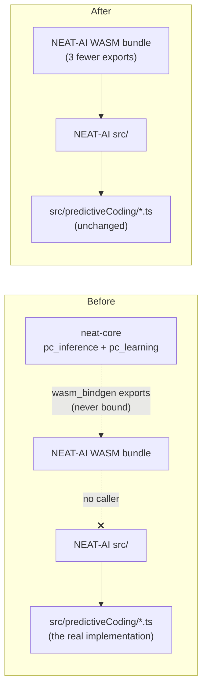

# Remove the unconsumed `PredictiveCodingEngine` (Issue #414)

## Summary

Deletes `neat-core`'s predictive-coding engine — `pc_inference.rs`,
`pc_learning.rs` and their tests — after confirming it has **no caller** outside
its own tests in any repository. NEAT-AI implements predictive coding entirely in
TypeScript (`src/predictiveCoding/`), and NEAT-AI-scorer never references the
engine. The `#[cfg_attr(target_arch = "wasm32", wasm_bindgen)]` annotations meant
the dead engine was still compiled into the shipped WASM bundle
(`predictivecodingengine_infer_wasm`, `_infer_batch_wasm`,
`_compute_gradients_wasm`), so removing it shrinks the bundle as well as the
crate. Closes #414.

The issue framed this as **adopt or remove**. The evidence below shows no
consumer and a complete, actively maintained TypeScript implementation on the
NEAT-AI side, so **remove** is the correct branch — nothing is being deprived of
an implementation.

**BREAKING CHANGE** (public API): `neat_core::pc_inference`,
`neat_core::pc_learning`, and the crate-root re-exports `PredictiveCodingEngine`
and `PcEngineError` are gone. The commit carries a Conventional Commit `!`
marker so CI bumps the minor per `RELEASING.md`.

## Evidence

No web interface to screenshot — this is a library-crate deletion. Verification
is the consumer sweep plus a green quality gate.

Consumer sweep (fresh shallow clones of both consuming repos, plus an org-wide
code search):

| Repository | Search | Result |
| --- | --- | --- |
| NEAT-AI | `PredictiveCodingEngine`, `infer_wasm`, `infer_batch_wasm`, `compute_gradients_wasm` across `src/`, `test/` | no hits — only the generated `wasm_activation/pkg/` artefact and a `docs/cspell.json` dictionary word |
| NEAT-AI-scorer | `PredictiveCoding`, `pc_inference`, `pc_learning` across the repo | no hits |
| org-wide (`gh search code --owner stSoftwareAU`) | `PredictiveCodingEngine` | only NEAT-AI-core sources/tests/benches, archived PR summaries, and NEAT-AI's generated `pkg/` |

NEAT-AI's own predictive coding lives in TypeScript and is untouched by this
change: `PredictiveCodingInference.ts`, `PredictiveCodingLearning.ts`,
`PredictiveCodingTrainer.ts`, `PredictionErrorComputation.ts`,
`PredictionErrorGuidedMutation.ts`, `AdaptiveScaling.ts`.

Gate results (`./quality.sh < /dev/null`): fmt, `cargo clippy --workspace
--all-targets --all-features -- -D warnings`, `cargo check`, `cargo test
--workspace --lib --tests --all-features`, `cargo doc` with `-D warnings`, and
the release build all pass. `cargo check -p neat-core --target
wasm32-unknown-unknown --all-features` also passes, confirming the WASM bundle
still builds without the engine.

## Test Plan

No new tests: this change removes behaviour rather than adding it, and a test
asserting a module's *absence* would be a source-grep "how" test, which
`AGENTS.md` forbids. The compile-and-suite pass is the verification.

Removed (all of them exercised only the deleted engine):

- `neat-core/tests/pc_inference.rs` (890 lines)
- `neat-core/tests/pc_learning.rs` (209 lines)
- `neat-core/tests/pc_inference_allocations.rs` (178 lines) — the Issue #389
  O(1)-allocation regression guard for the settling loop
- `neat-core/tests/typed_errors.rs::pc_engine_new_truncated_returns_typed_error`
- `neat-core/tests/wasm_bindgen_surface.rs::pc_engine_constructor_and_getters`,
  `::pc_engine_public_fields_remain_accessible`,
  `::pc_engine_infer_wasm_packs_header_and_body`
- `neat-core/benches/hot_paths.rs::bench_pc_inference` and its `build_pc_engine`
  fixture

Retained and green: every other test in `typed_errors.rs` (the `CompiledNetwork`
/ `CreatureError` typed-error contract) and `wasm_bindgen_surface.rs` (the
`CompiledNetwork` native-surface contract) — 6 tests still guard the bindgen
surface for the types that *do* have consumers.
