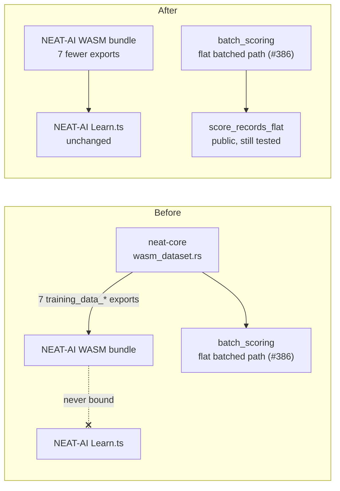

# Remove the unadopted `wasm_dataset` training-data offload (Issue #415)

## Summary

Deletes `neat-core`'s WASM training-data offload — `wasm_dataset.rs`, its seven
`training_data_*` `wasm_bindgen` shims, and the two test files that exercised
only that module — after confirming it has **no consumer** in any repository.
The offload landed as lane (c) of the wasm64 milestone (#295) on the explicit
understanding that the `Learn.ts` adoption was owned upstream by NEAT-AI#3410;
that issue closed without the wiring, the milestone closed too, and nothing has
tracked it since. The exports were still compiled into the shipped WASM bundle,
so removing them shrinks the bundle as well as the crate. Closes #415.

The issue framed this as **adopt or remove**. There is no live adoption issue
upstream and no caller anywhere, so **remove** is the correct branch — re-landing
the module against a real consumer is cheaper than carrying 1,157 unreferenced
lines and an unbound export surface. The performance work the module carried is
not lost: the flat batched scoring path it drove (Issue #386) is public,
independently tested, and unchanged.

**BREAKING CHANGE** (public API): `neat_core::wasm_dataset` and the crate-root
re-exports `DatasetError`, `DatasetRegistry` and `TrainingDataset` are gone,
along with the `training_data_load` / `_free` / `_num_records` / `_byte_len` /
`_evaluate_mse` / `_live_bytes` / `_peak_bytes` WASM exports. The commit carries
a Conventional Commit `!` marker so CI bumps the minor per `RELEASING.md`.

## Evidence

No web interface to screenshot — this is a library-crate deletion. Verification
is the consumer sweep, the upstream-tracking check, and a green quality gate.

Consumer sweep (fresh `--depth=1` clones of both consuming repos, plus an
org-wide code search):

| Repository | Search | Result |
| --- | --- | --- |
| NEAT-AI | all seven `training_data_*` names, `wasm_dataset`, `DatasetRegistry` | no hits |
| NEAT-AI-scorer | same set | no hits |
| org-wide (`gh api search/code`, `org:stSoftwareAU`) | `training_data_load`, `training_data_evaluate_mse`, `wasm_dataset`, `DatasetRegistry` | only NEAT-AI-core sources/tests/benches, its README, and archived PR summaries |
| NEAT-AI-Examples | `TrainingDataset` | unrelated — its own `writeStockTrainingDataset` helper |

Upstream tracking (both closed, no live replacement):

| Item | State |
| --- | --- |
| NEAT-AI#3410 — the named `Learn.ts` adoption issue | CLOSED |
| NEAT-AI-core#295 — the wasm64 milestone issue | CLOSED |
| `gh issue list --repo stSoftwareAU/NEAT-AI --search "…dataset offload…" --state open` | no open adoption issue |

Gate results (`./quality.sh < /dev/null`): shellcheck, bats, `deno check`, the
Mermaid gate, codespell, `cargo deny`, `cargo fmt`, `cargo clippy --workspace
--all-targets --all-features -- -D warnings`, `cargo check`, `cargo test
--workspace --lib --tests --all-features`, `cargo doc` with `-D warnings`, and
the release build all pass. `cargo check -p neat-core --target
wasm32-unknown-unknown --all-features` with `RUSTFLAGS="-D warnings"` also
passes, confirming the WASM bundle still builds without the module.

## Test Plan

No new tests: this change removes behaviour rather than adding it, and a test
asserting a module's *absence* would be a source-grep "how" test, which
`AGENTS.md` forbids. The compile-and-suite pass is the verification.

Removed (both exercised only the deleted module):

- `neat-core/tests/wasm_dataset_offload.rs` (326 lines) — SoA de-interleave,
  batch bounds, registry lifecycle
- `neat-core/tests/evaluate_mse_allocations.rs` (109 lines) — the Issue #386
  constant-allocation guard on `TrainingDataset::evaluate_mse`
- `neat-core/src/wasm_dataset.rs`'s 10 in-module unit tests
- `neat-core/benches/hot_paths.rs::bench_dataset_evaluate_mse`

Retained and green: `tests/scoring_allocations.rs` already pins the *same*
constant-allocation invariant directly on the shipping entry point
(`score_records_flat`), and `tests/flat_record_scoring_parity.rs` pins its
numerical contract — so deleting the dataset-level allocation test loses no
coverage of live code. The full suite passes unchanged.

## Documentation

- `README.md` — the "Training-data offload" section now records that lane (c)
  was removed as unadopted and where the surviving flat-batch contract lives;
  the JS↔WASM sequence diagram for the deleted exports is gone. Lane (d)'s
  paragraph and its research-doc link are untouched.
- `neat-core/benches/README.md` — `dataset_evaluate_mse` row and prose removed.
- `neat-core/benches/BASELINE.md` — the #386 measurements are kept as the
  historical record, annotated with the removal.
- `neat-core/src/batch_scoring.rs`, `neat-core/src/parallel_scoring.rs` — doc
  comments no longer point at the deleted module.
