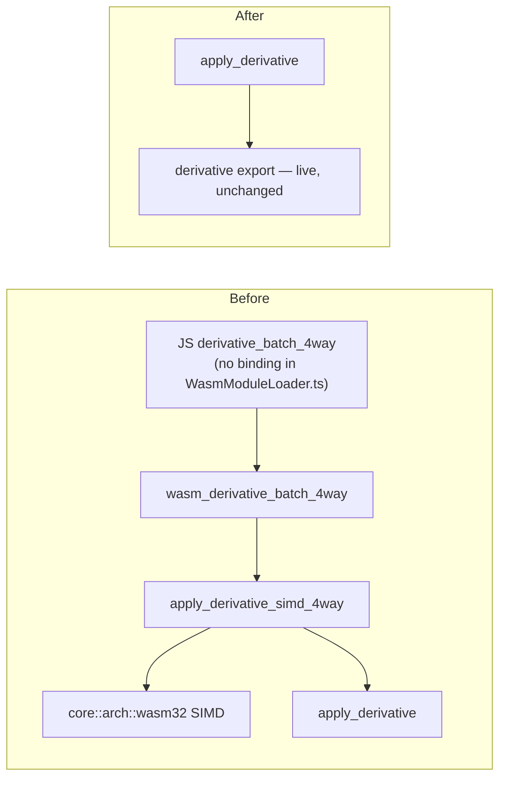

# Remove `derivative_batch_4way` / `apply_derivative_simd_4way` (Issue #422)

## Summary

Removes the `derivative_batch_4way` WASM export and the native
`apply_derivative_simd_4way` it wrapped. Closes #422.

The dead-code audit (Issue #416, from #413) verified there is no consumer: no
`module.derivative_batch_4way` binding (nor dynamic `module[...]` access) exists
in NEAT-AI's `src/wasm/WasmModuleLoader.ts`, and NEAT-AI, NEAT-AI-Discovery,
NEAT-AI-scorer, NEAT-AI-Examples and NEAT-AI-Explore have zero references. The
only callers were the `wasm_bindgen` shim and this crate's own tests.

Deleted:

| File | Item |
| --- | --- |
| `neat-core/src/wasm_exports.rs` | `wasm_derivative_batch_4way` shim + its import |
| `neat-core/src/derivative.rs` | both `cfg` arms of `apply_derivative_simd_4way` |
| `neat-core/src/derivative.rs` | the orphaned `core::arch::wasm32` SIMD import (the 4-way fn was its only consumer) |
| `neat-core/src/lib.rs` | `apply_derivative_simd_4way` re-export |
| `neat-core/tests/derivative.rs` | the 14 `test_derivative_simd_4way_*` tests + import |

`apply_derivative`, every non-4-way derivative test, and the **live** sibling
exports (`calculate_error_batch_4way`, `accumulate_*_batch_4way`,
`calculate_{weight,bias}_batch_4way`) are untouched.

**Breaking change** — `apply_derivative_simd_4way` was public API. Signalled by
the `refactor(wasm)!:` marker and `BREAKING CHANGE:` footer; workspace version
bumped `0.5.0 → 0.6.0` (minor, pre-1.0) with a Breaking-change log entry added
to `RELEASING.md`.

## Evidence

Backend/WASM-library change — no web interface to screenshot. Verified by
compiler, test and bundle output:

- `./quality.sh` — **green** (fmt, clippy `-D warnings`, deny, `cargo test
  --workspace`, doc, release build).
- `cargo check -p neat-core --target wasm32-unknown-unknown` — **green**. This
  is the load-bearing check for the orphaned-import gotcha: `derivative.rs`'s
  SIMD import sits behind `#[cfg(target_arch = "wasm32")]`, so host clippy never
  compiles it.
- `scripts/build-wasm-bundle.sh` succeeded; `grep -c derivative_batch_4way
  neat-core/wasm_activation/pkg/wasm_activation.d.ts` → **0**, while
  `derivative`, `calculate_error_batch_4way` and `accumulate_weight_batch_4way`
  remain in the generated surface.
- `grep -rn 'apply_derivative_simd_4way\|derivative_batch_4way' --include='*.rs' .`
  returns nothing outside `target/`.

## Test Plan

- **Removed** the 14 `test_derivative_simd_4way_*` tests in
  `neat-core/tests/derivative.rs` (including
  `test_derivative_simd_4way_matches_scalar`). This is the documented test
  modification required by the API removal — the tests exercised only the
  deleted function. No coverage is lost on the SIMD arm: those tests ran on the
  host and therefore only ever hit the scalar fallback, which simply delegated
  to `apply_derivative`; the `wasm32` SIMD arm never had test coverage.
- **Retained** every scalar `apply_derivative` test in the same file — they
  cover the numerics the removed wrapper delegated to, and stay green under
  `cargo test --workspace`.
