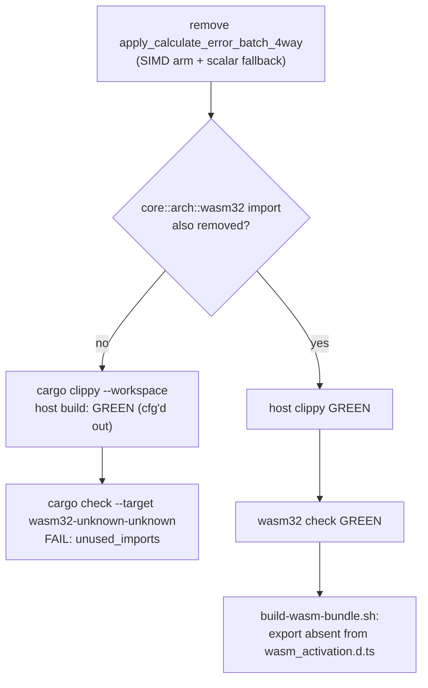

# PR Summary — Issue #423

## Summary

Removes the dead `calculate_error_batch_4way` WASM export and the native
`apply_calculate_error_batch_4way` it wrapped. Closes #423.

Sub-issue of the #416 dead-code audit (from #413). `WasmModuleLoader.ts` in
NEAT-AI has no `calculate_error_batch_4way` binding (and no dynamic
`module[...]` access), and no consumer exists in NEAT-AI, NEAT-AI-Discovery,
NEAT-AI-scorer, NEAT-AI-Examples or NEAT-AI-Explore. The only callers were the
WASM shim itself and this crate's own integration tests.

### Deleted

| File | Item |
| --- | --- |
| `neat-core/src/wasm_exports.rs` | `wasm_calculate_error_batch_4way` (`js_name = calculate_error_batch_4way`) and its local `first_four` helper |
| `neat-core/src/wasm_exports.rs` | `apply_calculate_error_batch_4way` dropped from the `crate::error` import |
| `neat-core/src/error.rs` | `apply_calculate_error_batch_4way` — both the `wasm32` SIMD arm and the scalar fallback arm |
| `neat-core/src/error.rs` | the orphaned `use core::arch::wasm32::{f32x4, …}` block and the stale `Issue #1213` module-doc line |
| `neat-core/src/lib.rs` | `apply_calculate_error_batch_4way` dropped from `pub use error::{…}` |
| `neat-core/tests/error_calculate.rs` | the 7 `test_calculate_error_batch_4way_*` tests and the import |

Left untouched: `apply_calculate_error`, `clamp_error`, `ERROR_EPSILON`,
`MAX_ERROR_MAGNITUDE`, every scalar `test_calculate_error_*` test, and the live
sibling `accumulate_*_batch_4way` / `calculate_{weight,bias}_batch_4way`
exports.

### Breaking change

`apply_calculate_error_batch_4way` was public API via `lib.rs`, so this is a
breaking removal under `RELEASING.md`. The workspace minor is bumped
**0.6.0 → 0.7.0** (sibling #422 took 0.6.0), the commit carries a `refactor!:`
Conventional-Commit marker plus a `BREAKING CHANGE:` footer, and a `0.7.0`
entry with a per-lane migration snippet is added to the `RELEASING.md`
breaking-change log.

## Evidence

Backend/Rust change only — no web interface to screenshot. Verified by the
acceptance gates:

| Gate | Result |
| --- | --- |
| `cargo clippy --workspace --all-targets -- -D warnings` | green |
| `cargo test --workspace` (via `./quality.sh`) | green — `All quality checks passed!` |
| `cargo check -p neat-core --target wasm32-unknown-unknown` | green — orphaned SIMD import removed |
| `scripts/build-wasm-bundle.sh --rev <sha>` | succeeds; `grep -c calculate_error_batch_4way …/wasm_activation.d.ts` → `0` |
| `grep -rn 'apply_calculate_error_batch_4way\|calculate_error_batch_4way' --include='*.rs' .` | no hits outside `target/` |

`error_calculate.rs` retains its 7 scalar tests, all passing.

Gotcha 1 from the issue is the reason the wasm32 gate matters — `error.rs`'s
SIMD import sits behind `#[cfg(target_arch = "wasm32")]`, so host clippy never
compiles it and an orphaned import would only surface at bundle-build time:

## Test Plan

No new tests — this is a pure dead-code removal, so the coverage evidence is the
surviving suite staying green plus the export disappearing from the generated
type surface.

- **Removed:** the 7 `test_calculate_error_batch_4way_*` tests in
  `neat-core/tests/error_calculate.rs` (`_identity`, `_complement`,
  `_tiny_error`, `_relu_active`, `_clamping`, `_matches_scalar`,
  `_aggregate_functions`). They exercised only the deleted function; the wasm32
  SIMD arm never had test coverage because the suite runs on the host and hit
  the scalar fallback exclusively. No coverage of surviving code is lost —
  `..._matches_scalar` compared the fallback against `apply_calculate_error`,
  which the scalar `test_calculate_error_*` tests still cover directly.
- **Retained and green:** the 7 scalar `test_calculate_error_*` tests in the
  same file — the over-deletion guard named in the issue's Failure Detection
  section.
- **Removal verified by:** `cargo check -p neat-core --target
  wasm32-unknown-unknown` (orphaned-import gate) and the absence of
  `calculate_error_batch_4way` from the freshly built
  `neat-core/wasm_activation/pkg/wasm_activation.d.ts`.
