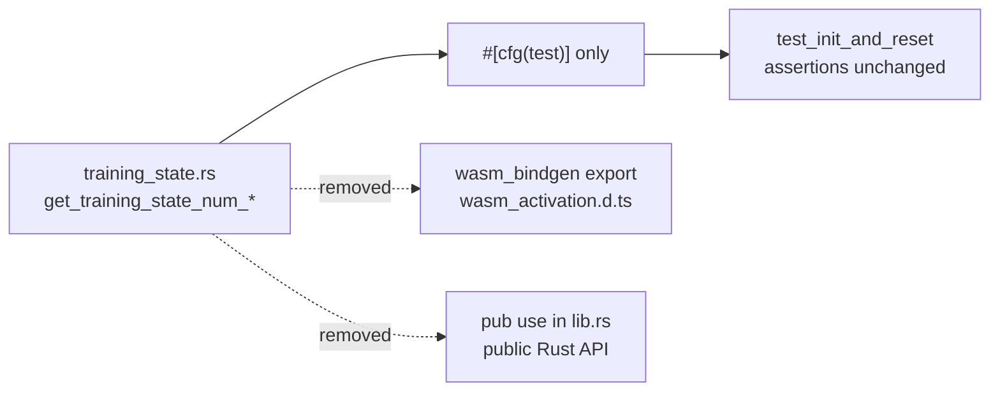

## Summary

Removed the `get_training_state_num_neurons` and `get_training_state_num_synapses`
WASM exports and their public re-exports, per the #416 dead-code audit. Neither
had a `module.<name>` binding in NEAT-AI's `src/wasm/WasmModuleLoader.ts`, nor a
caller in NEAT-AI, NEAT-AI-Discovery, NEAT-AI-scorer, NEAT-AI-Examples or
NEAT-AI-Explore — their only references were the in-file tests. Closes #424.

Route taken: the **preferred** one from the issue — both accessors are kept as
`#[cfg(test)]` helpers in `training_state.rs` (attribute dropped, `pub` dropped,
`lib.rs` re-export dropped), so `test_init_and_reset` keeps asserting the
recorded `NUM_SYNAPSES` / `NUM_NEURONS` counts **unchanged**. No assertions were
weakened or deleted.

Breaking removal of two public items → **minor** bump `0.7.0` → `0.8.0`, a
`RELEASING.md` breaking-change log entry, and a `refactor!:` Conventional-Commit
marker. Rebased on the milestone branch after siblings #422 (`0.6.0`) and #423
(`0.7.0`) merged, so there is no version collision.

Everything else in `training_state.rs` is untouched: `init_training_state`,
`free_training_state`, `reset_training_state`, the `read_*_state` readers and
the `accumulate_*_persistent_*way` exports remain live.

### Changes

| File | Change |
| --- | --- |
| `neat-core/src/training_state.rs` | both accessors: `#[cfg_attr(target_arch = "wasm32", wasm_bindgen)]` and `pub` dropped, `#[cfg(test)]` added |
| `neat-core/src/lib.rs` | both names dropped from `pub use training_state::{...}` |
| `Cargo.toml` / `Cargo.lock` | workspace version `0.7.0` → `0.8.0` |
| `RELEASING.md` | `0.8.0` breaking-change log entry with migration note |

## Evidence

Backend/Rust-only change — no web interface to screenshot. Verified by running
the acceptance commands locally:

| Acceptance check | Result |
| --- | --- |
| `cargo clippy --workspace --all-targets -- -D warnings` | green (no `dead_code` warning from the `cfg(test)` gating) |
| `cargo test --workspace` | green; `training_state::tests::test_init_and_reset` passes with its count assertions intact |
| `cargo check -p neat-core --target wasm32-unknown-unknown` | green |
| `wasm-pack build` (as `scripts/build-wasm-bundle.sh` runs it) | succeeds; `grep get_training_state_num_ wasm_activation.d.ts` returns nothing |
| `./quality.sh` | `✅ All quality checks passed!` |
| `breaking-change` signal | `refactor!:` marker + `RELEASING.md` entry + minor bump |

Generated `wasm_activation.d.ts` after the change — the removed names are gone
while the live neighbours still export:

```text
$ grep -n 'get_training_state_num_' wasm_activation.d.ts
(no matches)

$ grep -n 'free_training_state\|init_training_state\|read_synapse_state' wasm_activation.d.ts
478:export function free_training_state(): void;
518:export function init_training_state(num_synapses: number, num_neurons: number): void;
640:export function read_synapse_state(index: number): Float64Array;
```

Where the two accessors moved:



## Test Plan

No new tests — this is a removal, and the existing coverage is exactly what the
issue asks to preserve:

- `neat-core/src/training_state.rs::tests::test_init_and_reset` — unmodified.
  Still asserts `get_training_state_num_synapses() == 4` and
  `get_training_state_num_neurons() == 2` after `init_training_state(4, 2)`, and
  `get_training_state_num_synapses() == 0` after `free_training_state()`. It now
  calls the `#[cfg(test)]` helpers rather than public API.
- `cargo test --workspace` — full suite green, no other test referenced either
  name.
