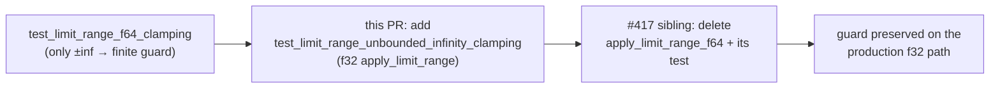

# PR Summary — Issue #425

## Summary

`test_limit_range_f64_clamping` was the only test asserting that the
**unbounded** activation ranges clamp `±inf` to a finite `±F32_LARGE`. Sibling
work under #417 deletes `apply_limit_range_f64` and that test, which would
silently drop the assertion.

This PR adds `test_limit_range_unbounded_infinity_clamping` to
`neat-core/tests/range.rs`, asserting the same behaviour through the production
`apply_limit_range` (f32) path for all seven `(-F32_LARGE, F32_LARGE)`
activations: `Identity`, `Cube`, `LeakyRelu`, `Tan`, `BentIdentity`,
`Complement`, `StdInverse`.

Test-only — no change to `neat-core/src/`. Closes #425.

## Evidence

Backend/library change with no web interface, so no screenshot applies. The
evidence is the test run.

The new assertions pass against the **current, unmodified** implementation, as
the acceptance criteria require:

```
running 10 tests
test test_limit_range_clamping ... ok
test test_limit_range_f64_clamping ... ok
test test_limit_range_unbounded_infinity_clamping ... ok
...
test result: ok. 10 passed; 0 failed
```

`./quality.sh` (fmt, clippy `-D warnings`, deny, workspace tests, doc, release
build) finished with `✅ All quality checks passed!`.

Coverage handover across the two milestone PRs:



## Test Plan

- Added `neat-core/tests/range.rs::test_limit_range_unbounded_infinity_clamping`
  — for each unbounded activation, asserts `apply_limit_range(s, f32::INFINITY)`
  is finite and `> 1e30`, and `apply_limit_range(s, f32::NEG_INFINITY)` is
  finite and `< -1e30`.
- No existing tests were modified or removed.
- `cargo fmt --all -- --check`, `cargo clippy --workspace --all-targets
  --all-features -- -D warnings`, and the workspace test suite are green via
  `./quality.sh`.
