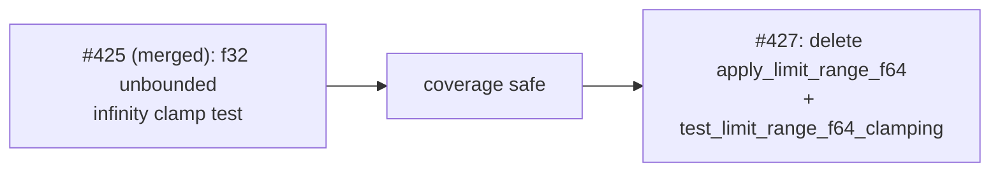

# Remove dead `apply_limit_range_f64` (Issue #427)

## Summary

Deleted `apply_limit_range_f64` from `neat-core/src/range.rs` and its only
caller, the integration test `test_limit_range_f64_clamping`. The function had
no caller outside that test, was absent from `lib.rs`'s curated re-exports, and
had no `#[wasm_bindgen]` wrapper — so removing it is not a public-surface
change. Its `#[allow(dead_code)]` suppressed nothing (`dead_code` does not fire
on `pub` items in a reachable `pub mod` of a library crate) and only obscured
that the function was unused. Sub-issue of #417. Closes #427.

`F32_LARGE` stays — it is still used throughout `apply_get_range`.

## Evidence

Backend-only change with no web interface, so no screenshot applies. Evidence is
the acceptance-criteria checks and the green quality gate:

- `grep -rn '\bapply_limit_range_f64\b' neat-core/src neat-core/tests neat-core/benches`
  → no hits.
- No `#[allow(dead_code)]` remains in `neat-core/src/range.rs`.
- `RUSTDOCFLAGS="-D warnings" cargo doc --no-deps -p neat-core` → clean, no
  `unresolved link` warning. The removed doc comment was the only one naming the
  f64 helper; the surviving `apply_limit_range` / `apply_limit_range_bounds`
  docs never linked to it, so no dangling intra-doc link was left behind.
- `./quality.sh` → fmt, clippy `-D warnings`, deny, full test run, doc build and
  release build all pass.

### Coverage dependency

The issue flagged that `test_limit_range_f64_clamping` was the only test
asserting an *unbounded* activation's infinity clamps to a finite `±F32_LARGE`.
The sibling sub-issue #425 has already landed on the milestone branch, adding
`test_limit_range_unbounded_infinity_clamping` on the f32 path — it asserts
`is_finite()` and the `±1e30` magnitude for `Identity`, `Cube`, `LeakyRelu`,
`Tan`, `BentIdentity`, `Complement` and `StdInverse`. That coverage is strictly
broader than the single `Identity` assertion being deleted here, so no coverage
is lost and no inline replacement was needed.

## Test Plan

- Removed `neat-core/tests/range.rs::test_limit_range_f64_clamping` (the deleted
  function's only caller) and dropped `apply_limit_range_f64` from the `use` on
  line 3. No other test was modified.
- Retained `test_limit_range_clamping` and `test_limit_range_unbounded_infinity_clamping`,
  which together cover the equivalent bounded and unbounded clamp behaviour on
  the f32 path that remains in use.
- Full workspace suite re-run green via `./quality.sh`.
