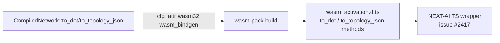

## Summary

Added the `#[wasm_bindgen]` annotation to the `impl CompiledNetwork` block in `neat-core/src/topology_export.rs` (gated to `wasm32`), so `to_dot(num_outputs)` and `to_topology_json(num_outputs)` are exposed as methods on the `CompiledNetwork` JS class in `wasm_activation/pkg/wasm_activation.{js,d.ts}`. This unblocks NEAT-AI issue #2417, which delegates all topology formatting to core. Closes #43.

The change mirrors the established pattern used for `activate` / `activate_view` / `reset_state` in `neat-core/src/network.rs` — a single `#[cfg_attr(target_arch = "wasm32", wasm_bindgen)]` on the impl block, no per-method annotation required.

## Evidence

Backend-only change (no UI, no performance work). Verified by:

1. `wasm-pack build neat-core --target web --out-name wasm_activation --out-dir wasm_activation/pkg` succeeds, and the generated `wasm_activation.d.ts` contains:
   ```
   to_dot(num_outputs: number): string;
   to_topology_json(num_outputs: number): string;
   ```
   plus the matching `compilednetwork_to_dot` / `compilednetwork_to_topology_json` raw exports in `InitOutput`.
2. `./quality.sh` is green (fmt, clippy, deny, doc, full workspace tests including the 13 existing `topology_export` tests and the 9 `wasm_bindgen_surface` tests).
3. Native build is unaffected — the impl block remains a plain Rust impl when the `wasm32` cfg is inactive.



## Test Plan

- Added two regression tests to `neat-core/tests/wasm_bindgen_surface.rs`:
  - `to_dot_method_callable_on_compiled_network` — invokes `CompiledNetwork::to_dot(1)` on a minimal serialised network and asserts the DOT digraph header/footer.
  - `to_topology_json_method_callable_on_compiled_network` — invokes `to_topology_json(1)` and asserts the JSON parses with the expected `num_inputs` / `num_outputs` / `num_neurons` values.
- Existing `neat-core/tests/topology_export.rs` (13 tests) continues to pass — the impl-block annotation does not change native behaviour.
- Manually verified the wasm bundle: `wasm-pack build` and `grep -E "to_dot|to_topology_json" neat-core/wasm_activation/pkg/wasm_activation.d.ts` shows the methods on the `CompiledNetwork` class.
