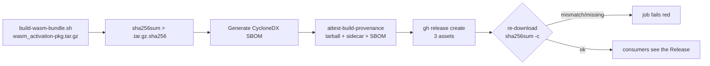

# Publish a `wasm_activation-pkg.tar.gz.sha256` sidecar on every bundle Release

## Summary

`wasm-bundle.yml` published only two assets per `wasm-bundle-<SHA>` Release —
the tarball and the CycloneDX SBOM. NEAT-AI's `build.sh` already knows how to
verify the downloaded tarball against a release-side
`wasm_activation-pkg.tar.gz.sha256`, but no such sidecar existed, so the only
SHA-256 anchor a consumer held for a **new** revision was the `deno.json`
`neatCore.assetSha256` pin recorded for the **old** revision. That is what makes
every internal `neatCore.rev` bump fail closed (stSoftwareAU/NEAT-AI#3504).

This PR emits the sidecar in standard `shasum -a 256` format, covers it with the
existing build-provenance attestation, publishes it as a third Release asset, and
extends the in-workflow verify step to re-download and check it. The sidecar
ships with the revision it describes, so it attests the new bundle without
weakening the pin's tamper check for the pinned revision.

Closes #438. Tracked downstream by stSoftwareAU/NEAT-AI#3513.

## Changes

- **`.github/workflows/wasm-bundle.yml`**
  - New **Generate tarball SHA-256 sidecar** step, between the bundle build and
    the attestation, writing `wasm_activation-pkg.tar.gz.sha256` and immediately
    re-checking it with `sha256sum -c` (fail loud, never a silently empty file).
  - **Attest wasm_activation bundle provenance** — sidecar added to
    `subject-path`, so the anchor itself is covered by the Sigstore attestation.
  - **Publish per-commit Release** — sidecar added to the `gh release create`
    asset list; every Release now carries three assets. Release notes mention it.
  - **Verify published bundle** — downloads `wasm_activation-pkg.tar.gz*`
    (the glob picks up the sidecar; the `.cdx.json` SBOM does not match), asserts
    the sidecar is present and non-empty, then runs `sha256sum -c`. A missing or
    mismatched sidecar now reddens the run on the commit that produced the
    bundle, before any consumer sees the Release (same rationale as #48).
- **`README.md`** — the propagation section documents the three assets and the
  sidecar's role as the per-revision hash anchor; sequence diagram updated.
- **`tests/scripts/wasm_bundle_sha256_sidecar.bats`** — new tests (below).

No change to the tag scheme, the tarball asset name, or the SBOM. No
auto-release or auto-bump behaviour is introduced.

## Flow



## Evidence

Workflow-only change — no web interface to screenshot. Evidence is the bats
suite, which executes the workflow's real step scripts under the shell GitHub
would use (`bash -e`) with a stubbed `gh`:

```
$ bats tests/scripts/wasm_bundle_sha256_sidecar.bats
1..10
ok 1 publish job generates the tarball SHA-256 sidecar
ok 2 sidecar is published as a Release asset
ok 3 sidecar is generated before the Release is published
ok 4 provenance attestation covers the sidecar
ok 5 verify step re-downloads the sidecar and checks it
ok 6 generate step emits a sidecar build.sh can parse and verify
ok 7 generate step fails loud when the tarball is missing
ok 8 verify step passes when the published sidecar matches the tarball
ok 9 verify step fails when the published sidecar hash is wrong
ok 10 verify step fails when the sidecar is missing from the Release
```

Full suite: `bats tests/scripts` → 299 passing, 0 failures. `actionlint`,
`markdownlint-cli2`, `scripts/typescript-check.sh` and the Mermaid gate are all
clean. Rust gates are untouched by this change.

Nine of the ten tests failed before the workflow edit (TDD red → green); the
tenth (`verify step passes …`) passed vacuously beforehand because the old
verify step performed no checksum check at all.

## Test Plan

- `tests/scripts/wasm_bundle_sha256_sidecar.bats` (new)
  - Wiring, parsed from `wasm-bundle.yml`: a step generates the sidecar; it is
    attached to `gh release create`; it is generated before both the attestation
    and the publish; the attestation's `subject-path` covers it; the verify
    step's `--pattern` glob-matches the sidecar and it runs `sha256sum -c`.
  - Behaviour, executing the extracted step scripts:
    - the generate step produces `<64-hex><two spaces><filename>` and the hash
      parsed the way `build.sh` parses it (`awk '{print $1}' | head -n1`) equals
      the tarball's real `sha256sum`;
    - the generate step exits non-zero and leaves no usable sidecar when the
      tarball is absent;
    - the verify step exits 0 on a matching sidecar, non-zero on a tampered
      tarball (swapped-upload regression), and non-zero when the Release has no
      sidecar at all.
