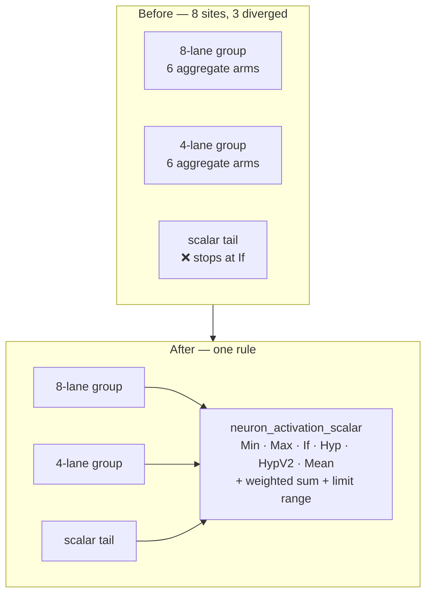

# Aggregate-squash activation: one rule, called from every scalar tail

## Summary

The rule that turns a neuron's inbound synapse range into an activation — the
dispatch over `Minimum` / `Maximum` / `If` / `Hypotenuse` / `HypotenuseV2` /
`Mean`, the standard weighted-sum fall-through, then `apply_limit_range` — was
copy-pasted across `neat-core/src/loss.rs`, and **three of those copies had
diverged**: they stopped at `If`, so a neuron using `Mean`, `Hypotenuse` or
`HypotenuseV2` fell through to a plain weighted sum whenever its record landed
in the scalar remainder instead of a full SIMD group.

That was reachable in production, not theoretical: `mse_sum_batch_8way_scattered`
is the arm selected *precisely when* `has_aggregate_squash()` is true, so the one
path reserved for aggregate networks mis-computed its own tail records. The
`batch_8way_activation!` tail is shared by the MAE, cross-entropy, MAPE, MSLE and
hinge paths, and `mse_sum_batch_4way` is reached with no aggregate guard at all.
An aggregate creature scored over nine records got the correct error for the
first eight and a silently wrong one for the ninth.

`neuron_activation_scalar` (`neat-core/src/batch_scoring.rs`) already held the
correct rule, byte-for-byte as `CompiledNetwork::activate_into` computes it. This
PR widens it to `pub(crate)` and calls it from every single-record site in
`loss.rs` — the three diverged scalar tails, the four per-lane aggregate loops
and the interleaved tail — deleting ~700 duplicated lines. Adding a seventh
aggregate squash now means editing one match.

Closes #441.

### Deliberately left alone

- **`CompiledNetwork::activate` / `activate_into`** keep their inlined copy.
  Routing them through the helper was implemented and measured: `forward_pass/
  production_exact` went from **13.4 µs → 19.3 µs (+46%)**, and still **17.4 µs
  (+30%)** with `#[inline(always)]`. Neither copy had diverged, so the trade was
  not worth it; the constraint is now recorded in `AGENTS.md`.
- **`network.rs:753-926`**, the `(activation, hint_value)` trace variant — it
  would need a mode parameter, which the issue explicitly rules out.



## Evidence

Backend/library change with no web interface, so no screenshot applies. Evidence
is the failing-then-passing regression test plus the benchmark A/B above.

**New test fails on the unfixed code** (`Hypotenuse`, tail record wrong by two
orders of magnitude more than the SIMD tolerance):

```
mse Hypotenuse n=5: batched 2.2803990747196785 diverged from per-record
reference 2.1519708379379026 by 0.12842823678177595 (tol 0.00001)
mae Hypotenuse n=9: batched 5.541243314743042 diverged from per-record
reference 5.42296490073204 by 0.11827841401100159 (tol 0.00001)
```

**After the fix:**

```
running 2 tests
test mse_scalar_tail_matches_reference_for_every_aggregate_squash ... ok
test shared_8way_scalar_tail_matches_reference_for_every_aggregate_squash ... ok
test result: ok. 2 passed; 0 failed
```

`./quality.sh` passes clean (fmt, clippy `-D warnings`, deny, full
`cargo test --workspace`, doc build, release build).

**Numerics note.** For `Hypotenuse` / `HypotenuseV2` / `Mean`, the per-lane
aggregate loops in `loss.rs` previously used naive scalar sums; they now use the
same SIMD sum helpers as the single-record reference. Results shift by f32
rounding *towards* `activate` — the batch paths are now closer to the reference,
not further. The existing bit-identity guard
(`loss::interleaved_mse_parity`) and the `mse_squash_simd_parity` /
`score_squash_simd_parity` suites all stay green.

**Benchmark A/B** (`cargo bench --bench hot_paths`, 100 samples): batched
scoring shows no consistent movement — `mse_sum_8records/production` 64.5 µs vs
64.9 µs, within the ±10% run-to-run noise seen in both directions on this host.
The changed code is only reached by aggregate networks and scalar tails, so this
is the expected result.

## Test Plan

Added `neat-core/tests/aggregate_squash_tail_parity.rs`:

- `mse_scalar_tail_matches_reference_for_every_aggregate_squash` — scores an
  aggregate network through `mse_sum_batch_packed` at record counts with a
  non-empty tail (5, 6, 7 → 4-way + tail; 9, 13 → 8-way group + tail) for all
  six aggregate squashes, asserting the batched result matches the per-record
  `CompiledNetwork::activate_into` reference (`forward_only = false`) within
  1e-5.
- `shared_8way_scalar_tail_matches_reference_for_every_aggregate_squash` — the
  same guard across the five loss functions sharing `batch_8way_activation!`
  (MAE, cross-entropy, MAPE, MSLE, hinge) at counts 9 and 13.

Both tests fail against the unfixed code and pass after the change. The fixture
alternates synapse types so the `If` arm sees condition, positive and negative
edges rather than a single branch.

Existing suites unchanged and green, including the bit-identity guards that pin
the interleaved kernel to the scattered one across the 8/4/tail boundaries.
