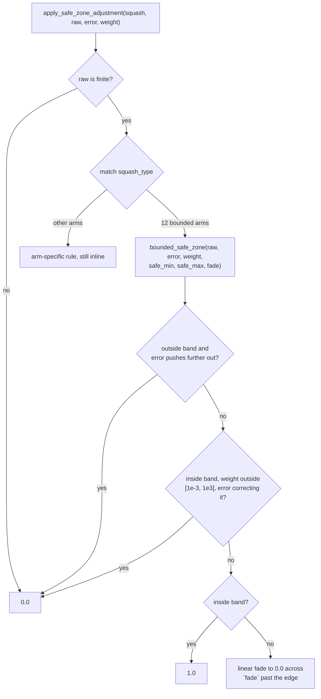

# Extract the bounded safe-zone rule shared by twelve SquashType arms

## Summary

Twelve `SquashType` arms of `apply_safe_zone_adjustment`
(`neat-core/src/safe_zone.rs`) each re-implemented the same ~22-line bounded
safe-zone policy. Only the safe band `[safe_min, safe_max]` and the fade width
differed — the guards, the `[1e-3, 1e3]` weight thresholds and the linear fade
formula were character-for-character identical. Extracted one private helper and
collapsed each arm to a single call. Closes #442.

```rust
#[inline(always)]
fn bounded_safe_zone(
    raw_input: f32, error: f32, weight: f32,
    safe_min: f32, safe_max: f32, fade: f32,
) -> f32
```

Each arm is now one line, e.g.
`SquashType::Selu => bounded_safe_zone(raw_input, error, weight, -10.0, 10.0, 10.0)`.

The six parameters are plain numeric bounds — no mode flags and no
`if caller == …` branching, so this is a call rather than a parameterised
super-helper. The arms encoding genuinely different rules (`Sine`, `Cosine`,
`Tan`, `Gaussian`, `BipolarSigmoid`, `ArcTan`, `Square`, `Cube`, `Sqrt`,
`Logistic`, `Tanh`, `HardTanh`, and the rest) are untouched.

Behaviour is unchanged. `safe_zone.rs` drops from 1010 to 630 lines.

### Bounds per arm

| Arm | `safe_min` | `safe_max` | `fade` |
| --- | ---: | ---: | ---: |
| `LeakyRelu` | -50 | 50 | 20 |
| `Selu` | -10 | 10 | 10 |
| `Elu` | -10 | 10 | 10 |
| `Softsign` | -10 | 10 | 10 |
| `Softplus` | -10 | 20 | 10 |
| `Swish` | -10 | 10 | 10 |
| `Mish` | -10 | 10 | 10 |
| `Gelu` | -6 | 6 | 10 |
| `StdInverse` | -10 | 10 | 10 |
| `Exponential` | -10 | 30 | 10 |
| `LogSigmoid` | -20 | 20 | 10 |
| `Isru` | -10 | 10 | 10 |

`LogSigmoid` previously spelled its fade edges as absolute `fade_min = -30.0` /
`fade_max = 30.0` rather than `safe_min - fade` / `safe_max + fade`; those are
the same values, so the collapse to `fade = 10.0` is exact.

## Evidence

This is a backend library refactor with no web interface, so there is no
screenshot. The evidence is the behavioural test suite plus a green quality
gate.



Quality gate (`./quality.sh`) passes cleanly: rustfmt, clippy, `cargo deny`, the
full workspace test suite, doc build and release build.

## Test Plan

Added `neat-core/tests/safe_zone_bounded.rs` — seven behavioural tests, each
looping over all twelve arms with their `(safe_min, safe_max, fade)` bounds and
asserting on the factor returned by the public
`apply_safe_zone_adjustment`, not on the helper:

- `inside_band_with_healthy_weight_flows_fully` — both edges and the centre
  return `1.0` for negative, zero and positive error.
- `outside_band_with_worsening_error_blocks_gradient` — past either edge with an
  error pushing further out returns `0.0`.
- `inside_band_defers_to_a_correcting_tiny_weight` — `|weight| < 1e-3` with
  `weight * error > 0` returns `0.0`; the same weight with a non-correcting
  error still returns `1.0`.
- `inside_band_defers_to_a_correcting_huge_weight` — the `|weight| > 1e3`
  mirror.
- `beyond_band_fades_linearly_to_zero` — 25%, 50%, 75% and 100% into each fade
  band returns exactly `0.75`, `0.5`, `0.25` and `0.0`.
- `past_the_fade_width_no_gradient_flows` — beyond the fade width returns `0.0`.
- `non_finite_raw_input_is_never_safe` — `NaN` and both infinities return `0.0`.

These were written and run **before** the extraction, against the twelve
existing copies, so they characterise the pre-change behaviour; they then stayed
green afterwards. That is what verifies the refactor is behaviour-preserving —
for a pure extraction there is no new behaviour for a failing-first test to
describe. The existing `test_safe_zone_adjustment` in
`neat-core/tests/integration.rs` is unchanged and still passes.
