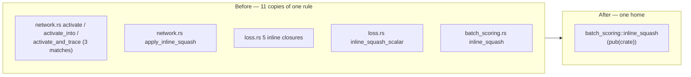

# One hot-squash dispatch: eleven copies become one call (Issue #443)

## Summary

The rule *"inline the four hot squash types, defer everything else to
`apply_squash`"* was written out at **eleven** sites — three private helpers
that already encoded it, plus eight longhand `match` copies. `inline_squash`
(`neat-core/src/batch_scoring.rs`) is promoted to `pub(crate)` as the single
home; `inline_squash_scalar` (`loss.rs`) and
`CompiledNetwork::apply_inline_squash` (`network.rs`) are deleted in its favour,
and every longhand match becomes one call. Behaviour is unchanged. Closes #443.

The issue listed fourteen sites against older line numbers; three of those had
already been absorbed by the #441 aggregate-activation work, leaving eleven at
the time of this change.

### Sites collapsed

| File | Was | Now |
| --- | --- | --- |
| `batch_scoring.rs` | `fn inline_squash` (private) | `pub(crate) fn inline_squash` — the single home |
| `loss.rs` | `fn inline_squash_scalar` | deleted |
| `network.rs` | `CompiledNetwork::apply_inline_squash` | deleted |
| `loss.rs` × 5 | inline `apply_squash_inline` closures in the 8-way macro, its 4-way remainder, `mse_sum_batch_4way`, and both loops of `mse_sum_batch_8way_scattered` | `inline_squash(...)` |
| `network.rs` × 3 | inline matches in `activate`, `activate_into`, `activate_and_trace` | `inline_squash(...)` |

The vectorised `squash_x4` / `squash_x8` approximations are a different rule and
stay where they are — only their scalar `None`-fallback branch now calls the
shared helper.



## Evidence

Backend-only change — no web interface to screenshot.

**Mutation sweep (the real evidence).** Before merging the copies, each of the
eleven sites was mutated one at a time (`1 => sum.max(0.0)` →
`1 => sum.max(0.1)`) and `inline_squash_dispatch.rs` re-run. Every mutation was
caught, proving the new test actually reaches all eleven former copies rather
than merely compiling:

```
loss.rs:125  -> FAILED   loss.rs:795   -> FAILED
loss.rs:239  -> FAILED   network.rs:502  -> FAILED
loss.rs:496  -> FAILED   network.rs:667  -> FAILED
loss.rs:939  -> FAILED   network.rs:914  -> FAILED
loss.rs:1064 -> FAILED   network.rs:1270 -> FAILED
batch_scoring.rs:148 -> FAILED
```

Two of the copies were initially *not* reached (the 4-record remainder inside
the 8-way macro, and the scattered MSE kernel); the test was tightened —
alternating input signs so every group straddles zero, and a mixed
aggregate/standard network to route MSE onto the scattered path — until all
eleven failed under mutation. After the merge, the same mutation applied to the
single `inline_squash` fails four of the six tests.

**No performance regression.** `network.rs`'s `activate` is a hot path, so
`cargo bench --bench hot_paths -- forward_pass` was run before and after:

| Fixture | Before | After | Criterion verdict |
| --- | --- | --- | --- |
| `production` | 20.559 µs | 21.468 µs | no change (p = 0.93) |
| `production_2x` | 42.270 µs | 41.397 µs | no change (p = 0.69) |
| `production_exact` | 19.856 µs | 21.924 µs | no change (p = 0.06) |

`inline_squash` is `#[inline]` and within the same crate, so the call compiles
to what the longhand match compiled to. (This is a duplication fix, not a
performance task — the numbers are here to show nothing was lost.)

**Quality gate.** `./quality.sh < /dev/null` passes: fmt, clippy under
`-D warnings`, `cargo deny`, full workspace tests, docs, release build.

## Test Plan

Added `neat-core/tests/inline_squash_dispatch.rs` — six "what" tests asserting
observable activations, not implementation:

- `activate_squashes_every_standard_type_like_apply_squash` — all 32 standard
  squash types × 6 probe sums, bit-exact against
  `apply_limit_range(squash, apply_squash(squash, sum))`.
- `activate_into_squashes_every_standard_type_like_apply_squash` — same, via
  `activate_into`.
- `activate_and_trace_squashes_every_standard_type_like_apply_squash` — same,
  via `activate_and_trace`.
- `traced_4way_batch_squashes_every_standard_type_like_apply_squash` — the 4-way
  traced batch, within `SQUASH_SIMD_MAX_ABS_ERR` for the vectorised types.
- `batched_loss_fallback_squash_matches_the_scalar_reference` — all six packed
  loss entry points (`mse`, `mae`, `cross_entropy`, `mape`, `msle`, `hinge`) ×
  six non-vectorised squash types × record counts 4 / 8 / 13, batched vs the
  single-record reference.
- `scattered_mse_fallback_squash_matches_the_scalar_reference` — a mixed
  aggregate + standard network, which routes MSE onto the scattered 8-way kernel
  that carried two of the copies.

No existing tests were modified or removed. `AGENTS.md` gains a
"One hot-squash dispatch for standard neurons" section beside the existing
"One activation rule" note, so the convention is stated where the next agent
will read it.
