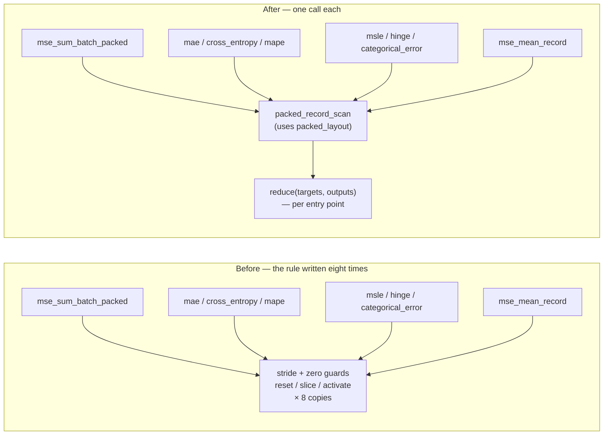
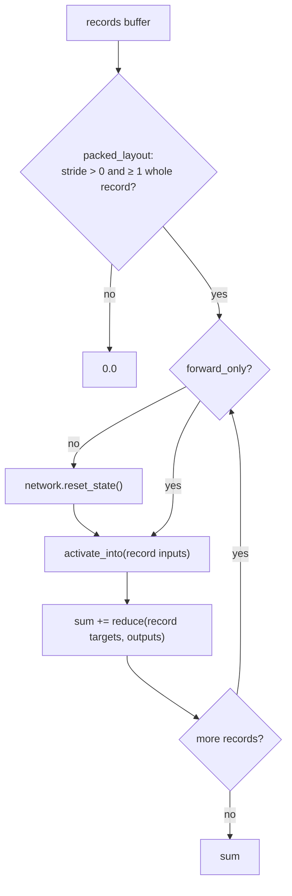

# One packed-record scan for every loss entry point (Issue #444)

## Summary

The packed-record scan — the `[inputs…, targets…]` layout arithmetic plus the
per-record reset/slice/activate driver — was copy-pasted into **eight** entry
points in `neat-core/src/loss.rs`. Only the innermost per-output reduction
differed, so a change to the layout rule (a buffer header, targets ahead of
inputs, a different reset condition) needed the same edit in eight places — and
a partial edit would still compile while silently mis-slicing records on the
paths that were missed.

This PR extracts the rule into one authoritative representation:

- `packed_layout(records_len, input_size, num_outputs) -> Option<PackedLayout>`
  — the stride (`input_size + num_outputs`) and the whole-record count, with
  both zero guards folded into the `None` case.
- `packed_record_scan(network, records, input_size, num_outputs, forward_only,
  reduce)` — drives the buffer record by record and returns the sum of
  `reduce(targets, outputs)`.

Each entry point keeps its own SIMD dispatch (MSE alone falls back through the
8-way *and* 4-way paths; `categorical_error_sum_batch_packed` uses neither and
keeps its own `num_outputs == 0` guard) and then calls the driver with a closure
carrying only its reduction. The per-record `1/num_outputs` factor lives inside
each closure, which keeps MSLE and hinge deliberately un-averaged. The driver
takes a closure and **no mode flags**. `mse_mean_record` divides the returned
sum by `num_records` at the call site.

Behaviour is unchanged — this is a de-duplication, not a semantic change.
`AGENTS.md` gains a section stating the rule and where it lives, matching the
existing #441 / #443 entries.

Closes #444.

## Evidence

Backend/library change with no web interface to screenshot. Evidence is the test
suite: `cargo test --workspace` is green (all 35 test binaries), and
`./quality.sh` passes cleanly (fmt, clippy with `-D warnings`, deny, tests, doc,
release build).

Per-record scan, stated once:

**Mutation check.** Before the refactor, an off-by-one target start was injected
into a *single* copy (`mae_sum_batch_packed`); the new suite failed on it
(`every_sum_entry_point_equals_the_sum_of_its_single_record_scans`), confirming
the tests bite per site rather than only at the shared helper. The mutation was
reverted before the refactor landed.

**Performance.** The SIMD kernels (`*_sum_batch_8way`, `mse_sum_batch_4way` and
the interleaved gather) are untouched — the change is confined to the scalar
record loop, where the closure is a monomorphised `impl Fn` and indexed target
reads became slice iteration. No benchmark numbers are claimed because this is a
de-duplication, not a performance task.

## Test Plan

New: `neat-core/tests/packed_record_scan.rs` — seven "what" tests driving the
public entry points with real networks, covering all eight sites:

- `every_packed_entry_point_ignores_a_trailing_partial_record` — the stride is
  `input_size + num_outputs` and only whole records are scanned.
- `every_packed_entry_point_returns_zero_without_a_whole_record` — empty buffer,
  buffer shorter than one record, and a zero-width record.
- `every_sum_entry_point_equals_the_sum_of_its_single_record_scans` — records are
  independent; at nine records this also pins the SIMD-batched buffer against the
  scalar single-record path.
- `mse_mean_record_equals_the_mean_of_its_single_record_scans` — same carve, then
  the average.
- `every_packed_entry_point_pairs_a_record_with_its_own_targets` — swapping two
  records' target blocks changes the result (MSLE excluded by mathematics: its
  reduction is `Σ(ln t) - Σ(ln o)`, invariant under that permutation).
- `every_packed_entry_point_reads_the_target_block_of_every_record` — editing the
  targets of any single record moves the result, including MSLE.
- `stateless_reset_is_conditional_on_forward_only` — on a self-loop network,
  `forward_only=false` keeps records independent, `forward_only=true` lets state
  carry over, and `mse_mean_record` always resets.

Unchanged and still green: the existing `loss.rs` unit tests, the interleaved
MSE bit-identity guards, and `inline_squash_dispatch.rs` /
`aggregate_squash_tail_parity.rs`, which exercise the same entry points from the
activation side. No existing test was modified or removed.
