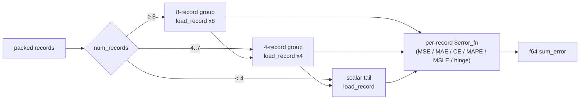

# MSE adopts the shared 8→4→1 batch skeleton (Issue #445)

## Summary

MSE was the only loss kind that hand-inlined the batched record-scan skeleton —
walk records in SIMD groups of eight, then one group of four, then a per-record
scalar tail, loading each record's inputs into per-lane activation buffers and
accumulating an `f64` error sum. The other five loss kinds already get that rule
from the `batch_8way_activation!` macro, parameterised by a per-record
`$error_fn` closure.

MSE now calls the same macro. `mse_sum_batch_4way` and
`mse_sum_batch_8way_scattered` are gone, replaced by one ~45-line
`mse_sum_batch_scattered` that supplies only the squared-error reduction. Net
`-511 / +105` lines. The record-**interleaved** 8-group path (Issue #384) stays
separate, as the issue asks — it is a genuinely different memory layout, and no
mode flag was added to merge it.

The loader sub-rule that had drifted is fixed at the same time.
`load_record` (`neat-core/src/batch_scoring.rs`) is now the single home of
clamp-and-zero: copy `min(record.len(), num_inputs)` values and zero every input
slot the record does not cover, exactly as `CompiledNetwork::activate_into`
does. Every per-lane loader in the macro and in the interleaved remainder calls
it. `load_batch_input` — whose doc comment promised zeroing its body never did —
is deleted.

Closes #445.

## Evidence

Backend/library change with no web interface, so no screenshot. Evidence is the
test suite plus the pre-existing bit-identity parity guards.

**Behaviour fixed.** Before this change, a packed batch whose records carried
more input columns than the network has inputs panicked in the forward-only
batched path (`range end index 8 out of range for slice of length 6`) while the
single-record path silently ignored the extras. Both now agree.

```
# before (new tests against unfixed code)
test aggregate_network_ignores_input_columns_beyond_the_network_inputs ... FAILED
test input_columns_beyond_the_network_inputs_are_ignored ... FAILED
test result: FAILED. 3 passed; 2 failed

# after
test result: ok. 5 passed; 0 failed
```

**Numerics unchanged.** The existing `interleaved_mse_parity` module asserts the
scattered kernel is **bit-identical** (`f64::to_bits`) to the interleaved path
across every record count that straddles a group boundary (8, 9, 12, 13, 15, 16,
17, 24, 4096) for seven squash types, plus the aggregate-dispatch guard. Those
tests pass unchanged against the macro-driven kernel, so the consolidation moved
no bits. `./quality.sh` is green (fmt, clippy `-D warnings`, deny, full
workspace test suite, doc build, release build).

**Performance.** Not a performance change, and the benchmark harness on this
machine cannot resolve one: every `hot_paths` network spec uses Tanh, so all
benched MSE batches route through the *unchanged* interleaved kernel. Two
back-to-back runs of the identical post-change binary swung from −26% to +46% on
the same benchmark IDs, so the criterion "regressed"/"improved" verdicts in this
range are noise, not signal.



## Test Plan

New `neat-core/tests/batch_record_skeleton.rs` — "what" tests driving the public
`*_sum_batch_packed` entry points against a single-record reference built from
`CompiledNetwork::activate`:

- `grouping_does_not_change_the_batched_sum` — every loss kind, 14 record counts
  straddling the 4- and 8-record boundaries (1, 3, 4, 5, 7, 8, 9, 11, 12, 13,
  16, 17, 24, 33).
- `aggregate_network_grouping_does_not_change_the_batched_sum` — the same rule
  on a network whose `MEAN` neuron keeps it on the per-lane kernels.
- `input_columns_beyond_the_network_inputs_are_ignored` — regression test for
  the loader drift; fails (panics) against the unfixed code.
- `aggregate_network_ignores_input_columns_beyond_the_network_inputs` — the same
  regression on the scattered route; also fails against the unfixed code.
- `uncovered_input_slots_score_as_zero` — a record covering fewer columns than
  the network has inputs reads the uncovered slots as zero for every record, so
  nothing leaks between groups.

Existing suites re-run unchanged and green, notably
`neat-core/src/loss.rs::interleaved_mse_parity` (bit-identity),
`neat-core/tests/mse_squash_simd_parity.rs`,
`neat-core/tests/mse_batch_interleaved_parity.rs`,
`neat-core/tests/packed_record_scan.rs` and
`neat-core/tests/aggregate_squash_tail_parity.rs`.

Docs: `AGENTS.md` gains the "One batched record-scan skeleton for every loss
kind" rule beside the #441/#443/#444 entries; the two stale
`mse_sum_batch_4way` references in `mse_squash_simd_parity.rs` are updated.
