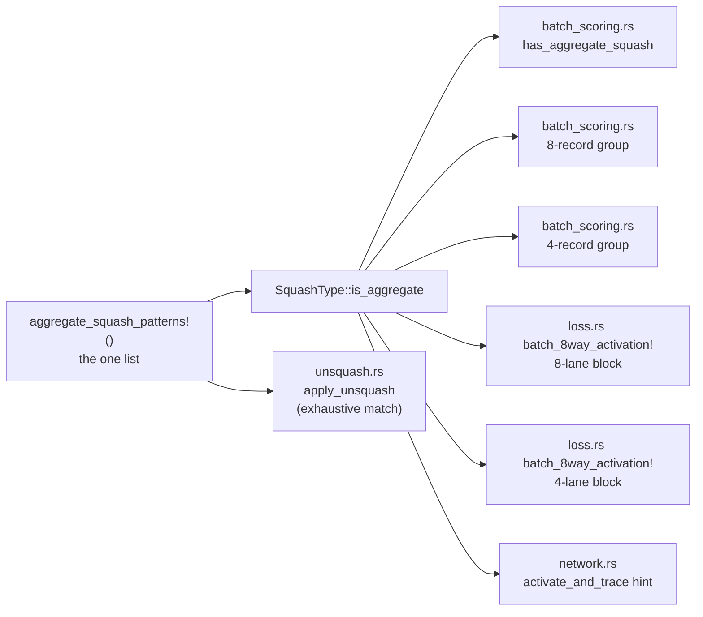

# One aggregate-squash set: seven copies become one predicate (Issue #446)

## Summary

The knowledge of *which squash types are aggregates* — `Minimum`, `Maximum`,
`If`, `Hypotenuse`, `HypotenuseV2`, `Mean`: the six that cannot be
lane-vectorised and must take the exact single-record kernel — was open-coded as
a six-arm type list at every consumer, with no `is_aggregate` predicate anywhere
in the crate. Adding a seventh aggregate type meant the identical one-arm edit at
each site, and a missed site fails **silently**: the new type would be routed
down the lane-vectorised weighted-sum path and produce numbers differing from
`activate()`, with no panic to flag it.

`SquashType::is_aggregate` (`neat-core/src/squash.rs`) is now the single home of
that membership rule. Every site calls it instead of restating the list; local
twists stay local (`has_aggregate_squash` keeps its own `!neuron.is_constant`
condition, `apply_unsquash` still uses the set to pick the hint rather than to
dispatch). Closes #446.

The issue listed ten sites against an older tree; #444 and #445 have since
folded the five `loss.rs` copies into two, so seven remained:

| Site | Role |
| --- | --- |
| `batch_scoring.rs` `has_aggregate_squash` | dispatch: per-lane vs interleaved |
| `batch_scoring.rs` `score_batch_per_lane` (8-group) | dispatch: scalar kernel vs SIMD lanes |
| `batch_scoring.rs` `score_batch_per_lane` (4-group) | dispatch: scalar kernel vs SIMD lanes |
| `loss.rs` `batch_8way_activation!` (8-lane block) | dispatch: scalar kernel vs SIMD lanes |
| `loss.rs` `batch_8way_activation!` (4-lane block) | dispatch: scalar kernel vs SIMD lanes |
| `network.rs` `activate_and_trace` | hint semantics: hint == activation |
| `unsquash.rs` `apply_unsquash` | hint semantics: not invertible, prefer hint |

### One list, two spellings — and why

Six of the seven sites take the predicate directly (`s if s.is_aggregate()`, or a
plain call). `apply_unsquash` is the exception: its `match` is exhaustive over
`SquashType`, and a guard arm would forfeit the compiler's exhaustiveness check —
a future non-aggregate squash type would then compile and fall into whatever
catch-all replaced it. So it takes the set as a *pattern* via
`aggregate_squash_patterns!()`, the `pub(crate)` macro that `is_aggregate` is
itself built from. There is still exactly one list; the second spelling is a
pattern view of the same list, not a second copy.



## Evidence

Backend-only change to a Rust library — there is no web interface to screenshot.
The evidence is the test suite plus a mutation check.

`./quality.sh` passes cleanly (fmt, clippy with `-D warnings`, `cargo deny`,
`cargo test --workspace`, doc build, release build):

```
✅ All quality checks passed!
```

**Mutation check — the new tests really do catch drift.** Dropping `Mean` from
the one list produced two independent failures, which is the whole point of the
change:

1. A **compile error** at `apply_unsquash` (`error[E0004]: non-exhaustive
   patterns: SquashType::Mean not covered`) — the pattern spelling turns a
   dropped type into a build failure, not a silent mis-route.
2. Keeping the macro intact but letting only `is_aggregate` drift (open-coding a
   five-member list in the predicate) failed
   `is_aggregate_holds_for_exactly_the_six_aggregate_squashes` and
   `batched_scoring_matches_single_record_activation_for_every_squash_type` —
   `Mean` records scored through the SIMD lane path diverged from `activate()`,
   exactly the silent failure the issue describes.

Both were reverted; the final tree is green.

No behaviour changed: `is_aggregate` is a `const fn matches!` over the same six
variants, so every dispatch decision and hint value is identical to before.

## Test Plan

New file `neat-core/tests/aggregate_squash_set.rs` — "what" tests calling real
public entry points and asserting on observable results:

- `is_aggregate_holds_for_exactly_the_six_aggregate_squashes` — every
  `SquashType` (discriminants 0–37) agrees with the aggregate set.
- `batched_scoring_matches_single_record_activation_for_every_squash_type` —
  13 records (8-group + 4-group + scalar tail) through the public
  `score_records_flat` match per-record `activate()` for all 38 squash types,
  pinning the dispatch predicate at every batched site.
- `traced_hint_equals_activation_for_aggregate_squashes` — `activate_and_trace`
  reports the activation itself as the hint for each aggregate.
- `traced_hint_is_the_pre_squash_value_for_standard_squashes` — for every
  non-aggregate type the traced hint squashes back to the activation.
- `unsquash_prefers_the_hint_for_every_aggregate_squash` — `apply_unsquash`
  returns a finite hint, and falls back to the activation when the hint is NaN.

Existing suites unchanged and still green, notably
`aggregate_squash_tail_parity.rs`, `inline_squash_dispatch.rs`,
`packed_record_scan.rs`, `batch_record_skeleton.rs` and `unsquash.rs`.

Documentation: `AGENTS.md` gains a **One aggregate-squash set for dispatch and
hints (Issue #446)** section alongside the sibling #441/#443/#444/#445 rules, and
the `batch_scoring.rs` doc comments that spelled the six names out in prose now
link `SquashType::is_aggregate`.
