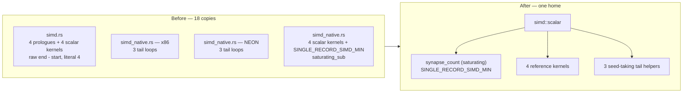

## Summary

The ISA-neutral scalar layer of the weighted-sum kernels — the reference scalar
loops, the seed-taking tails behind each SIMD kernel, and the count prologue
that guards them — was duplicated between `neat-core/src/simd.rs` (wasm) and
`neat-core/src/simd_native.rs` (x86/aarch64), and again between the two ISA
modules inside `simd_native.rs`. The two sides had already drifted: the native
prologues had been hardened to `end.saturating_sub(start)` with a named
`SINGLE_RECORD_SIMD_MIN`, while the wasm prologues still computed raw
`end - start` (an underflow/panic on `end < start`) and hard-coded the literal
`4` four times.

This extracts that layer into one `cfg`-independent module,
`neat-core/src/simd/scalar.rs`, and points every copy at it. Eighteen scalar
sites collapse to seven definitions with one home. **Closes #447.**

The new module carries two deliberately distinct layers:

- **Reference kernels** (`weighted_sum`, `weighted_sum_of_squares`,
  `weighted_sum_no_bias`, `weighted_sum_of_squares_v2`) seed their own
  accumulator and index safely — what every target's below-threshold count
  falls back to.
- **Seed-taking tail helpers** (`tail_sum`, `tail_sum_of_squares`,
  `tail_sum_of_squares_v2`) take the caller's *running* accumulator, so a SIMD
  kernel's 0..3 remainder continues the reference f32 rounding order instead of
  starting a second sum. Reusing the reference kernels for tails would reseed
  and break the bit-parity the tests and docs rely on — which is why these are
  new helpers, not a call to the existing fallbacks. They keep `get_unchecked`
  under the load-time index-validation invariant (`AGENTS.md` → "Unsafe & SIMD
  invariants") and are `unsafe fn` with a `# Safety` contract naming it.

`synapse_count(start, end)` is the one count prologue: **saturating**, so a
reversed range counts as zero rather than underflowing. Every prologue on both
sides now uses it — no raw `end - start`, no hard-coded `4`. The wasm side
picks up the already-proven hardening as part of the same change.

### Changed

| File | Change |
| --- | --- |
| `neat-core/src/simd/scalar.rs` | **New.** The shared ISA-neutral scalar layer. |
| `neat-core/src/simd.rs` | Declares `pub mod scalar`; four wasm small-count fallbacks and three wasm count prologues now call it. |
| `neat-core/src/simd_native.rs` | Four scalar fallbacks and the local `SINGLE_RECORD_SIMD_MIN` deleted; six ISA tail loops (3 shapes × x86/NEON) and every count prologue now call the shared layer. |
| `AGENTS.md` | New "One ISA-neutral scalar layer for every weighted-sum kernel (Issue #447)" section pinning the rule. |
| `neat-core/tests/simd_scalar_layer.rs` | **New.** Pins the rule. |

### Out of scope

The multi-record scalar fallbacks (`weighted_sum_simd_8records_scalar`,
`weighted_sum_simd_4records_scalar`, `weighted_sum_interleaved_8_scalar`) exist
only on the native side — there is no wasm counterpart to drift from — so they
stay where they are. The wasm SIMD kernels' own bounds-checked remainder loops
are likewise left alone: routing them through the unchecked tail helpers would
turn a wasm-side panic into undefined behaviour, which is a soundness change,
not a de-duplication.

## Evidence

Backend/library change — no web interface to screenshot.

**Bit-parity**, not approximate agreement, is what the new tests assert: below
the SIMD threshold every public kernel is bit-identical to the reference
(`f32::to_bits`), and splitting a range at *any* point and continuing through a
tail helper reproduces the reference result exactly — so a tail that reseeded or
reordered would fail.

**Correctness evidence**

- `cargo test --test simd_scalar_layer` — 10 passed (new).
- `cargo test --test simd_weighted_sums` — 23 passed (existing parity suite,
  unchanged).
- `./quality.sh` — green end to end (fmt, clippy `-D warnings`, `cargo deny`,
  full workspace test run, rustdoc `-D warnings`, release build).
- `cargo check --target wasm32-unknown-unknown` with
  `-C target-feature=+simd128,+relaxed-simd` — clean, so the rewritten wasm
  prologues compile on the target they serve (they are `cfg`-gated out of the
  native test run).

**Performance evidence**

This is a refactor with no algorithmic change, but it moves six SIMD tail loops
behind a function-call boundary, so codegen was verified rather than assumed:

- The release assembly (`cargo rustc --release -- --emit asm`) contains **no
  call to `tail_sum` / `tail_sum_of_squares` / `tail_sum_of_squares_v2`** — the
  `#[inline]` helpers are fully inlined into the `#[target_feature]` kernels,
  exactly as the previous in-body loops were. No vector types cross the
  boundary, so the call is inlinable by construction.
- `cargo bench --bench hot_paths -- forward_pass` was attempted and its output
  discarded as unusable: the build host was running at load average ~14 on 12
  cores, and re-measuring the **unchanged** baseline code against its own
  baseline reported "+77.8% regressed". With a noise floor that wide, no
  A/B on this host is meaningful. The inlining check above is the load-
  independent evidence in its place.

## Test Plan

New — `neat-core/tests/simd_scalar_layer.rs`:

- `synapse_count_measures_the_range` — the guard counts `start..end`.
- `synapse_count_saturates_when_end_precedes_start` — regression test for the
  drifted wasm prologue: a reversed range saturates to zero instead of
  underflowing.
- `reference_kernels_return_their_seed_for_a_reversed_range` — all four
  reference kernels return bias/0.0 on `end < start`.
- `public_kernels_survive_a_reversed_range` — the same at the public
  `weighted_sum_*_simd` entry points.
- `small_counts_are_bit_identical_to_the_reference_kernels` — for every count
  below `SINGLE_RECORD_SIMD_MIN`, all four public kernels match the reference
  bit-for-bit (`to_bits`).
- `tail_sum_continues_the_reference_accumulation_bit_for_bit`,
  `tail_sum_of_squares_…`, `tail_sum_of_squares_v2_…` — splitting a 9-synapse
  range at every split point and continuing through the tail helper reproduces
  the reference result exactly, pinning the seed-taking contract (a reseeding
  helper fails these).
- `tail_helpers_return_the_seed_for_an_empty_tail` — an empty tail is the
  identity.
- `reference_kernels_compute_the_documented_formulas` — each kernel computes its
  documented formula on hand-checked values.

Modified — `neat-core/src/simd_native.rs` unit tests: the four
`*_matches_scalar` tests now compare against `scalar::weighted_sum*` instead of
the deleted local fallbacks. Same assertions, same fixtures; no test was removed
or weakened.

### Security self-check

- **Input validation**: the new count guard is the validation — `synapse_count`
  saturates instead of underflowing, removing a panic (debug) / enormous-count
  (release) path that existed in the wasm kernels.
- **Injection surface / output encoding / authentication**: not applicable —
  pure numeric library code, no SQL, shell, filesystem, HTTP, or rendering.
- **Error handling**: no error paths added; nothing is swallowed. The reference
  kernels index safely and panic loudly on a genuinely out-of-range index.
- **Unsafe**: the three new `unsafe fn` helpers carry `# Safety` contracts
  naming the load-time `CompiledNetwork::new` index validation, and each
  internal `unsafe` block carries a `// SAFETY:` note. No new `unsafe` reaches
  code that was previously bounds-checked — the helpers replace `get_unchecked`
  loops that already had that contract.
- **Secrets / dependencies**: none staged; no new dependency. The `Cargo.lock`
  bump is `quality.sh`'s own `cargo upgrade`/`cargo update` step (clap
  4.6.4 → 4.6.5, a dev-tree transitive), and `cargo deny check` passed after it.
