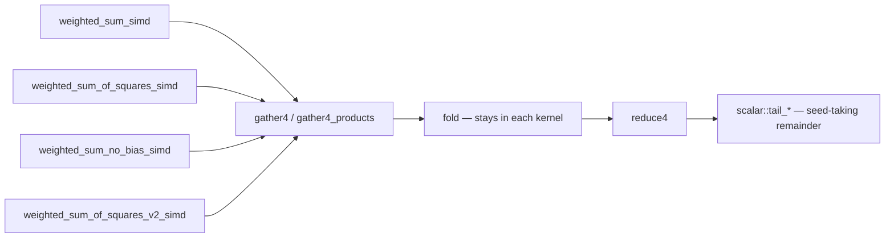

# One chunk-walk scaffold for the wasm weighted-sum kernels (Issue #448)

## Summary

The four single-record `wasm32` kernels in `neat-core/src/simd.rs` each carried
their own copy of the same chunk-loop scaffolding — 4-wide lane gather, lane
reduce, and the 0..3 scalar remainder — around different folds. The cost was
already paid: the Issue #1197 dual-accumulator rework landed on
`weighted_sum_simd` only, and `weighted_sum_no_bias_simd`'s doc claimed it
"Shares the dual-accumulator approach with `weighted_sum_simd`" when its body
ran a single accumulator.

This extracts the scaffold into three helpers — `gather4`, `gather4_products`,
`reduce4` — and routes every kernel's remainder through the seed-taking
`scalar::tail_*` helpers that Issue #447 already made the single home of that
rule, replacing four re-inlined scalar loops. The fold stays in each kernel, as
the issue requires: these are calls, not a parameterised super-helper, because
unifying plain-FMA, square-the-product and square-the-biased-product would need
a mode flag. Both stale doc claims are corrected — `weighted_sum_of_squares_simd`
also claimed dual accumulators — and `AGENTS.md` gains the rule so the next
scaffold improvement cannot land on one copy again.

Behaviour is unchanged: the refactor is numerically bit-identical (evidence
below). Applying the dual-accumulator form to the other three kernels is
deliberately **not** in this PR — that is a performance change, and this repo
requires before/after benchmark evidence for those. With the walk shared it is
now a fold-level edit on top of one scaffold.

Closes #448.



## Evidence

Backend/library change with no web interface, so no screenshot applies. The
changed code is `wasm32`-only, which the native test suite cannot execute, so it
was verified by **running the refactored kernels on a real wasm runtime**
(`wasm32-wasip1` under Node's WASI, `-C target-feature=+simd128,+relaxed-simd`):

- All three new parity checks pass when compiled to wasm and executed:

  ```
  every_kernel_matches_its_reference_from_any_offset: ok
  the_remainder_continues_the_span_rather_than_restarting_it: ok
  an_empty_or_reversed_span_is_the_kernel_seed: ok
  ```

- **Bit-identical to the pre-refactor kernels.** The same wasm probe was run
  against `simd.rs` before and after the change, dumping the raw `f32` bit
  patterns of all four kernels over every `(start, count)` span for
  `start` 0..11 and `count` 0..40 — 492 spans, 1968 results:

  ```
  diff before.txt after.txt   # no differences
  BIT-IDENTICAL across 492 spans
  ```

  `gather4_products` uses `f32x4_mul`, a plain IEEE-754 lane multiply rather
  than a relaxed operation, so replacing the hand-packed
  `f32x4(a0*w0, …)` gathers cannot shift a result; the `scalar::tail_*` helpers
  continue the running accumulator in the same order the inline loops did.

- `cargo clippy --target wasm32-unknown-unknown` with `-D warnings` is clean
  (the wasm path is not covered by `quality.sh` or the PR CI lane — it builds
  only on push to `Develop` via `wasm-bundle.yml`).
- `./quality.sh` passes: fmt, clippy, deny, doc, and the full native test suite.

## Test Plan

Added `neat-core/tests/simd_chunk_walk_scaffold.rs` (3 tests) — the file that
pins the rule, in the style of `simd_scalar_layer.rs`:

- `every_kernel_matches_its_reference_from_any_offset` — sweeps all four kernels
  over starts 0..9 × counts 0..24 against the `simd::scalar` reference kernels.
  The **offset** sweep is the new coverage: `simd_weighted_sums.rs` sweeps counts
  from `start == 0` only, which would not catch a scaffold that derives its
  chunk base from the chunk index alone.
- `the_remainder_continues_the_span_rather_than_restarting_it` — a span of 8+3
  equals the 8-span plus the three trailing synapses' contribution, pinning the
  seed-taking tail rather than a second sum merged in.
- `an_empty_or_reversed_span_is_the_kernel_seed` — empty and reversed ranges
  return each kernel's seed (`bias` / `0.0`), carrying the Issue #447 saturating
  count guard through the refactor.

No existing tests were removed or modified. `simd_weighted_sums.rs` (23 tests)
and `simd_scalar_layer.rs` (8 tests) continue to pass unchanged and remain the
regression net for kernel semantics.
