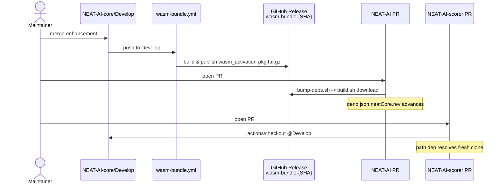

## Summary

Documents the end-to-end propagation flow from `NEAT-AI-core/Develop` to the
two consumer repositories (NEAT-AI and NEAT-AI-scorer), so a maintainer can
see at a glance that an enhancement merged here flows automatically to the
next downstream PR. Adds a new `Propagation to downstream repositories`
section to `README.md` covering both consumer paths, a Mermaid sequence
diagram, a wiring reference table, and a note on the `wasm-bundle.yml` race
window. Closes #47.

## Evidence

Documentation-only change. The new section is rendered from `README.md`
and visible on the repository landing page after merge. The Mermaid
sequence diagram below is the same block that appears in the README:

`./quality.sh` passes cleanly (fmt, clippy, deny, tests, doc, release
build) — no code paths changed.

## Test Plan

- No new unit tests: README.md change only.
- Verified `./quality.sh < /dev/null` passes end-to-end on the modified
  tree (all existing workspace tests green).
- Manually checked README rendering for the new section, the Mermaid
  block, the wiring table, and the race-window note against the issue
  acceptance criteria.
