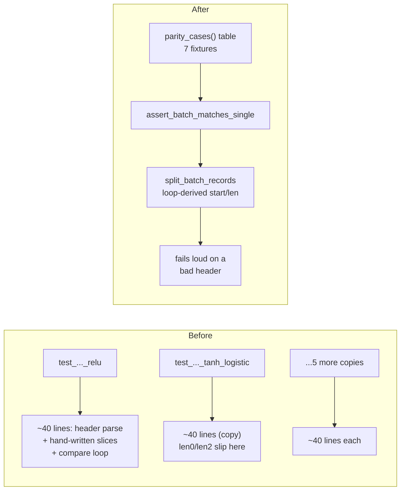

# Express the batch-parity contract once (Issue #476)

## Summary

`neat-core/tests/network_activate_trace_batch.rs` carried seven near-duplicate
tests, each repeating the same ~40-line "parse the batch header, slice out four
records, compare against the single-record run" block and differing only in
fixture and inputs. One copy had already been mis-transcribed: record 2 was
sliced as `&batch_result[start2..start2 + len0]` — `len0` where `len2` was
intended. It passed only because every record in that fixture happens to be the
same length, so the parity check it exists to provide was silently weakened.

Resolution (a) from the issue: the contract is now stated once and driven from a
table.

- **`split_batch_records`** walks the four-value length header in a loop,
  accumulating each record's `start` from the preceding lengths. A record is
  therefore always sliced with its **own** length — the `len0`/`len2` class of
  bug is no longer expressible.
- It also **fails loud** rather than silently comparing a prefix: a header that
  overruns the buffer, or whose lengths do not cover the payload exactly, is an
  explicit assertion failure with a named cause instead of an opaque slice panic
  or a quietly-truncated comparison.
- **`assert_batch_matches_single`** holds the single copy of the
  batch-vs-single oracle, driven from **`parity_cases()`** — the same seven
  fixtures (ReLU, TANH/LOGISTIC, MINIMUM, MAXIMUM, IF, constant neuron,
  multi-layer), now as data rather than as seven hand-copied function bodies.

Net: 404 lines removed, 290 added, with no loss of fixture coverage.

`test_batch_4way_buffer_reuse_no_state_leak` (Issue #155) is a production
regression test, not part of the family, and is unchanged.

Closes #476.

### Test restructuring (declared, per the "do not remove existing tests" rule)

The seven `test_batch_4way_*` test functions are **replaced**, not deleted:
every fixture and every input record survives as an entry in `parity_cases()`,
and each is still asserted by the same oracle — now through one shared helper.
Assertion messages carry the case name, so a failure still identifies which
fixture broke. The seven `#[test]` functions collapse into one
(`batch_4way_matches_single_record_for_every_fixture`), which is the
consolidation the issue asked for.



## Evidence

Backend/library change with no web interface, so no screenshot applies. The
evidence is a mutation test: the old hand-copied slicing (including the
`len0`/`len2` slip) was temporarily reintroduced into `split_batch_records` and
the suite re-run. All three new oracle tests failed, confirming they catch the
bug class rather than merely passing alongside it:

```
---- split_batch_records_uses_each_records_own_length ----
  left: [30.0]
 right: [30.0, 31.0, 32.0]

failures:
    split_batch_records_rejects_header_that_overruns_the_buffer
    split_batch_records_rejects_header_that_undercovers_the_buffer
    split_batch_records_uses_each_records_own_length

test result: FAILED. 2 passed; 3 failed
```

With the loop-derived splitter restored:

```
running 5 tests
test split_batch_records_uses_each_records_own_length ... ok
test test_batch_4way_buffer_reuse_no_state_leak ... ok
test split_batch_records_rejects_header_that_overruns_the_buffer - should panic ... ok
test split_batch_records_rejects_header_that_undercovers_the_buffer - should panic ... ok
test batch_4way_matches_single_record_for_every_fixture ... ok

test result: ok. 5 passed; 0 failed
```

`./quality.sh` passes cleanly (fmt, clippy, deny, workspace tests, docs,
release build).

## Test Plan

Tests in `neat-core/tests/network_activate_trace_batch.rs`:

- `batch_4way_matches_single_record_for_every_fixture` — the parity contract
  across all seven fixtures, replacing the seven copy-pasted variants.
- `split_batch_records_uses_each_records_own_length` — **regression for the
  reported defect.** A synthetic buffer whose four records have *distinct*
  lengths (1, 2, 3, 4); fails against the old `len0`-for-`len2` slicing, passes
  against the loop-derived splitter. The production code cannot produce
  differing per-record lengths today (record size is fixed by topology), which
  is exactly why the defect stayed latent — so the oracle itself is tested
  directly.
- `split_batch_records_rejects_header_that_overruns_the_buffer` — a header
  claiming more data than the buffer holds fails with a named cause.
- `split_batch_records_rejects_header_that_undercovers_the_buffer` — a header
  that leaves payload unaccounted for fails instead of silently comparing a
  prefix.
- `test_batch_4way_buffer_reuse_no_state_leak` — unchanged (Issue #155).

## Follow-up

Filed **stSoftwareAU/NEAT-AI-core#484**: the same seven `test_batch_4way_*`
tests still exist verbatim in `src/network.rs`'s `mod tests`, despite this
file's header claiming they were moved out of it. That cross-file duplication is
separate work and was left out of this change to keep it in scope.
