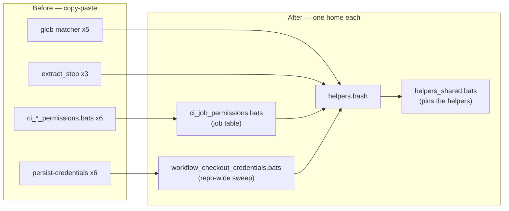

# Share the BATS suite's helpers instead of copy-pasting them (Issue #477)

## Summary

The `tests/scripts/` BATS suite had no shared helper file — no `load` statement
anywhere — so every helper and test body was pasted per file. The GitHub
branch-filter glob model lived in five copies, the `persist-credentials` checkout
check in six, the least-privilege permissions body in six, and the `extract_step`
harness in three. A bug in any one copy had to be found and fixed five or six
times, and the per-job enumerations silently missed every job added afterwards.

This change adds `tests/scripts/helpers.bash` (loaded with `load helpers`) as the
single home for those assertions, collapses each copy-pasted family into one
data-driven file, and pins the shared helpers themselves with a dedicated unit
test suite. Closes #477.

What changed:

- **`tests/scripts/helpers.bash`** (new) — `require_python3`, `strip_comments`,
  the GitHub branch-filter glob model (`github_glob_py` /
  `github_glob_matches` / `assert_pr_branch_filter_matches`),
  `assert_job_least_privilege`, `extract_step`, `assert_cyclonedx_sbom_release`
  and `assert_pinned_cli_install`.
- **`ci_job_permissions.bats`** (new) replaces the six `ci_*_permissions.bats`
  files with one table (`READ_ONLY_JOBS`) plus the `security` caller's two unique
  assertions. Adding a gated job is now one table row, not a new file.
- **`workflow_checkout_credentials.bats`** (new) replaces the six copies of the
  `persist-credentials` check with a sweep over every workflow and job — the
  pattern `workflow_sha_pinning.bats` already uses for pins. It *derives* the
  exemption instead of enumerating it: a checkout may keep the credential only
  when its job actually reaches the remote (a `git push`/`pull`/`fetch`/
  `ls-remote`/`clone` in a `run:` block, or an action that pushes on the job's
  behalf). Future jobs are covered automatically.
- **`helpers_shared.bats`** (new) — 13 tests that exercise each helper against
  purpose-built good/bad workflow fixtures, so the one surviving copy of each
  model is itself guarded.
- The five glob-matcher call sites, the two SBOM twins, the two pinned-install
  twins and the three `extract_step` copies now go through the shared helpers.

### Gap the sweep closed

The derived rule immediately found a job the six hand-written copies had missed:
`ci.yml`'s `typescript-gate` checked out with the default
`persist-credentials: true` while only running `deno check` — it never touches
the remote. `ci.yml` now sets `persist-credentials: false` there, matching
`rust-gates`/`validation`.

### Deliberate test consolidation

Per the issue's suggested fix, near-duplicate `@test` bodies were merged rather
than kept — no assertion was dropped:

| Was | Now |
|-----|-----|
| `ci_{quality,rust-gates,scripts-and-spelling,validation,wasm64-memory64-smoke,security}_permissions.bats` (19 tests) | `ci_job_permissions.bats` (4 tests) |
| `persist-credentials` `@test` in 6 files (8 tests incl. job-exists twins) | `workflow_checkout_credentials.bats` (2 tests, repo-wide) |
| `release_sbom.bats` / `wasm_bundle_sbom.bats` (8 body-identical tests) | 2 tests via `assert_cyclonedx_sbom_release` |
| `gitleaks_pinned_install.bats` / `wasm_pack_pinned_install.bats` (8 mirror tests) | 2 tests via `assert_pinned_cli_install` |

Suite total: 301 → 281 tests, of which 13 are new helper unit tests, so ~33
duplicated bodies were removed while coverage grew (the credential sweep and the
glob model are now checked more thoroughly than before).

## Evidence

Backend/CLI change — no web interface to screenshot. Evidence is the test suite
and the local quality gate.



```text
$ bats tests/scripts < /dev/null
...
281 tests, 0 failures

$ ./quality.sh < /dev/null
✅ All quality checks passed!
```

The sweep was written before the fix and failed on the gap it found:

```text
$ bats tests/scripts/workflow_checkout_credentials.bats   # before the ci.yml fix
not ok 1 every checkout in a job that never uses the remote drops the credential
# ci.yml job=typescript-gate: checkout persists the GITHUB_TOKEN but the job
# never uses the remote

$ bats tests/scripts/workflow_checkout_credentials.bats   # after
ok 1 every checkout in a job that never uses the remote drops the credential
ok 2 the sweep actually reaches the jobs hardened for credential leakage
```

## Test Plan

- Added `tests/scripts/helpers_shared.bats` — 13 tests over the shared helpers,
  each asserting both the accepting and the rejecting case against fixture
  workflows written into `$BATS_TEST_TMPDIR`:
  - the glob model: `*` does not cross `/`, `**` does, non-glob characters are
    literal, the match is anchored at both ends;
  - `assert_pr_branch_filter_matches` accepts a milestone-aware filter and
    rejects a `["*"]`-only one;
  - `assert_job_least_privilege` accepts read-only and declared-write jobs, and
    rejects an undeclared write scope, a missing `permissions:` block and a
    missing job; workflow-level fallback covered;
  - `extract_step` writes the real script and the right shell argv for both
    `shell:`-less and `shell: bash` steps, and fails loud on an absent step;
  - `assert_pinned_cli_install` rejects a `curl … | sh` bootstrap;
  - `strip_comments` removes commented-out lines;
  - `assert_cyclonedx_sbom_release` rejects an unpinned install / SBOM built
    after the Release.
- Added `tests/scripts/workflow_checkout_credentials.bats` — repo-wide sweep plus
  a reach check pinning the six jobs hardened by Issues
  #317/#318/#320/#322/#323/#332.
- Added `tests/scripts/ci_job_permissions.bats` — table-driven least-privilege
  check over `quality`, `rust-gates`, `scripts-and-spelling`, `validation`,
  `wasm64-memory64-smoke`, plus the `security` caller's scope coverage. Verified
  the table fails loud by temporarily adding a bogus job name.
- Updated `ci_workflow.bats`, `actionlint_workflow.bats`,
  `gitleaks_pinned_install.bats`, `markdown_lint_workflow.bats`,
  `semgrep_workflow.bats`, `rust_gates_workflow.bats`, `release_sbom.bats`,
  `wasm_bundle_sbom.bats`, `wasm_pack_pinned_install.bats`,
  `workflow_pipefail.bats` and `wasm_bundle_sha256_sidecar.bats` to assert
  through the shared helpers.
- `./quality.sh` green (bats, shellcheck, `deno check`, Mermaid gate,
  fmt/clippy/deny/tests/doc); `actionlint` passes against the modified `ci.yml`
  via the suite's own behavioural check.
