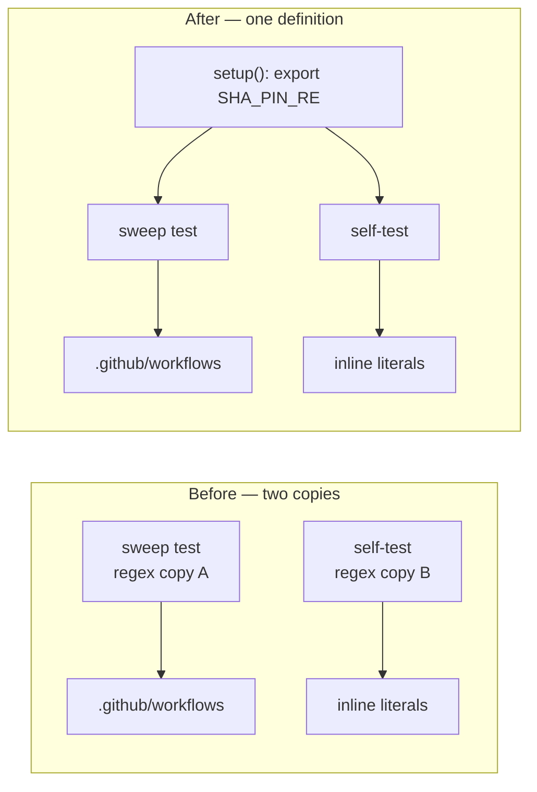

# PR Summary — Issue #478

## Summary

Three BATS "regex rejects known-bad input" tests asserted against a **private
copy** of the regex they claimed to protect, so weakening the live gate failed
nothing and the two copies could silently diverge. Each pattern now has exactly
one definition — exported from the file's `setup()` and compiled by both the
sweep over the real workflows and the good/bad literal check — which is
resolution (a) from the issue. Closes #478.

| File | Shared variable | Copies collapsed |
| --- | --- | --- |
| `tests/scripts/workflow_sha_pinning.bats` | `SHA_PIN_RE` | 2 → 1 |
| `tests/scripts/workflow_container_pinning.bats` | `IMAGE_DIGEST_RE` | 3 → 1 |
| `tests/scripts/workflow_script_injection.bats` | `TAINTED_CONTEXT_RE` | 2 → 1 |

Heredocs that read a shared pattern switched from `<<PY` to quoted `<<'PY'`
with `os.environ[...]`, so the shell no longer interpolates regex text (this
also removes the `\$` escaping the digest copy needed). No gate's behaviour
changed — the patterns are byte-identical to the live originals.



## Evidence

Backend/CLI test change — no web interface to screenshot. Falsifiability was
proven by mutation, since a passing test is not evidence for this class of bug.

**Before** — gutting the live gate regex on `workflow_sha_pinning.bats:31` to
`re.compile(r".*")` (accepts every floating tag):

```text
ok 1 every action in every workflow is pinned to a 40-char commit SHA
ok 2 every SHA-pinned action has a version comment alongside it
ok 3 no workflow uses an action pinned to a deprecated Node runtime
ok 4 SHA-pin regex rejects floating tags and branch refs     <-- should have failed
```

**After** — weakening each single definition (`SHA_PIN_RE='.*'`,
`IMAGE_DIGEST_RE='.*'`, `TAINTED_CONTEXT_RE='NEVER_MATCHES_XYZ'`):

```text
not ok 4  SHA-pin regex rejects floating tags and branch refs
not ok 8  digest regex rejects bare image names and mutable tags
not ok 10 tainted-context detector regex catches known-bad patterns
```

Unmutated tree: `bats tests/scripts` → **281 passed, 0 failed**;
`./quality.sh < /dev/null` → `✅ All quality checks passed!`.

## Test Plan

No tests were removed or disabled — the three self-tests were rewired to
exercise the live pattern, and their good/bad literal lists are unchanged.

- `tests/scripts/workflow_sha_pinning.bats::SHA-pin regex rejects floating tags and branch refs`
- `tests/scripts/workflow_container_pinning.bats::digest regex rejects bare image names and mutable tags`
- `tests/scripts/workflow_script_injection.bats::tainted-context detector regex catches known-bad patterns`

Each now fails when its gate is weakened (mutation results above) and passes
against the real pattern. The four sweep tests that consume the same variables
(`every action …`, `every job container …`, `every *_IMAGE env value …`,
`no run: block …`) still pass against the real `.github/workflows`, confirming
the extracted patterns are equivalent to the originals.
