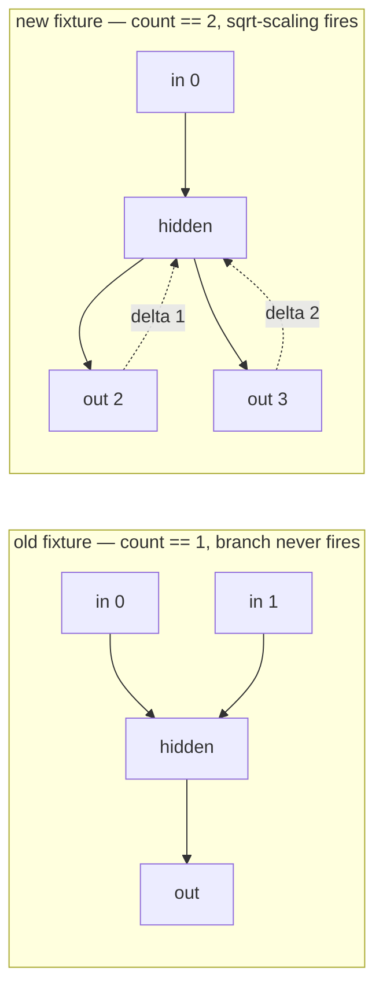

## Summary

Replaced four vacuous or unjustified test oracles with derived, falsifiable ones.
Every site flagged by the audit now asserts the value the spec/formula requires,
with the derivation written down beside it. Closes #479.

| Site | Before | After |
| --- | --- | --- |
| `neat-core/src/accumulate.rs` — `test_limit_weight_clamping` | `assert!(result.abs() <= 100000.0)` (passes for a broken clamp) | `assert_eq!(result, 1.0)` — the value the comment already derived — plus the symmetric negative case and a case where the *global* scale limit bites instead of the adjustment clamp |
| `neat-core/tests/accumulate_public.rs` — `test_calculate_weight_basic` | `assert!(result.is_finite())` | `assert_close(result, 1.5)` hand-derived from the documented formula (blend → `average_weight` 2.0 → adjustment clamp to `current + 1.0`) |
| `neat-core/tests/accumulate_public.rs` — `test_calculate_bias_basic` | `assert!(result.is_finite())` | `assert_close(result, 1.5)` hand-derived (`effective_generations` 0 → `adjusted_bias` 1.5 → no clamp) |
| `neat-core/tests/accumulate_public.rs` — magic lengths `28` / `12` | bare `assert_eq!(result.len(), 28)` | derived as `BATCH_4WAY * WEIGHT_SLOTS_PER_SYNAPSE` (4 × 7) and `BATCH_4WAY * BIAS_SLOTS_PER_NEURON` (4 × 3), with **every** slot asserted against a per-item derivation |
| `neat-core/src/topological_backprop.rs` — `normalise_gradients_reduces_multi_path_delta` | single-path fixture (`count == 1`, branch a no-op) with the near-unfalsifiable `assert!(normalised <= unnormalised + 1e-6)` | split into two honest tests, one of which finally exercises the sqrt-scaling branch |

### The gradient-normalisation split

The old fixture wired 2 inputs → 4 hiddens → 1 output, which gives every hidden
exactly **one** inbound path, so `count == 1` and the Issue #1872 sqrt-scaling
branch never fired — as the test's own trailing comment admitted.

- **`normalise_gradients_scales_two_path_delta_by_inverse_sqrt_count`** — new
  fixture: 1 input → 1 hidden → **2 outputs**. The hidden neuron accumulates a
  target delta from each output, reaching `count == 2`, which arms the branch.
  Both outputs contribute the same signed delta, so the raw sum is identical in
  both runs and the only difference is the scaling: the test asserts
  `normalised == unnormalised / sqrt(2)`, with a guard that the fixture actually
  produced a delta (no vacuous `0 == 0` pass).
- **`normalise_gradients_is_a_no_op_for_single_path_neurons`** — keeps the old
  single-path fixture, renamed to say what it actually tests, and strengthened
  from the loose inequality to exact equality (`assert_eq!`).

## Evidence

Backend/library change only — no web interface to screenshot.

**Mutation testing** — the two rewritten gradient tests were verified to
genuinely falsify by mutating `topological_backprop.rs` and confirming a red run
(each mutation was reverted afterwards):

| Mutation | Result |
| --- | --- |
| `sum / (count as f64).sqrt()` → `sum / (count as f64)` | `..._scales_two_path_delta_by_inverse_sqrt_count` **FAILED** ✅ |
| unconditional normalisation with an off-by-one count: `if normalise_gradients { sum / (count + 1).sqrt() }` | **both** tests **FAILED** ✅ |

Against the unmutated tree all 23 lib tests and all 8 `accumulate_public` tests
pass, and `./quality.sh` finishes with `✅ All quality checks passed!` (fmt,
clippy, deny, full workspace tests, doc build, release build).

## Test Plan

Modified (strengthened oracles — no test was deleted or commented out):

- `neat-core/src/accumulate.rs::tests::test_limit_weight_clamping` — exact
  `assert_eq!` on the derived clamp result, plus negative-direction and
  global-scale-limit cases.
- `neat-core/tests/accumulate_public.rs::test_batch_4way_weight` — length
  derived from the layout spec; all 28 slots asserted.
- `neat-core/tests/accumulate_public.rs::test_batch_4way_bias` — length derived
  from the layout spec; all 12 slots asserted.
- `neat-core/tests/accumulate_public.rs::test_calculate_weight_basic` — derived
  expected value replaces `is_finite()`.
- `neat-core/tests/accumulate_public.rs::test_calculate_bias_basic` — derived
  expected value replaces `is_finite()`.
- `neat-core/src/topological_backprop.rs::tests::normalise_gradients_is_a_no_op_for_single_path_neurons`
  — renamed from `normalise_gradients_reduces_multi_path_delta`; loose
  inequality → exact equality.

Added:

- `neat-core/src/topological_backprop.rs::tests::normalise_gradients_scales_two_path_delta_by_inverse_sqrt_count`
  — first test in this repo to actually execute the `count > 1` sqrt-scaling
  branch.
