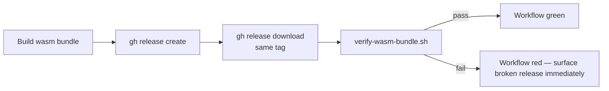

## Summary

Add a post-publish verification step to `wasm-bundle.yml` so a silent
`gh release create` upload regression is caught in NEAT-AI-core CI rather
than discovered when a downstream NEAT-AI bump-deps PR fails on `build.sh`.

A new `scripts/verify-wasm-bundle.sh` re-downloads the just-published
asset, extracts it, and asserts the same invariants NEAT-AI's `build.sh`
checks for: top-level `pkg/`, four required files, and a
`wasm_activation_bg.wasm` blob above the 128 KiB stub-detection threshold.
When `--rev` is supplied, the embedded `neat_core_rev.txt` must also match,
proving the asset attached to the tag corresponds to that tag's commit SHA.

Closes #48.

## Evidence

CLI / workflow change — no UI to screenshot. Verification logic is exercised
by 16 new bats cases against synthetic fixture archives (good case plus
multiple failure modes: missing files, undersized wasm, malformed archive,
mismatched rev, layout without top-level `pkg/`).

Per-tool runs:

- `bats tests/scripts` → 39/39 pass (16 new + 23 existing).
- `shellcheck` clean on `scripts/verify-wasm-bundle.sh`.
- `./quality.sh` → all checks pass.

## Test Plan

- Added `tests/scripts/verify_wasm_bundle.bats` with 16 cases covering:
  - usage / unknown options / missing `--archive` / non-existent archive
  - happy path (well-formed bundle accepted)
  - each required file missing → fails (incl. `wasm_activation_bg.wasm.d.ts`)
  - undersized wasm rejected; exact 128 KiB threshold accepted
  - `--min-size-bytes` override; non-integer rejected
  - `--rev` mismatch fails; match passes; absent `neat_core_rev.txt` tolerated
  - malformed (non-gzip) archive rejected
  - archive without top-level `pkg/` rejected
- Existing `build_wasm_bundle.bats` continues to pass — file list and size
  threshold semantics stay aligned with the verifier.
