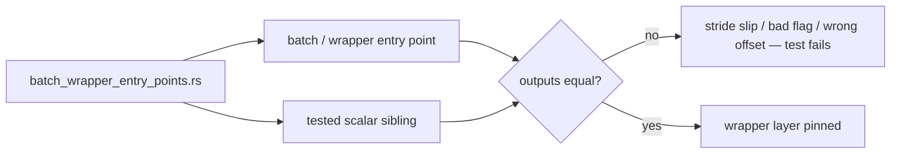

# Direct tests for the batch/wrapper public entry points

## Summary

Six public batch/wrapper entry points had no direct test, even though their
scalar inner functions are well covered. Each wrapper exists for the WASM
boundary-batching contract and carries real logic beyond delegation — packing
strides, flag decoding, `start_index` offset arithmetic, and fallback branches —
so a refactor could break only the wrapper layer and leave every existing test
green.

This PR adds `neat-core/tests/batch_wrapper_entry_points.rs`: 20 behavioural
("what") tests that assert each wrapper's observable output against its
already-tested scalar sibling. No production code changed. Closes #480.

| Entry point | Wrapper-only logic now pinned |
| --- | --- |
| `accumulate_bias_batch_8way` | 8-neuron loop, stride-3 packing into 24 slots |
| `calculate_weight_batch_4way` | 32-`f64` unpacking at stride 8 |
| `calculate_bias_batch_4way` | 12-`f64` packing + `u8` flag decode (0 → false, non-zero → true) |
| `accumulate_bias_persistent_8way` | `start_index` offset arithmetic into thread-local state |
| `apply_safe_zone_adjustment_batch` | non-finite weight → substitute `1.0` |
| `distribute_elastic_error` | invalid `plank_constant` → default `1e-12` fallback |



## Evidence

Backend library change with no web interface, so no screenshot applies.

**Mutation check** — each wrapper's unique logic was temporarily broken in the
source and the new suite re-run, confirming the tests bite rather than merely
passing alongside the code. Every mutation was reverted before commit.

| Mutation | Result |
| --- | --- |
| `calculate_weight_batch_4way` stride `i * 8` → `i * 7` | 3 tests fail |
| `accumulate_bias_batch_8way` stride `i * 3` → `i * 2` | 3 tests fail |
| `calculate_bias_batch_4way` flag decode `!= 0` → `> 1` | 2 tests fail |
| `accumulate_bias_persistent_8way` `start_index + i` → `+ i + 1` | 3 tests fail |
| `apply_safe_zone_adjustment_batch` drops the `1.0` substitution | 2 tests fail |
| `distribute_elastic_error` drops the `plank_constant` fallback | 1 test fails |

**Quality gate** — `./quality.sh < /dev/null` passes cleanly (fmt, clippy with
`-D warnings`, `cargo deny`, full workspace test run, docs, release build).

```
running 20 tests
test result: ok. 20 passed; 0 failed; 0 ignored; 0 measured; 0 filtered out
...
✅ All quality checks passed!
```

## Test Plan

All tests added in `neat-core/tests/batch_wrapper_entry_points.rs`:

**`accumulate_bias_batch_8way`**

- `bias_batch_8way_matches_the_4way_sibling_on_both_halves` — the 24 outputs
  equal two `accumulate_bias_batch_4way` calls over each half.
- `bias_batch_8way_packs_each_neuron_at_stride_three` — each neuron's
  `[count, totalBias, totalAdjustedBias]` triple lands at `i * 3`.
- `bias_batch_8way_zeroes_only_the_non_finite_neuron` — a NaN target zeroes
  that neuron's triple and leaves the other seven counted.

**`calculate_weight_batch_4way`**

- `weight_batch_4way_matches_the_scalar_sibling_for_every_synapse` — all four
  outputs equal the corresponding direct `calculate_weight` call.
- `weight_batch_4way_unpacks_each_synapse_independently` — changing one
  synapse's packed weight moves only that output.
- `weight_batch_4way_returns_the_current_weight_when_a_synapse_has_no_count`.

**`calculate_bias_batch_4way`**

- `bias_batch_4way_matches_the_scalar_sibling_for_every_neuron`.
- `bias_batch_4way_reads_every_non_zero_flag_as_no_change` — flag bytes `1`,
  `2` and `255` all pin the current bias; `0` adjusts.
- `bias_batch_4way_unpacks_each_neuron_independently`.
- `bias_batch_4way_treats_a_missing_flag_as_change_allowed` — a short flag
  array does not panic and does not read as "no change".

**`accumulate_bias_persistent_8way`**

- `bias_persistent_8way_writes_exactly_the_eight_slots_from_start_index` —
  with 16 neurons and `start_index = 5`, `read_neuron_state` shows slots 5..13
  matching `accumulate_bias_batch_8way` and every other neuron still zero.
- `bias_persistent_8way_accumulates_across_iterations` — three passes give
  count 3 and triple the bias total.
- `bias_persistent_8way_drops_lanes_past_the_end_of_the_buffer` — lanes beyond
  the buffer are dropped without panicking.

**`apply_safe_zone_adjustment_batch`**

- `safe_zone_batch_matches_the_scalar_call_for_every_synapse` — five squash
  types against direct `apply_safe_zone_adjustment` calls.
- `safe_zone_batch_substitutes_one_for_a_non_finite_weight` — `+∞`, `-∞` and
  NaN all behave as weight `1.0`, which is observably different from passing
  the non-finite weight straight through.
- `safe_zone_batch_substitutes_per_synapse_only` — a finite weight in the same
  batch is passed through unchanged.
- `safe_zone_batch_of_zero_synapses_returns_no_factors`.

**`distribute_elastic_error`**

- `elastic_error_passes_a_valid_plank_constant_through` — a valid `1e-20`
  keeps the activation-proportional pass.
- `elastic_error_falls_back_to_the_default_plank_constant_when_invalid` —
  `0.0`, `-1.0`, NaN, `+∞` and `-∞` all route through the default `1e-12` and
  take the weight² fallback.
- `elastic_error_shares_still_sum_to_the_error_after_the_fallback`.
