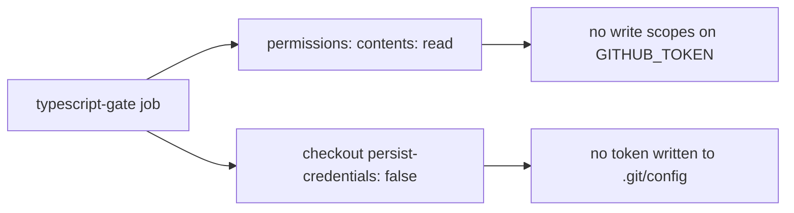

# PR Summary — Issue #482

## Summary

Hardened the `typescript-gate` job in `.github/workflows/ci.yml` — the only job
in the repository still without a `permissions:` block and still persisting the
workflow `GITHUB_TOKEN` on disk. The job now declares least-privilege
`contents: read` and its checkout sets `persist-credentials: false`, matching
every sibling job hardened in the earlier sweep (#309–#313, #331/#332).
The job only reads the repo (checkout, install Deno, run
`scripts/typescript-check.sh`), so neither write scopes nor an on-disk token
were ever needed. Closes #482.

## Evidence

Backend/CI-configuration change — no web interface to screenshot. Verified with
the new bats suite (failing before the workflow edit, passing after) plus
`actionlint .github/workflows/ci.yml` (clean) and a full `./quality.sh` run
(`✅ All quality checks passed!`).



Before the fix:

```text
not ok 2 typescript-gate job declares an explicit permissions block
not ok 3 typescript-gate job grants read-only contents and no write scopes
not ok 4 typescript-gate checkout does not persist credentials on disk
```

After the fix: all 4 tests pass.

## Test Plan

- Added `tests/scripts/ci_typescript_gate_permissions.bats` (run by
  `./quality.sh` via `bats tests/scripts`), asserting on the parsed YAML:
  - `ci.yml` defines a `typescript-gate` job,
  - the job declares an explicit `permissions:` block,
  - it grants `contents: read` and no `write` scopes,
  - every `actions/checkout` step in the job sets `persist-credentials: false`.
- Existing test suites unchanged and green.
