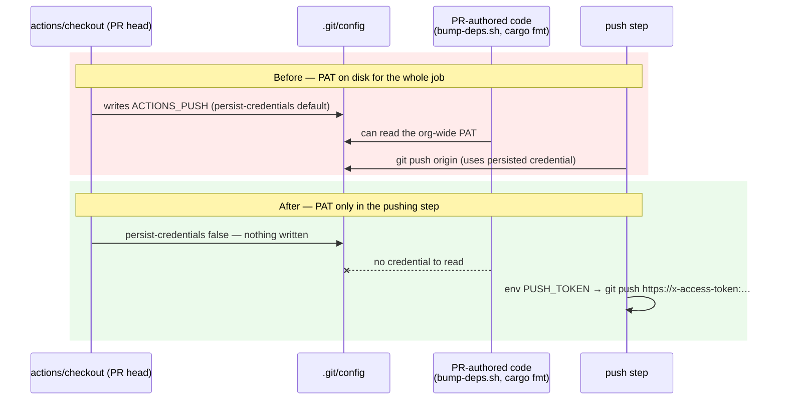

# PR Summary — Issue #483

## Summary

The `version-increment` and `auto-format` jobs in `.github/workflows/ci.yml`
checked out the **PR head** with `token: secrets.ACTIONS_PUSH` and the default
`persist-credentials: true`, which writes the PAT into `.git/config`. Both jobs
then execute code from that same PR head — `./bump-deps.sh` and `cargo fmt` —
so a same-repo branch PR could read an org-wide credential off disk for the
whole job lifetime, when only the final push step needs it.

The PAT is now supplied **just-in-time**: the checkouts carry no `token:` and
set `persist-credentials: false` (the repo is public, so the intermediate
`git pull` works anonymously and the default `GITHUB_TOKEN` clones fine), and
`ACTIONS_PUSH` is exposed as a step-level `PUSH_TOKEN` env var to the one step
that pushes, through an explicit `https://x-access-token:…` remote URL.

**Scope of `ACTIONS_PUSH` — confirmed org-level.** The issue flagged that
`ci.yml:2` ("PAT with contents:write on this repo") and
`upgrade-dependencies.yml` ("the org-level PAT") disagreed. This repository
defines **no** Actions secrets of its own
(`gh api repos/stSoftwareAU/NEAT-AI-core/actions/secrets` →
`{"total_count":0,"secrets":[]}`), so `ACTIONS_PUSH` resolves from the
organisation and the blast radius is org-wide. The `ci.yml` header, `AGENTS.md`
and `SECURITY.md` now say so. Replacing it with a repo-scoped fine-grained PAT
or GitHub App token remains a worthwhile follow-up, but it is a secret-rotation
action only a repo/org admin can take — the persistence fix here is independent
of it.

Closes #483.

## Evidence

Backend/CI change — no web interface to screenshot. Verified with the BATS
suite, `actionlint`, and `shellcheck`.



Command output:

```text
$ bats tests/scripts/ci_push_credential_persistence.bats
1..4
ok 1 version-increment keeps the push PAT off disk and out of PR-head steps
ok 2 auto-format keeps the push PAT off disk and out of PR-head steps
ok 3 no checkout anywhere in ci.yml persists the ACTIONS_PUSH PAT
ok 4 ci.yml documents the real scope of the ACTIONS_PUSH PAT
```

All four fail against the unfixed `ci.yml` (e.g. *"version-increment: checkout
persists credentials into .git/config"*), so they are genuine regression tests.
The full `bats tests/scripts` suite (289 tests) passes, including the existing
`workflow_checkout_credentials.bats` sweep, which deliberately exempts jobs that
talk to the remote — precisely the gap this new file closes.

## Test Plan

- Added `tests/scripts/ci_push_credential_persistence.bats` — asserts, for both
  pushing jobs, that every checkout sets `persist-credentials: false`, that no
  checkout / job-level env / non-pushing step can see `ACTIONS_PUSH`, and that
  the pushing step receives it as its own env var and pushes to an explicitly
  authenticated `https://` remote rather than `origin`. A fourth test pins the
  corrected org-level description in the `ci.yml` header.
- Added `assert_just_in_time_push_credential` to `tests/scripts/helpers.bash`
  (the shared-helper home established by Issue #477) so the rule has one
  implementation across both jobs.
- Documentation updated in the same change: `ci.yml` header, the CI/secrets
  section of `AGENTS.md`, and the review-governance section of `SECURITY.md`.
