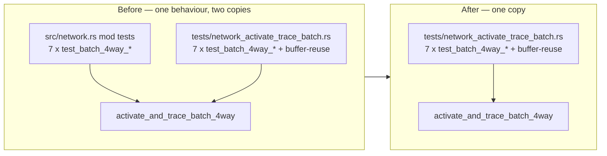

# Complete the move of the batch_4way parity tests (Issue #484)

## Summary

The seven `test_batch_4way_*` parity tests existed verbatim in **both**
`neat-core/src/network.rs` `mod tests` and
`neat-core/tests/network_activate_trace_batch.rs`, whose header already claimed
the tests had been "moved from `src/network.rs`". The move was a copy: the same
fixtures and the same parity oracle lived in two files, so every change to the
`activate_and_trace_batch_4way` trace-header layout had to be applied twice, and
the copies could drift silently (the src copy had already grown its own
`split_batch_records` helper).

This PR deletes the src copy — the seven tests plus the four helpers only they
used (`make_network`, `make_synapse`, `make_synapse_typed`,
`split_batch_records`, `assert_records_match`) — completing the move. The
integration file covers the same behaviour through the public API
(`CompiledNetwork::activate_and_trace` vs `activate_and_trace_batch_4way`, both
`pub`, with `NeuronData` / `SynapseData` fields already public), so no coverage
is lost. Its header now records that it is the sole home of these tests.

Closes #484.



## Evidence

Backend/library change — no web interface to screenshot. Evidence is the test
run: the integration copy covers every behaviour the deleted unit copy did, and
the src copy is gone.

Integration coverage unchanged (before **and** after the deletion):

```text
$ cargo test -p neat-core --test network_activate_trace_batch
running 8 tests
test test_batch_4way_if_aggregate ... ok
test test_batch_4way_constant_neuron ... ok
test test_batch_4way_matches_single_tanh_logistic ... ok
test test_batch_4way_buffer_reuse_no_state_leak ... ok
test test_batch_4way_matches_single_relu ... ok
test test_batch_4way_maximum_aggregate ... ok
test test_batch_4way_minimum_aggregate ... ok
test test_batch_4way_multi_layer ... ok

test result: ok. 8 passed; 0 failed
```

The duplicate unit copies are gone:

```text
$ cargo test -p neat-core --lib -- test_batch_4way --list   # before
network::tests::test_batch_4way_constant_neuron: test
network::tests::test_batch_4way_if_aggregate: test
network::tests::test_batch_4way_matches_single_relu: test
network::tests::test_batch_4way_matches_single_tanh_logistic: test
network::tests::test_batch_4way_maximum_aggregate: test
network::tests::test_batch_4way_minimum_aggregate: test
network::tests::test_batch_4way_multi_layer: test
7 tests, 0 benchmarks

$ cargo test -p neat-core --lib -- test_batch_4way --list   # after
0 tests, 0 benchmarks
```

`./quality.sh` passes cleanly (fmt, clippy with `-D warnings`, deny, workspace
tests, doc build, release build): `✅ All quality checks passed!`

## Test Plan

- **Removed** (duplicates only): `network::tests::test_batch_4way_matches_single_relu`,
  `test_batch_4way_matches_single_tanh_logistic`, `test_batch_4way_minimum_aggregate`,
  `test_batch_4way_maximum_aggregate`, `test_batch_4way_if_aggregate`,
  `test_batch_4way_constant_neuron`, `test_batch_4way_multi_layer` in
  `neat-core/src/network.rs`. Each remains, with the same fixtures and the same
  single-vs-batch parity oracle, in `neat-core/tests/network_activate_trace_batch.rs`.
  No behaviour lost coverage — this is the documented removal required by
  instruction 2 (existing tests are not commented out; the surviving copy is the
  same test in its declared home).
- **Added**: no new tests. The change is a deduplication; the integration file
  already asserts the behaviour through the public API.
- **Verified**: `cargo test --workspace` green (all suites), and
  `./quality.sh < /dev/null` green.
