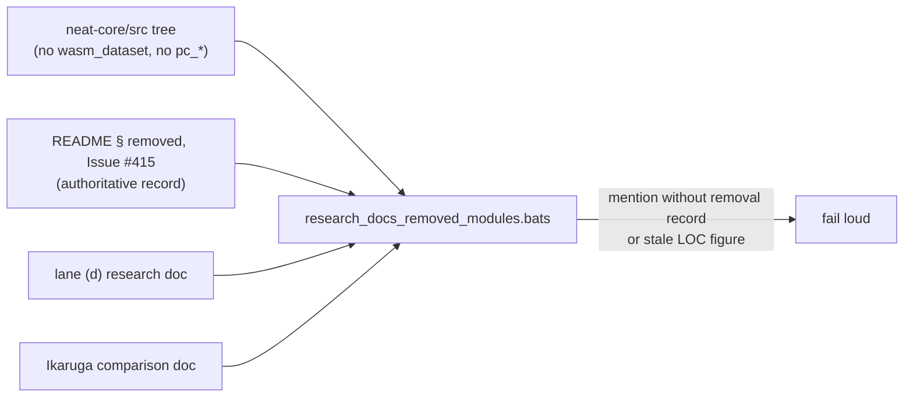

# Correct research docs that presented removed modules as current (Issue #498)

## Summary

Two research documents described modules deleted by Issues #414 and #415 as if
they were still part of the crate, and the lane (d) document contradicted the
README's own removal record by presenting the `wasm_dataset` offload as a
delivery path still waiting on NEAT-AI#3410. The README is the authoritative
side, so both docs now agree with it. Closes #498.

- **`docs/research/wasm64-lane-d-learn-wiring-verification.md`** — added a
  superseded-by-history note linking
  [README § Training-data offload — removed, Issue #415](../../../README.md#training-data-offload-wasm-linear-memory--removed-issue-415);
  rewrote the purpose line, the lane (c) bullet and the residual-heap-growth
  bullet to past tense, stating plainly that NEAT-AI#3410 closed unadopted and
  **no delivery path for the residual is open**. The lane (d) verification
  content (the `learn_flags_wiring.ts` invariants and the RAM-aware selection
  table) is accurate and unchanged.
- **`docs/research/ikaruga-neat-ai-comparison.md`** — dropped the
  `pc_inference` / `pc_learning` inventory row and annotated the remaining
  predictive-coding mentions with the Issue #414 removal; refreshed the stale
  source footprint (~15,100 → ~18,300 LOC, measured on `Develop`).
- `Cargo.lock`: routine dependency refresh from `quality.sh` (`aho-corasick`
  1.1.4 → 1.1.5, `regex-automata` 0.4.16 → 0.4.18); `cargo deny check` clean.

## Evidence

Documentation-only change — no web interface to screenshot. The evidence is the
new regression gate, which reproduces every claim in the issue before the fix
and passes after it.

Before (on the unfixed docs), 6 of 7 tests fail:

```text
ok 1 the modules removed by #414 and #415 are absent from neat-core/src
not ok 2 no research doc names a removed module without its removal record
#   ikaruga-neat-ai-comparison.md:15, :45, :86
#   wasm64-lane-d-learn-wiring-verification.md:21, :101
not ok 4 the lane (d) doc points at the README removal record
not ok 5 the lane (d) doc does not present the offload as a pending delivery
not ok 6 the Ikaruga comparison lists no predictive-coding module as current
not ok 7 the Ikaruga comparison's LOC figure tracks neat-core/src
```

After:

```text
1..7
ok 1 the modules removed by #414 and #415 are absent from neat-core/src
ok 2 no research doc names a removed module without its removal record
ok 3 README names the removed offload only beside its removal record
ok 4 the lane (d) doc points at the README removal record
ok 5 the lane (d) doc does not present the offload as a pending delivery
ok 6 the Ikaruga comparison lists no predictive-coding module as current
ok 7 the Ikaruga comparison's LOC figure tracks neat-core/src
```

`./quality.sh` passes end to end (fmt, clippy, deny, workspace tests, doc,
bats, TypeScript and Mermaid gates).



## Test Plan

Added `tests/scripts/research_docs_removed_modules.bats` (7 "what" tests, run by
`./quality.sh` and the CI bats gate). It asserts observable state of the tree
and the docs, not phrasing of the fix:

- the modules removed by #414/#415 really are absent from `neat-core/src`
  (the premise — keeps the doc rule non-vacuous);
- no file under `docs/research/`, and not the README, names a removed module
  without its removal record (`#414`/`#415` or "removed") within four lines;
- the lane (d) doc links the README removal record;
- the lane (d) doc does not present the offload as a pending delivery;
- the Ikaruga inventory carries no `pc_inference` / `pc_learning` row;
- the Ikaruga LOC figure stays within 10% of the actual `neat-core/src` line
  count — drift fails loud rather than rotting silently.
