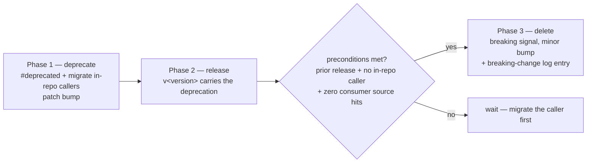

# Complete and de-contradict the `RELEASING.md` breaking-change log (Issue #499)

## Summary

`RELEASING.md` is the single source of truth for the versioning/release policy
(Issue #251), but its breaking-change log broke its own completeness rule and
contradicted itself. Both defects are fixed, the deprecate → migrate → delete
flow that the recent removals actually followed is folded in from the PR-summary
archive, and a new bats gate fails loud on either defect returning.
Closes #499.

- **Two missing major-equivalent bumps logged.** The log jumped `0.3.0` →
  `0.6.0`. Added `0.4.0` (Issue #414 — `pc_inference` / `pc_learning`,
  `PredictiveCodingEngine`, `PcEngineError` and the three
  `predictivecodingengine_*_wasm` exports) and `0.5.0` (Issue #415 —
  `wasm_dataset`, `DatasetError` / `DatasetRegistry` / `TrainingDataset` and the
  seven `training_data_*` exports) in their chronological slots. Both were
  module deletions with no caller in any repository, so each carries a
  "no migration needed" note pointing at what survives.
- **The `0.6.0` self-contradiction corrected.** That entry listed
  `calculate_error_batch_4way` as "live and unchanged" — but the `0.7.0` entry
  one section above removes it, and the symbol is absent from `neat-core/src`.
  It is dropped from the live list and replaced by a cross-reference to the
  `0.7.0` entry. The `accumulate_*_batch_4way` /
  `calculate_{weight,bias}_batch_4way` half was true and stands
  (`neat-core/src/accumulate.rs:306,436,675,733`).
- **New "Removing public API: the three-phase flow" section**, above the log,
  absorbing the four process learnings that lived only in
  `pr-summary-408.md` / `pr-summary-409.md`: CI's `RUSTFLAGS="-D warnings"`
  turns `#[deprecated]` into a hard error in-repo (every in-repo caller migrates
  in the same PR; a parity oracle that must keep calling the old API carries an
  `#[allow(deprecated)]` naming the deletion issue); there is no `CHANGELOG.md`,
  so the `v<version>` GitHub release plus a README/module-doc note is the record;
  the deletion preconditions verified in #409; and sibling removals on one
  milestone branch rebase in sequence to take successive minors
  (`0.6.0` → `0.7.0` → `0.8.0`) without a version collision.

### Why `pr-summary-408.md` / `pr-summary-409.md` are kept

The issue made their deletion conditional on nothing else in them remaining
unabsorbed. That condition is not met: `pr-summary-409.md` carries the
parity-oracle mutation-check evidence (perturbing `RecordBatch::record()` fails 5
of 8 tests) and `pr-summary-408.md` carries the `scoring_flat` bench-group
retirement rationale — point-in-time evidence with no home in `RELEASING.md`.
`pr-summary-409.md` also records the repo's own stance that archived summaries
are historical records and are deliberately untouched. The risk the issue named —
losing the `-D warnings` learning if the archive is pruned — is now removed,
because that learning lives in `RELEASING.md`.

Docs-only change: no public API moved, so this ships on a patch and
`scripts/detect-breaking.sh origin/Develop..HEAD` returns `false`.

## Evidence

Documentation-only change — no web interface to screenshot. The evidence is the
new regression gate, which reproduces every claim in the issue against the
unfixed doc and passes after the fix.

Before (on the unfixed `RELEASING.md`), all 9 tests fail:

```text
not ok 1 the breaking-change log has an entry for every minor between its oldest and newest
# breaking-change log skips: 0.4.0 0.5.0
not ok 2 the 0.4.0 entry records the PredictiveCodingEngine removal (Issue #414)
not ok 3 the 0.5.0 entry records the wasm_dataset removal (Issue #415)
not ok 4 no entry claims a removed symbol is live
# calculate_error_batch_4way: The sibling `calculate_error_batch_4way`, … exports are live and unchanged.
not ok 5 every symbol the log calls live resolves in neat-core/src
# documented as live but absent from neat-core/src: calculate_error_batch_4way
not ok 6 RELEASING.md documents the deprecate-migrate-delete flow
not ok 7 the removal flow records the -D warnings interaction with #[deprecated]
not ok 8 the removal flow records that there is no CHANGELOG.md
not ok 9 the removal flow records the deletion preconditions and the rebase rule
```

After:

```text
1..9
ok 1 the breaking-change log has an entry for every minor between its oldest and newest
ok 2 the 0.4.0 entry records the PredictiveCodingEngine removal (Issue #414)
ok 3 the 0.5.0 entry records the wasm_dataset removal (Issue #415)
ok 4 no entry claims a removed symbol is live
ok 5 every symbol the log calls live resolves in neat-core/src
ok 6 RELEASING.md documents the deprecate-migrate-delete flow
ok 7 the removal flow records the -D warnings interaction with #[deprecated]
ok 8 the removal flow records that there is no CHANGELOG.md
ok 9 the removal flow records the deletion preconditions and the rebase rule
```

Ground truth for the two added entries (the log now matches the release record):

| Version | Issue | Commit | `v<version>` release | Module in `neat-core/src` |
|---|---|---|---|---|
| `0.4.0` | #414 | `37a3b84` (PR #420, `refactor(pc)!:`) | 2026-07-29T02:01Z | `pc_inference.rs`, `pc_learning.rs` absent |
| `0.5.0` | #415 | `e81e5cb` (PR #421, `refactor(wasm)!:`) | 2026-07-29T04:13Z | `wasm_dataset.rs` absent |

The flow the new section documents:



Full gate: `./quality.sh < /dev/null` → `✅ All quality checks passed!`
(bash syntax, shellcheck, bats, `deno check`, Mermaid gate, codespell,
`cargo deny`, fmt, clippy `-D warnings`, full workspace test run, doc build,
release build). `markdownlint-cli2 RELEASING.md` → 0 errors.

## Test Plan

Added `tests/scripts/releasing_breaking_change_log.bats` (9 tests, run by
`quality.sh` and the CI bats job). It parses the log out of `RELEASING.md` and
checks it against the crate rather than against fixed strings:

- **Completeness** — the `### \`0.<minor>.0\`` headings must form a contiguous
  minor sequence; a skipped major-equivalent bump is reported by version number.
- **`0.4.0` / `0.5.0` entries** — each names its issue and the modules it
  removed, and those modules really are absent from `neat-core/src`.
- **No removed symbol described as live** — every backticked symbol in a heading
  that says "removed" is checked against every sentence in the log that claims
  something is live. This is the exact `0.6.0` defect.
- **Every "live" symbol resolves in `neat-core/src`** — the log's `*` glob and
  `{a,b}` alternation shorthands are expanded and matched against the sources,
  so an entry cannot outlive the export it describes.
- **The three-phase flow is documented** — the section exists and carries the
  `-D warnings` / `#[allow(deprecated)]` interaction, the "no `CHANGELOG.md`"
  record, the consumer code-search precondition, and the rebase-in-sequence rule.

No existing tests were modified, removed, or commented out.
